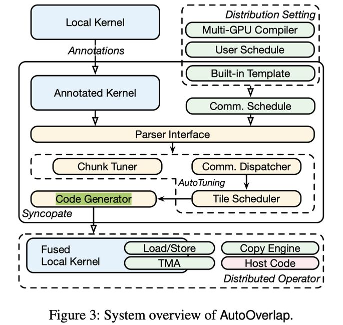

# AutoOverlap: Enabling Fine-Grained Overlap of Computation and Communication with Chunk-Based Scheduling

> Xinwei Qiang, Yue Guan, Zhengding Hu, Yufei Ding, Adnan Aziz

> 注：以下论文笔记由 AI Agent 自动生成，可能存在理解偏差或遗漏，请以原论文为准。

## Abstract

Communication has become a first-order bottleneck in large-scale GPU workloads, and existing distributed compilers address it mainly by overlapping whole compute and communication kernels at the stream level. This coarse granularity incurs extra kernel launches, forces device-wide synchronizations at kernel boundaries, and leaves substantial slack when the slowest tile or kernel stretches the communication tail. We present AutoOverlap, a compiler and runtime that enables automatic fine-grained overlap inside a single fused kernel. AutoOverlap introduces a communication chunk abstraction that decouples communication granularity from kernel structure and backend mechanisms, allowing chunk-level plans to be ported from existing distributed compilers, written directly by users, or instantiated from reusable templates. Given a local Triton kernel and a chunk schedule, AutoOverlap performs transformations to align computation with chunk availability. Implemented as a source-to-source compiler on Triton, AutoOverlap delivers an average end-to-end speedup of 1.3× and up to 4.7× on multi-GPU workloads.

## 一句话总结

AutoOverlap 是一个基于 Triton 的编译器和运行时，通过通信块（chunk）抽象实现内核级别的细粒度计算-通信重叠，平均加速 1.3×，最高 4.7×，解决了传统内核级重叠的同步开销和通信尾部延迟问题。

## 背景与问题

- **通信瓶颈**：在多 GPU 系统中，通信操作（AllGather、ReduceScatter、All-to-All）频繁主导端到端延迟，即使使用 NVLink/NVSwitch 高带宽互连。
- **现有方法的局限**（内核级重叠）：
  - **额外内核启动**：每个通信阶段需要额外的内核启动
  - **设备级同步**：内核边界强制设备级同步
  - **SM 空闲**：最慢的 tile 延伸通信尾部，导致 SM 空闲
  - **通信尾部**：粗粒度重叠在时间线末尾留下长段通信，几乎无重叠

- **核心问题**：如何在**单个融合内核**内实现**细粒度**计算-通信重叠？

## 核心方法

### 1. 通信块抽象（Communication Chunk）

**核心思想**：将通信粒度从内核结构和后端机制中解耦，允许灵活匹配 tile 生成数据的方式和通信后端消费数据的方式。

**关键特性**：
- **逻辑数据块**：表示与特定通信操作关联的逻辑数据块，以及产生或消费它的 tile
- **灵活粒度**：不假设 tile 级或全内核粒度总是合适的
- **设计空间**：暴露少量原则性旋钮（chunk size、backend 选择、tile 顺序）

### 2. 自适应通信后端（❶ Adaptive Communication Backend）

- 从融合内核内部直接启动通信，而非委托给外部通信库
- 编译器显式控制每个传输使用的硬件后端：
  - **Copy Engine**：DMA 传输
  - **Tensor Memory Accelerator**：张量内存加速器
  - **Load/Store on CUDA Cores**：CUDA 核心上的加载/存储

### 3. 自适应 Tile 调度（❷ Adaptive Intra-Chunk Tile Schedule）

- 重新组织内核的 tile 执行以跟踪通信进度
- 保留寄存器、共享内存和缓存层次的局部性
- 减少 SM 空闲时间

### 4. 自适应块大小（❸ Adaptive Chunk Size）

- 调整块大小以平衡链路吞吐量和同步成本
- 减少通信尾部延迟

### 5. 编译器流水线

- **输入**：标准 Triton 内核 + 高层通信计划
- **输出**：融合分布式内核（支持细粒度重叠）
- **自优化**：chunk 间和 chunk 内自动调优（块大小、后端选择、SM 分配、tile 顺序）
- **运行时**：轻量级运行时，与 PyTorch Distributed 无缝集成

## 技术细节

### 编译器实现

- **源到源编译器**：基于 Triton，将标准内核转换为融合分布式内核
- **变换**：重组 tile 执行以对齐 chunk 可用性
- **后端选择**：自动选择适当的通信后端
- **自动调优**：chunk 间和 chunk 内调优

### 与现有方法的对比

| 项目 | 粒度 | 计算 | 通信 | 调度 | 性能 |
|------|------|------|------|------|------|
| Alpa | 内核 | 自动 | 自动 | 模板 | ✔ |
| Mercury | 内核 | 自动 | 自动 | 自动 | ✔✔ |
| Flux | Tile | 手动 | 手动 | 手动 | ✔✔ |
| AsyncTP | Tile | 手动 | 手动 | 手动 | ✔✔ |
| Syncopate | Tile | 自动 | 手动 | 手动 | ✔ |
| **AutoOverlap** | **Chunk** | **自动** | **自动** | **自动** | **✔✔✔** |

### 评估配置

- **工作负载**：多 GPU 分布式工作负载
- **操作**：常见算子（GEMM、AllGather、ReduceScatter 等）
- **硬件**：多 GPU 系统（NVLink/NVSwitch）

## 主要结果

### 性能提升

- **平均加速**：1.3×（常见算子）
- **最高加速**：4.7×（最佳情况）

### 关键发现

1. **细粒度重叠**：单个融合内核内的细粒度重叠显著优于内核级重叠
2. **减少同步**：避免额外内核启动和设备级同步
3. **减少 SM 空闲**：通过自适应 tile 调度减少 SM 空闲时间
4. **减少通信尾部**：通过自适应块大小减少通信尾部延迟
5. **通用性**：在多样化的分布式工作负载中保持高性能

## 优点与局限

### 优点

1. **细粒度重叠**：单个融合内核内实现细粒度计算-通信重叠
2. **通信块抽象**：灵活的 chunk 抽象，解耦通信粒度和内核结构
3. **自适应**：自适应通信后端、tile 调度和块大小
4. **通用性**：在多样化工作负载中保持高性能
5. **易集成**：与 PyTorch Distributed 无缝集成
6. **自动调优**：chunk 间和 chunk 内自动调优

### 局限

1. **Triton 依赖**：基于 Triton 编译器，可能不适用于其他编译器
2. **硬件特定**：在 NVLink/NVSwitch 上优化，其他互连可能需要调整
3. **实现复杂性**：融合内核的编译和运行时实现复杂
4. **评估范围**：主要在常见算子上评估，更复杂的工作负载需进一步测试
5. **无代码开源**：代码 URL 为空，可能尚未开源

## 与 EfficientPaper 主题的关系

AutoOverlap 属于 **Overlap**（`overlap`）领域，核心贡献包括：

- **细粒度重叠**：单个融合内核内的细粒度计算-通信重叠
- **通信块抽象**：灵活的 chunk 抽象，解耦通信粒度和内核结构
- **自适应**：自适应通信后端、tile 调度和块大小

与 EfficientPaper 中已有论文的关系：
- **FlashOverlap**（2026）：FlashAttention 的重叠优化
- **FlashPrefill**（2026）：预填充阶段的重叠优化
- **Flux**（2024）：手动 tile 级重叠
- **AsyncTP**（2024）：手动 tile 级重叠
- **Alpa**（2022）：内核级分布式编译
- **Mercury**（2025）：内核级分布式编译

## 可复现/实现要点

1. **通信块抽象**：逻辑数据块 + tile 关系
2. **Triton 编译器**：源到源编译，生成融合分布式内核
3. **自适应通信后端**：Copy Engine、Tensor Memory Accelerator、CUDA Cores
4. **自适应 Tile 调度**：跟踪通信进度，保留局部性
5. **自适应块大小**：平衡链路吞吐量和同步成本
6. **运行时**：轻量级运行时，与 PyTorch Distributed 集成

## 个人备注

- AutoOverlap 的核心洞察是：**细粒度重叠（内核级别）比粗粒度重叠（内核级别）更有效**，因为它减少了同步开销和 SM 空闲时间。
- 通信块抽象是一个重要的设计选择，它将通信粒度从内核结构中解耦，允许灵活的重叠策略。
- 自适应通信后端、tile 调度和块大小是关键优化，它们使 AutoOverlap 在多样化工作负载中保持高性能。
- 论文来自 Meta 和 UC San Diego，且基于 Triton 编译器，说明这是一个实用的系统。
- 值得关注的未来方向：(1) 在更复杂的工作负载上的验证；(2) 在其他编译器上的应用；(3) 端到端的自动调优。
