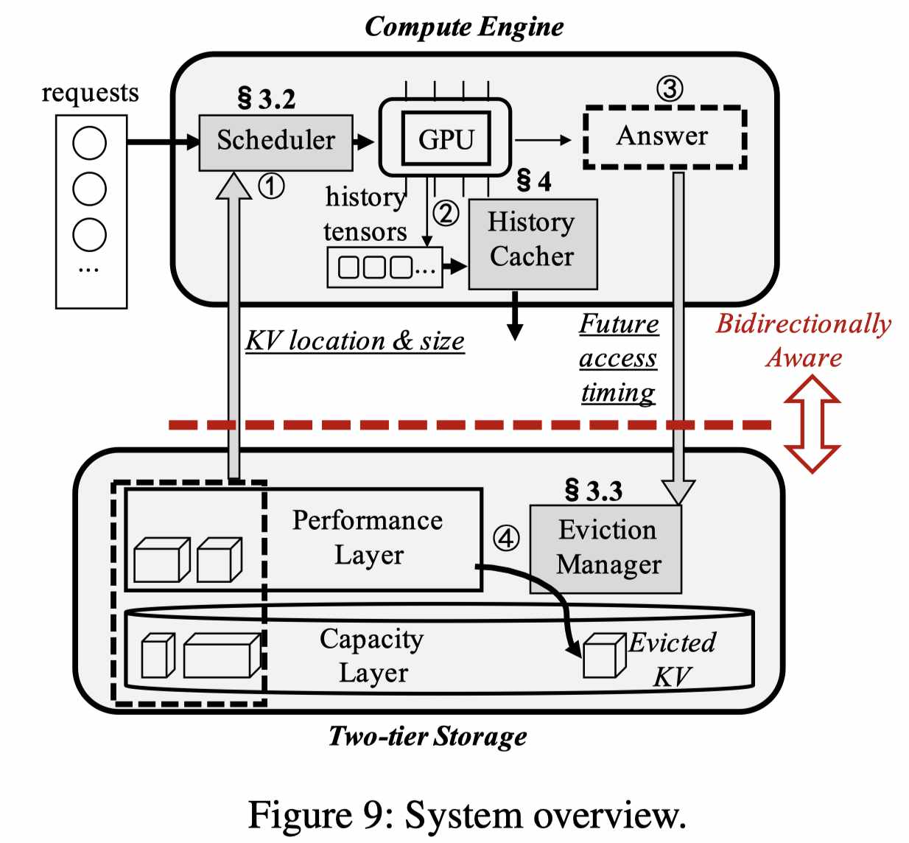

# Bidaw: Enhancing Key-Value Caching for Interactive LLM Serving via Bidirectional Computation-Storage Awareness

> Shipeng Hu, Guangyan Zhang, Yuqi Zhou, Yaya Wei, Ziyan Zhong, Jike Chen

## Abstract

In interactive LLM serving, historical key-value tensors of multi-round conversations are often cached in a two-tier storage system consisting of host memory and SSDs. However, loading KVs from two-tier storage in existing approaches increases serving latency by up to 3.8x and decreases throughput by up to 2.0x compared to an ideal large-memory setting. Bidaw improves KV caching with bidirectional awareness between compute and storage: the compute engine schedules requests with KV-loading latency awareness, while the storage system uses LLM-generated response length to predict user access patterns during eviction. Bidaw further balances storage footprint and computational savings by selectively caching storage-efficient history tensors. Experiments show up to 3.58x response-latency reduction and up to 1.83x throughput improvement over state-of-the-art approaches.

---

## 论文详细总结

> 由 GPT 自动生成，请人工核验。

### 1. 研究背景与动机

交互式 LLM serving 中，用户和模型进行多轮对话。每一轮回答都依赖之前轮次的 KV cache 来保持上下文一致性；如果每轮结束后直接从 GPU 删除 KV，下轮请求到来时就需要重新计算历史上下文。论文的真实交互 workload 显示，用户平均有 **22.4** 轮对话，历史重计算最高可占总计算量 **93.1%**。

因此，多轮交互服务通常需要把历史 KV 缓存在 GPU 外部。现有两层存储方案通常使用 **host memory + SSD**：host memory 作为 performance layer，SSD 作为 capacity layer。但作者发现现有方法在交互式 workload 上 KV loading 效率很差：相比所有 KV 都在 host memory 的理想大内存设置，响应延迟最高增加 **3.8×**，吞吐最高下降 **2.0×**。

根因是 **compute engine 和 two-tier storage 互相无感知**：

- compute scheduler 不知道每个请求的 KV 在 host memory 还是 SSD，也不知道 KV 大小，容易让慢 I/O 请求阻塞后续快请求；
- storage eviction 只看历史访问/队列信息，不理解对话行为；交互式对话相邻访问间隔长，KV 访问 temporal locality 差，导致 host memory hit rate 低。

### 2. Bidaw 核心思想

Bidaw 是一个面向交互式 LLM serving 的两层 KV caching 系统，通过 **bidirectional computation-storage awareness** 提升 KV loading 效率：

- compute 侧感知 storage I/O latency，按 KV 所在层级和大小调度请求，减少 I/O-induced blocking；
- storage 侧感知 compute 生成的模型回答，用回答长度预测用户下一次访问时间，从而改进 KV eviction；
- 进一步选择性缓存 storage-efficient history tensor，在存储开销和未来计算节省之间做权衡。

一句话概括：**Bidaw 不是单纯把 KV 放到 host/SSD，而是让计算调度知道 KV 加载成本，让存储淘汰知道对话行为。**

### 3. 关键技术

| 技术 | 说明 |
|------|------|
| **I/O-aware request scheduling** | 请求到达时获取其 KV 所在 storage layer 和 KV size；避免长 SSD I/O 请求阻塞短 host-memory I/O 请求。 |
| **Dual queues** | 将请求分为 ready queue 和 preparing queue：KV 在 performance layer 的请求进入 ready queue，可直接调度 GPU；KV 在 capacity layer 的请求先进入 preparing queue，加载到 performance layer 后再提升。 |
| **KV-size-based reordering** | preparing queue 中按 KV size 和等待时间给请求排序，优先加载预计 I/O 时间短的请求，同时避免 starvation。 |
| **Previous-answer-based eviction** | 利用上一轮 LLM answer 长度预测下一次 KV 访问的 weighted reuse distance；回答越长，用户阅读/思考越久，下一次访问越晚。 |
| **Ghost cache hit-probability estimation** | 维护使用未来信息的 optimal eviction ghost cache，根据过去 I/O trace 估计不同 weighted reuse distance 的 hit probability。 |
| **Storage-efficient history tensor caching** | 在 GPU 推理产生的多种中间 tensor 中，选择“单位存储开销可节省更多计算”的 history tensor 缓存；MHA 模型收益明显，GQA 模型更适合直接缓存 KV。 |

### 4. 实验结果

| 指标 | 结果 |
|------|------|
| 会议 | FAST 2026 |
| 评测 workload | 真实交互式 conversation workload + public ShareGPT multi-round workload |
| 模型 | OPT-6.7B、Qwen-7B、OPT-13B、Qwen-14B、OPT-30B |
| 对比系统 | vLLM、CachedAttention、FlashGen，以及 ideal large host memory upper bound |
| 主结果 | 相比 SOTA 方法，响应延迟最多降低 **3.58×**，吞吐最多提升 **1.83×** |
| ShareGPT 结果 | 相比 FlashGen，在相近平均延迟下支持 **1.40×** 更多 users/min；响应延迟相比 vLLM/CachedAttention/FlashGen 分别最多降低 **69.8% / 65.8% / 56.9%** |
| Host memory sensitivity | 在 host memory 从 120GB 到 200GB 变化时，Bidaw 仍支持 **1.75×–2.19×** 更高 user arrival rate |
| Miss rate | previous-answer-based eviction 相比 queue-enhanced miss rate 最多降低 **57.6%**，相比通用 eviction 策略最多降低 **69.9%** |
| Request queueing | I/O-aware scheduler 将平均排队时间从 **5.76s** 降到 **2.45s**，降低 **57.5%** |
| Overhead | scheduling 平均 **0.62ms**；eviction 平均 **0.35ms**；history tensor → KV 转换为几十毫秒，在低优先级 CUDA stream 上执行 |
| Tail latency | OPT-30B 上 P90/P95/P99 latency 相比 FlashGen 分别降低 **66.63% / 62.64% / 56.81%** |

### 5. 核心贡献

1. 指出交互式 LLM serving 中，两层 KV storage 的主要瓶颈不是容量，而是 compute 与 storage 缺少协同。
2. 提出 **I/O-aware request scheduling**，把 KV 所在层级和 KV size 纳入 GPU 请求调度。
3. 提出 **previous-answer-based eviction**，把 LLM answer length 作为预测用户下一次访问时间的信号。
4. 提出 **storage-efficient history tensor caching**，从“缓存什么 tensor”角度优化 KV reuse 的存储收益比。
5. 在真实交互式 workload 和 ShareGPT workload 上显著优于 vLLM/CachedAttention/FlashGen，并接近大 host memory 理想上界。

### 6. 局限性与讨论

- Bidaw 主要针对 **interactive multi-round conversation**；对于单轮请求、短上下文或高度批处理的离线生成场景，previous-answer-based eviction 的收益可能较弱。
- previous-answer 信号依赖真实用户阅读/思考时间；在 ShareGPT 这类无时间戳、需用 Poisson 模拟 timestamp 的 workload 上，eviction 收益下降。
- 系统假设两层 storage 主要是 host memory + SSD，未扩展到 CXL/RDMA/多节点 KV pool；可与 LMCache/Mooncake/CacheFlow 这类更大范围 KV 管理互补。
- storage-efficient tensor caching 对 MHA-based 模型更通用；GQA-based 模型因 KV 本身更小，直接缓存 KV 更合适。

### 7. 对当前研究的启发

- Bidaw 与 PredictKV 的方向高度互补：Bidaw 给出了真实系统实现和 FAST 评测，PredictKV 更偏多层级投影设计；后续可以把 Bidaw 的 previous-answer signal 扩展到 CXL/RDMA/SSD 分层 KV 管理。
- 对 agentic serving 很有启发：tool call 输出长度、模型回答长度、用户停顿时间都可以作为 session-level reuse predictor，而不仅仅依赖 LRU/recent/sink。
- 可尝试做 **conversation-aware KV offload scheduler**：把 request scheduling、KV prefetch、eviction、tensor format 选择统一建模为 compute-storage co-design。

