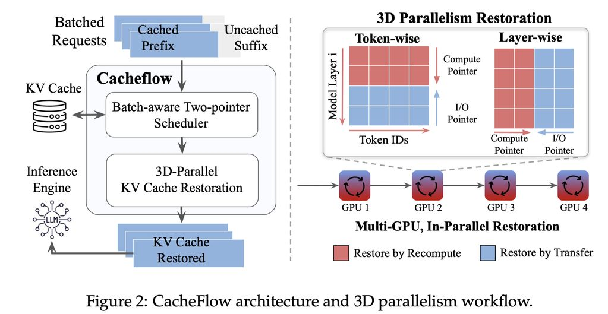

# CacheFlow: Efficient LLM Serving with 3D-Parallel KV Cache Restoration

> Sean Nian, Jiahao Fang, Qilong Feng, Zhiyu Wu, Fan Lai

## Abstract

KV cache restoration has emerged as a dominant bottleneck in serving long-context LLM workloads, including multi-turn conversations, retrieval-augmented generation, and agentic pipelines. Existing approaches treat restoration as a per-request tradeoff between recomputation and I/O transfer, recomputing KV states from scratch or offloading them from external storage (e.g., CPU memory or remote machines). However, existing advances fail to exploit parallelism across tokens, layers, and distributed deployments, and critically ignore resource contention under batched serving. We present CacheFlow, a KV cache restoration framework that rethinks cache restoration as a multi-dimensional parallel execution problem. CacheFlow introduces a unified 3D parallelism abstraction across tokens, layers, and GPUs, enabling fine-grained overlap of recomputation and I/O along the structural dependencies of transformer inference. At the core of CacheFlow is a batch-aware two-pointer scheduler that jointly optimizes compute and I/O allocation across requests by prioritizing operations with the highest marginal reduction in recomputation cost. Our evaluations show that CacheFlow reduces Time-To-First-Token (TTFT) by 10%-62% over existing advances across diverse models, workloads, and hardware.

---

*以下总结由 MiMo 生成：*

这篇论文旨在解决长上下文大语言模型服务中KV缓存恢复的瓶颈问题。作者提出了CacheFlow框架，通过引入跨令牌、层和GPU的统一3D并行抽象，将缓存恢复重构为多维并行执行问题，并采用批处理感知的双指针调度器优化计算与I/O分配。实验表明，CacheFlow在不同模型、工作负载和硬件上，将首令牌生成时间（TTFT）降低了10%至62%。

---

## 论文详细总结

### 1. 研究背景与动机

KV 缓存恢复已成为长上下文 LLM 服务中的主要瓶颈，出现在多轮对话、RAG 和智能体流水线等场景。现有方法将恢复视为每个请求的"重计算与 I/O 传输之间的权衡"，未能利用 token、层和分布式部署之间的并行性，且忽略了批处理服务下的资源竞争问题。

### 2. CacheFlow 核心思想

将缓存恢复重新定义为**多维并行执行问题**，而非简单的逐请求权衡。核心架构围绕**统一的 3D 并行抽象**展开，涵盖 token、层和 GPU 三个维度。

### 3. 关键技术

| 技术 | 说明 |
|------|------|
| **3D 并行性** | 在 token、layer、GPU 三个维度同时引入并行 |
| **批量感知双指针调度器** | batch-aware two-pointer scheduler，优先处理边际重计算成本降低最高的操作 |
| **结构性依赖感知重叠** | 根据 transformer 推理的结构依赖关系实现精细时间重叠 |

### 4. 实验结果

| 指标 | 结果 |
|------|------|
| TTFT 降低 | **10% 至 62%** |
| 适用范围 | 多种模型、工作负载和硬件配置 |

### 5. 核心贡献

1. 首个将 KV 缓存恢复建模为**多维并行问题**的框架
2. 设计统一的 **3D 并行抽象**，打通 token、层、GPU 三个并行维度
3. 开发**批量感知双指针调度算法**，优化资源分配
4. 实现显著的 TTFT 降低（10%-62%），验证框架有效性和通用性
