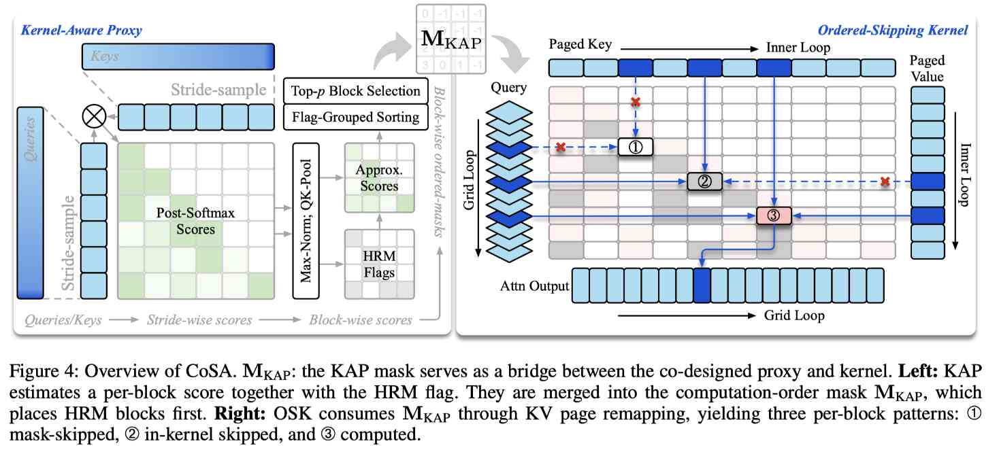

# CoSA: Accelerating Long-Context Inference via Proxy-Kernel Co-Designed Sparse Attention

> Yufei Xue, Lin Niu, Hong Liu, Siran Liu, Hanyong Shao, Wei Liu, Guanghua Yu, Jianchen Zhu, Jun Zhang

> 注：以下论文笔记由 AI Agent 自动生成，可能存在理解偏差或遗漏，请以原论文为准。

## Abstract

长上下文自注意力的二次复杂度带来显著推理开销。现有 training-free block-sparse attention 通常由 proxy 预测二值稀疏 mask，再由 kernel 机械执行；预算收紧时，proxy 会漏掉重要 block，而 kernel 又无法补救。CoSA 提出 proxy-kernel 协同设计的两阶段稀疏注意力：Kernel-Aware Proxy（KAP）在中等预算下选择 block，并输出规定 KV page 访问顺序的有序 mask；Ordered-Skipping Kernel（OSK）消费该顺序，再依据在线 softmax 统计在更紧预算下继续跳过 block。论文在 128K 上报告 4.93× attention speedup 和 2.53× TTFT speedup，且性能损失很小。

## 一句话总结

CoSA 将稀疏选择和 kernel 执行顺序打通，用 HRM-first 的 KV page 重排让精确的 in-kernel skipping 更早获得可靠 rowmax，从而同时降低 QK 计算和 value-side 计算。

## 创新点

1. **把 proxy 与 kernel 设计成闭环**：KAP 不只输出“保留/丢弃”二值 mask，还输出 block 的访问顺序，使 proxy 结果能够直接塑造 kernel 的执行路径。
2. **Kernel-Aware Proxy（KAP）**：对下采样的 Q/K 做廉价打分，按 key block 做 MaxPool、按 query row 做 MaxNorm，并识别包含 row-wise maximum 的 HRM block；排序时优先访问 HRM block，再按分数选择第一阶段保留集合。
3. **Ordered-Skipping Kernel（OSK）**：通过 paged KV 的物理 page remapping 跳过未选 block，并在保留 block 上复用 online-softmax 的精确 logits 做第二阶段 in-kernel skip；HRM-first 顺序缓解 running-max 不等于 global-max 和单行 outlier 导致的 bucket effect。
4. **无需训练、面向真实后端**：KAP/OSK 只在推理时工作，采用 128-token logical block、SM90 warp-specialized kernel，并与 PagedAttention 风格的 KV cache 兼容。

## 带来什么提升

1. 在 Qwen3-8B 与 Llama-3.1-8B-Instruct 上，RULER 和 LongBench-v2 的 sparse 方法中取得更高平均准确率，同时使用更低计算预算；128K 时 CoSA 的 RULER 平均预算为 22%。
2. 在 128K context 下，attention 相对 full attention 达到 4.93× speedup，端到端 prefill 的 TTFT 达到 2.53× speedup；4K 处也报告 1.11× attention speedup，未出现短上下文回归。
3. LongBench-v2 上，Qwen3-8B 的 CoSA 平均分为 36.51、预算 15%；Llama-3.1-8B-Instruct 平均分为 30.96、预算 17%，均优于 MInference、FlexPrefill 和 XAttention 的稀疏基线。
4. 消融实验显示，KV page remapping 在相同质量下进一步降低预算；Qwen3-8B 上从基础 mask-skipping 到完整 CoSA，平均分由 32.71 提升至 33.45、预算由 22% 降至 15%。

## 备注

- 实验只稀疏 prefill，decode 仍使用 dense attention；作者将 decode 扩展列为未来工作，因此不能直接把本文结果解释为完整 decode 加速。
- 论文比较的主要基线为 MInference、FlexPrefill、XAttention，完整注意力基线为 FlashAttention-2；论文页面未提供公开代码链接。
- CoSA 的关键系统假设是 paged KV cache 支持轻量 page remapping，且 kernel 可以有效利用任意顺序访问；迁移到不同 GPU 架构或 page layout 时需要重新验证开销。
