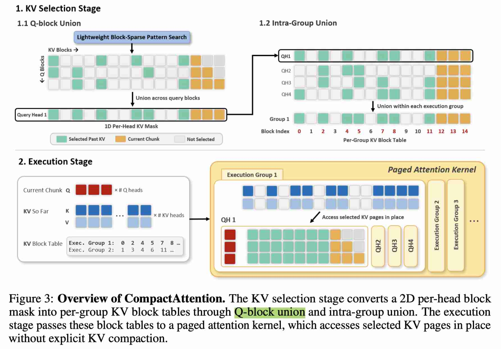

# CompactAttention: Accelerating Chunked Prefill with Block-Union KV Selection

> Jiwon Song, Dongwon Jo, Beomseok Kang, Jae-Joon Kim  
> Seoul National University  
> arXiv:2605.16839v1 · 2026  
> Code: https://github.com/jiwonsong-dev/CompactAttention


这里dense compute是精髓，由于chunk内共享mask，所以只用load 部分kv cache block，kernel本质上是dense 运算；等到下一个chunk prefill时，允许不同的mask，这也是和one-shot prefill不同的关键

> 注：以下论文笔记由 AI Agent 自动生成，可能存在理解偏差或遗漏，请以原论文为准。

## Abstract

Chunked prefill has become a widely adopted serving strategy for long-context large language models, but efficient attention computation in this regime remains challenging. Existing sparse attention methods are primarily designed for one-shot prefill and do not translate efficiently to chunked prefill: block-sparse kernels lose efficiency when the query length is limited by the chunk size, while fine-grained pattern search becomes costly when repeated over the accumulated KV cache at every chunk. QUOKA, a recent method that directly targets chunked prefill, avoids sparse-kernel overhead but relies on query-subsampled, token-level KV selection, which can miss query-specific KV entries and introduce explicit KV-copy overhead. To address these limitations, we propose CompactAttention, a chunked-prefill attention mechanism based on Block-Union KV Selection. CompactAttention treats 2D block-sparse masks as KV-selection signals rather than direct sparse-kernel execution plans, and converts them into GQA-aware per-group KV block tables through Q-block union and intra-group union. This construction produces the minimal block tables that preserve all KV blocks selected by the input masks under paged execution constraints, enabling selected KV blocks to be accessed in place without explicit KV compaction. On LLaMA-3.1-8B-Instruct, CompactAttention maintains accuracy close to dense attention on the RULER benchmark while delivering up to 2.72× attention speedup at 128K context length under chunked prefill.


## 一句话总结

CompactAttention 面向长上下文 LLM serving 中的 chunked prefill 场景，把传统 2D block-sparse attention mask 降维为 GQA-aware 的 per-group KV block table，并用 zero-copy paged attention 原地访问被选中的 KV block，从而绕开 chunked prefill 下 block-sparse kernel 效率低和 token-level KV 选择需要显式拷贝的问题。在 LLaMA-3.1-8B-Instruct 128K 上，它在 RULER/LongBench V2 精度接近 dense attention 的同时，最高获得 2.72× attention speedup 和 1.96× end-to-end speedup。

## 背景与问题

长上下文 LLM 已经扩展到数十万甚至百万 token，典型应用包括长文档理解、代码分析、多步 agentic workload 和长程推理。一次性 one-shot prefill 会遇到两个明显瓶颈：

1. full-sequence attention 的计算量随上下文长度二次增长；
2. 在线 serving 中长 prefill 会阻塞 decode 请求，破坏 time-between-token（TBT）等服务质量目标。

因此 vLLM、SGLang 等 serving 框架广泛采用 **chunked prefill**：把长输入切成固定大小的 chunk 顺序处理，每个 chunk 的 query 同时 attend 到当前 chunk 和过去累积的 KV cache。这个调度方式缓解了 serving 层面的阻塞，但也改变了 attention 的形态：每次 attention 的 `Q` 只等于 chunk size，而 `KV` 随上下文长度持续增长，即典型的 `Q ≪ KV`。

已有长上下文加速方法主要来自 block-sparse attention。它们先找出重要 attention block，再用 block-sparse kernel 只计算被选中的 tile。该范式在 one-shot prefill 中有效，因为 query 和 KV 都足够长，稀疏 kernel 的不规则访存和 mask 解释开销可以被摊销；但在 chunked prefill 中会暴露两类问题：

- **kernel inefficiency**：query block 数太少，block-sparse kernel 难以获得足够并行度，实际 speedup 远低于理论 sparsity；
- **pattern search overhead**：每个 chunk 都要在不断增长的 KV cache 上重新搜索 sparse pattern，累计开销变成一阶成本。

另一条路线是 QUOKA 这类直接 KV selection：采样部分 query token 作为 evaluator，对 KV token 做重要性打分，然后对选中的 KV 做 dense attention。这避免了 sparse kernel 开销，但带来两个新问题：

- query-subsampled selection 可能漏掉只对未采样 query 重要的 query-specific KV；
- token-level KV selection 需要 gather/pack 成新的紧凑 KV tensor，显式 KV copy 开销随 context length 和 batch size 增长。

CompactAttention 的目标就是在 chunked prefill 下同时满足三点：覆盖所有 query block、避免短 query 下的 sparse-kernel 低效、并以 block granularity 原地访问 KV，避免显式 compaction。

## 核心方法

CompactAttention 的核心思想是：**把 block-sparse mask 当作 KV-selection signal，而不是直接当作 sparse-kernel execution plan**。

整体分为两个阶段：

1. **KV selection：Block-Union KV Table Construction**  
   输入可以是任意轻量 block-sparse pattern search 方法产生的 2D per-head block mask，例如 SeerAttention 或 FlashPrefill。CompactAttention 不直接用这个 mask 调 sparse attention kernel，而是通过 union 操作把它转换为可被 paged dense attention 使用的 per-group KV block table。

2. **Execution：Zero-Copy Paged Attention**  
   生成的 KV block table 作为 page metadata 传给 paged attention kernel。kernel 直接在原始 KV cache 中访问被选中的 page/block，不把 KV payload 拷贝到新的 compact buffer。

这种设计把“如何选择 KV block”和“如何执行 attention”解耦：selection 阶段复用已有 lightweight block-sparse selector，execution 阶段则走对 chunked prefill 更友好的 dense paged attention backend。

## 技术细节

### 1. Q-block union

设输入 mask 为 `M_{b,h,i,j} ∈ {0,1}`，其中 `b` 是 batch，`h` 是 query head，`i` 是当前 chunk 内的 query block，`j` 是 KV block。传统 block-sparse 方法会直接按 `(i,j)` 的 2D mask 执行 sparse attention。

CompactAttention 首先对同一 head 内所有 query block 做 union：

```text
M̄_{b,h,j} = OR_i M_{b,h,i,j}
```

这样每个 query head 得到一个 1D KV block mask。原因是 dense paged attention 对一组一起执行的 query block 需要共享一个 KV block list，而不能为每个 query block 使用不同 list。

### 2. Intra-group union

在 GQA 模型中，多个 query head 共享同一个 KV head。CompactAttention 进一步对同一 execution group 内的 query heads 做 union：

```text
G_{b,g,j} = OR_{h ∈ H(g)} M̄_{b,h,j}
T_{b,g} = { j | G_{b,g,j} = 1 }
```

其中 `T_{b,g}` 就是 batch `b`、execution group `g` 的 KV block table。这个 table 有两个性质：

- **coverage-preserving**：任意 query block / query head 在原始 2D mask 中选中的 KV block 都会被保留；
- **minimal under paged execution constraint**：在同一 execution group 必须共享一个 block table 的约束下，任何不在 `T_{b,g}` 中的 KV block 都没有被该 group 的任何 query 选中，因此可以安全排除。

union 会降低 sparsity，因为只要一个 query block 或 head 选中某个 KV block，该 block 就会保留。论文的做法是使用更激进的初始 pattern search 来抵消 union 后的 sparsity loss。例如 CompactAttention-FP 使用比 FlashPrefill 更激进的 threshold，union 之后仍能达到与 FlashPrefill 相近的 executed sparsity。

### 3. Sub-KV-group union

对 GQA ratio 较大的模型（如 Qwen3-30B-A3B-Instruct-2507 的 8:1），如果直接对整个 KV group 内所有 query head 做 union，会损失过多 sparsity。论文提出把每个 KV group 切成更小的 execution subgroup，默认 subgroup size 为 4。这样既减少 union 带来的 sparsity loss，又避免 subgroup 太小造成过多 block table 构造和 metadata overhead。

### 4. Zero-copy paged execution

CompactAttention 要让不同 execution group 使用不同 KV block table，同时不拷贝 K/V payload。为此，它采用 **KV-head-major layout**：

```text
[B, H_kv, L, D]
```

这样每个 `(batch, KV head, block)` 都对应一段连续 `[block_size, D]` 内存，可以直接视作 page。CompactAttention 只构造 CSR-style metadata：

- `kv_indptr`
- `kv_indices`

然后把这些 metadata 传给 FlashInfer paged attention backend。K/V 本体仍留在原 KV cache 中，不发生 gather/pack。

实现上，论文把 batch 和 KV-head 维度 flatten 成 pseudo-batch，并以 `num_kv_heads = 1` 调用 backend，使每个 pseudo-sequence 可以拥有独立 page list。当前 chunk 始终保持 fully open，以避免在 compacted-position space 上错误应用 causal mask。

## 实验设置

### 模型与任务

论文评估了两个长上下文开源模型：

- **LLaMA-3.1-8B-Instruct**：dense LLM，128K context window；
- **Qwen3-30B-A3B-Instruct-2507**：MoE LLM，256K context window。

准确率 benchmark：

- **RULER**：长上下文检索/推理评测；
- **LongBench V2**：更偏深层理解和长上下文推理。

### Baselines

- Dense attention：FlashInfer 0.6.9，底层使用 FlashAttention-2 或 FlashAttention-3；
- Block-sparse attention：SeerAttention、XAttention、FlashPrefill；
- Chunked-prefill KV selection：QUOKA；
- CompactAttention variants：
  - **CompactAttention-SA**：使用 SeerAttention selector；
  - **CompactAttention-FP**：使用 FlashPrefill-style training-free selector。

QUOKA 使用原论文固定的 25% KV budget；其他 sparse 方法分别调 sparsity hyperparameter 到 accuracy-preserving operating point。CompactAttention-FP 在 LLaMA 上使用更 aggressive 的 `α=0.06`，FlashPrefill baseline 使用 `α=0.01`；在 Qwen3 上 CompactAttention-FP 使用 `α=0.12`，FlashPrefill 使用 `α=0.02`。

### 硬件与配置

- RTX PRO 6000：TP=2，batch size 4，chunk size 512；
- H200 SXM：TP=2，batch size 8，chunk size 1024；
- 主要 latency 关注 attention-level speedup 和 end-to-end chunked prefill latency。

## 主要结果

### 1. LLaMA-3.1-8B-Instruct 上的速度

在 H200、128K context、chunk size 1024 下：

- Dense attention latency：55,678.4 ms；
- FlashPrefill attention latency：24,886.5 ms；
- CompactAttention-FP attention latency：20,489.7 ms；
- 对 dense 的 attention speedup：**2.72×**；
- end-to-end latency 从 71,015.1 ms 降到 36,265.4 ms，对 dense 的 end-to-end speedup：**1.96×**。

在 RTX PRO 6000、128K context、chunk size 512 下：

- CompactAttention-FP attention latency 为 24,055.4 ms，相比 dense 的 65,971.1 ms 约 **2.74×**；
- end-to-end latency 为 54,130.6 ms，相比 dense 的 94,944.3 ms 约 **1.75×**。

论文同时观察到：QUOKA 的 token-level gather/pack 开销抵消了选择更少 KV 的收益；XAttention 和 SeerAttention 在 chunked prefill 下经常慢于 dense，说明 repeated pattern search 和 Q≪KV 下的 block-sparse execution 开销很重；FlashPrefill 是最强 block-sparse baseline，但 CompactAttention 在长上下文下仍能进一步超过它。

### 2. RULER 准确率

在 chunk size 1024 下，LLaMA-3.1-8B-Instruct 的 RULER 平均准确率：

| Method | 32K | 64K | 128K | Avg |
|---|---:|---:|---:|---:|
| Dense | 88.23 | 83.52 | 76.59 | 82.78 |
| QUOKA | 83.52 | 79.99 | 70.44 | 77.98 |
| XAttention | 89.16 | 83.27 | 74.50 | 82.31 |
| SeerAttention | 90.23 | 83.82 | 73.34 | 82.46 |
| CompactAttention-SA | 88.92 | 84.12 | 74.28 | 82.44 |
| FlashPrefill | 88.99 | 83.94 | 74.12 | 82.35 |
| CompactAttention-FP | 88.77 | 83.96 | 74.17 | 82.30 |

CompactAttention 的平均精度与对应 block-sparse baseline 基本一致，说明 Q-block union 和 intra-group union 保留了 selector 的选择质量；同时 QUOKA 明显掉点，尤其是在需要 distributed information access 的任务上。

Qwen3-30B-A3B-Instruct-2507 上，CompactAttention-FP 的 RULER 平均准确率为 89.29，接近 dense 的 90.46，并优于 QUOKA 的 80.19 和 FlashPrefill 的 88.68。

### 3. LongBench V2 准确率

在 LLaMA-3.1-8B-Instruct、chunk size 1024 下，CompactAttention-FP 的 LongBench V2 overall accuracy 为 **30.4**，与 dense attention 的 **30.4** 相同；CompactAttention-SA 为 29.6，接近 dense。QUOKA 为 26.8，明显低于 dense，尤其在 Hard 样本上下降更明显。

这说明 CompactAttention 不只是保住 synthetic retrieval 类任务，在更真实、更难的长上下文理解与推理任务上也能维持较好精度。

### 4. Ablation：sparsity 与 execution strategy

在 RULER 128K 上：

- FlashPrefill `α=0.01` 的 sparsity 为 69.8%；
- CompactAttention-FP 初始 mask 使用 `α=0.06`，pre-union sparsity 为 89.8%；
- 经过 Q-block union 和 intra-group union 后 sparsity 降为 70.2%。

这支持论文的设计：可以先用更 aggressive selector 获取更稀疏的 2D mask，再通过 union 得到 accuracy-preserving 且可执行的 block table。

execution-only ablation 进一步证明：在相同 unioned block mask 下，zero-copy paged execution 比 block-sparse kernel 和显式 KV copy 更快。论文报告在 RTX PRO 6000、128K、batch size 4、chunk size 512 下：

- block-sparse execution：15.64 ms/layer/chunk；
- CompactAttention-FP with copy：6.54 ms/layer/chunk；
- CompactAttention-FP zero-copy：5.03 ms/layer/chunk。

batch-size scaling 也显示 copy overhead 随 batch size 增长明显，而 metadata overhead 增长较慢，进一步支持 zero-copy 设计。

### 5. Chunk size 与 Qwen3 扩展性

chunk size sensitivity 显示，H200、LLaMA 128K 下，CompactAttention-FP 在 chunk size 512/1024/2048 上分别获得 2.85×、2.72×、2.38× attention speedup。chunk 越大，迭代次数减少但 Q-block union 范围变大、effective sparsity 下降，因此相对 speedup 略降，但仍明显快于 dense。

在 Qwen3-30B-A3B-Instruct-2507 上，CompactAttention-FP 从 64K 开始超过 QUOKA 和 FlashPrefill，并在 256K context 下达到 **1.64× attention speedup**，说明方法对更大 MoE 模型和更长上下文也有收益。

## 优点与局限

### 优点

- **针对真实 serving 场景**：论文没有停留在 one-shot prefill，而是直接面向 vLLM/SGLang 常用的 chunked prefill。
- **selection/execution 解耦**：可复用 SeerAttention、FlashPrefill 等 selector，也能受益于未来更快的 pattern search 方法。
- **覆盖性强于 query subsampling**：所有 query block 都参与 block-level selection，避免 QUOKA 采样 query 导致的 query-specific KV 遗漏。
- **zero-copy**：通过 paged metadata 原地访问 KV，避免 token-level KV selection 的 gather/pack 成本。
- **工程路径清晰**：基于 FlashInfer paged attention backend，KV-head-major layout 和 CSR metadata 都比较贴近高性能 serving 实现。

### 局限

- **依赖底层 selector 质量**：如果输入 block-sparse mask 漏掉重要 KV block，union 操作不能恢复它们。
- **union 会损失 sparsity**：Q-block union 和 intra-group union 会保留任意 query/head 选中的 block，因此需要更 aggressive 的初始 selector 或 sub-KV-group union 平衡 sparsity。
- **收益依赖上下文长度**：当 KV cache 不够大时，pattern search 和 metadata construction 可能无法被充分摊销，短上下文或小 batch 下收益可能有限。
- **需要特定 KV cache layout 与 kernel 支持**：KV-head-major layout、group-dependent page table、FlashInfer paged attention backend 都需要 serving 系统配合；不是简单替换 attention kernel 即可。
- **主要实验仍是离线评估**：虽然面向 serving，但论文没有完整展示多租户在线调度、decode interleaving、真实 arrival pattern 下的端到端 SLO 影响。

## 与 EfficientPaper 主题的关系

这篇论文属于 **LLM inference serving / long-context attention / sparse attention / KV cache execution** 方向。它不是压缩模型权重或减少参数，而是优化长上下文 chunked prefill 的 attention 执行路径，尤其强调：

- long-context prefill acceleration；
- block-sparse attention 在 serving 场景下的 kernel inefficiency；
- GQA-aware KV block selection；
- paged attention 与 KV cache layout；
- zero-copy KV access。

在 EfficientPaper 中可归入 `sparse_pruning` 或更宽泛的 inference/KV-cache efficiency 类别。若后续维护更细粒度 taxonomy，建议标注为 `long_context_inference`、`sparse_attention`、`kv_cache`、`serving`。

## 可复现/实现要点

- 代码仓库：`https://github.com/jiwonsong-dev/CompactAttention`。
- selector 可以接入 SeerAttention 或 FlashPrefill；CompactAttention 本身关注把 selector 的 2D block mask lowering 成 executable KV block tables。
- 当前 chunk 必须 fully open，否则 compacted-position space 下的 causal mask 会破坏原始 causal attention 语义。
- 对大 GQA ratio 模型，建议使用 sub-KV-group union，论文默认 subgroup size 为 4。
- KV cache 需要采用 `[B, H_kv, L, D]` 的 KV-head-major layout，以便每个 `(batch, KV head, block)` 作为独立 page 被 metadata 引用。
- paged attention 调用只传 metadata（如 `kv_indptr`、`kv_indices`），不复制 K/V payload。
- 性能收益主要出现在长上下文、大 KV cache、batch serving 场景；短上下文下 metadata/search overhead 可能抵消收益。

## 个人备注

这篇工作的关键价值在于指出：chunked prefill 下 sparse attention 的瓶颈不只是“选哪些 KV block”，还包括“选中的 block 如何执行”。把 block-sparse mask 作为 selection signal、再通过 paged dense attention 执行，是一个很适合现有 serving infrastructure 的折中。后续值得关注的问题包括：

- CompactAttention 如何与 vLLM/SGLang 的 continuous batching、prefix cache、speculative decoding 等机制组合；
- selector 的在线 pattern search 成本能否进一步降低，甚至离线/缓存化；
- 在多请求 heterogeneous context length 下，per-group page table 的调度和内存碎片问题；
- 是否能把这种 block-union lowering 推广到 decode 阶段或多模态长上下文模型。
