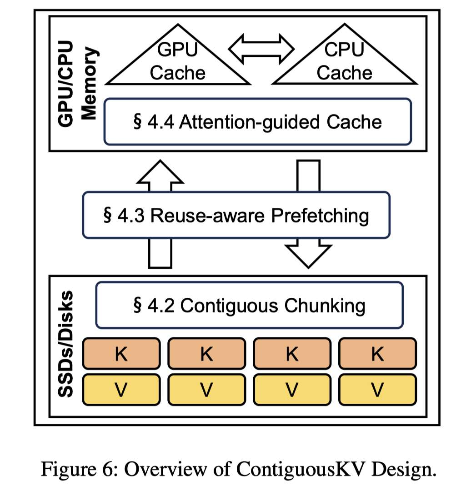

# ContiguousKV: Accelerating LLM Prefill with Granularity-Aligned KV Cache Management

> Jing Zou, Shangyu Wu, Hancong Duan, Qiao Li, Chun Jason Xue

> 注：以下论文笔记由 AI Agent 自动生成，可能存在理解偏差或遗漏，请以原论文为准。

## Abstract

在共享前缀场景（如 RAG、多轮对话）中，高效地加载预计算的 Prefix KV Cache 并完成首 token 生成（Re-Prefill Phase）是 LLM 推理系统的关键挑战。现有卸载系统（如 IMPRESS）面临两个核心瓶颈：（1）语义感知的 KV Cache 剪枝算法在细粒度（token 级）选择重要 token，但系统以粗粒度固定大小 block 管理 I/O，导致严重的读放大；（2）识别重要 token 和加载 KV Cache 之间存在严格的顺序依赖，造成 GPU 和 I/O 资源的严重空闲。

ContiguousKV 提出三大创新：ContiguousChunk 统一粒度对齐、基于跨层相似性的两层异步预取、以及注意力引导的缓存管理。在 Qwen2.5 系列模型上，ContiguousKV 相比 IMPRESS 实现了 3.85x 的 Re-Prefill 加速，同时保持高质量输出。

## 一句话总结

通过将 KV Cache 剪枝粒度与系统 I/O 粒度对齐（ContiguousChunk），并利用跨层注意力模式相似性进行异步预取，ContiguousKV 解决了 Re-Prefill 阶段的读放大和资源空闲问题，实现了 3.85x 的端到端加速。

## 背景与问题

### Re-Prefill Phase 的定义

在 RAG、多轮对话、代码补全等共享前缀场景中，多个请求共享相同的长前缀（如文档文本、系统提示词）。为避免重复计算，系统会持久化存储共享前缀的预计算 KV Cache，并在后续请求中复用。这引入了一个关键阶段——**Re-Prefill Phase**：

1. 从慢速存储（CPU 内存或 SSD）加载共享前缀的预计算 KV Cache
2. 计算新请求独有的后缀 token 的 KV Cache
3. 对加载的前缀 KV Cache 执行注意力计算，生成首个 token

### 粒度不匹配问题

现有卸载系统（如 IMPRESS）存在**算法粒度与系统粒度的根本性不匹配**：
- **算法端**：KV Cache 选择算法（如 H2O）在 token 级或小 chunk 级进行语义选择
- **系统端**：卸载系统以粗粒度固定大小 block（如 64 token/chunk，约 1.8MB）管理 I/O

这导致系统必须加载整个多 MB 的 block 来获取其中仅几 KB 的有用 KV 数据，产生严重的**读放大**（Read Amplification）。实验显示 IMPRESS 的读放大因子平均约 12x，极端情况可达 52x。

### 资源利用不足

Re-Prefill 的计算是逐层严格串行的：每层必须先加载前缀 key 才能进行计算，导致 GPU 和 I/O 子系统交替空闲。在 IMPRESS 的延迟分解中，I/O 阶段占比超过 65%，而计算阶段仅占不到 35%，GPU 大量时间在等待 I/O。

## 核心方法

### 1. ContiguousChunk：统一对齐粒度

**核心思想**：将 KV Cache 的剪枝、存储、传输和缓存管理统一在同一个粒度——ContiguousChunk（连续 token 组）上。

**定义**：对于长度为 n 的前缀，划分为 m = ⌈n/c⌉ 个 ContiguousChunk，每个包含最多 c 个 token（默认 c=16）。

**关键优势**：
- 与 chunk 级 KV Cache 剪枝算法（如 ChunkKV）天然对齐
- 加载一个 ContiguousChunk 的 I/O 操作恰好对应算法需要的语义单元
- **零读放大**：每个从存储读取的字节都被计算使用
- 典型配置下（Qwen2.5-7B，c=16），每个 ContiguousChunk 约 448KB，充分利用 SSD 顺序带宽

### 2. Reuse-aware 异步预取

**观察**：不同 Transformer 层之间，重要的 ContiguousChunk 索引集合具有高度相似性。

**Period 定义**：将连续若干层（默认 p=8）组成一个 Period，Period 内所有层共享相同的 ContiguousChunk 索引集合（在第一层确定后复用）。

**两层预取机制**：

**Period 内预取（Intra-Period Prefetching）**：
1. 在 Period 的第一层，完成 key 加载、query 计算和重要 ContiguousChunk 识别
2. 识别完成后，立即异步发起 I/O 请求，加载该 Period 所有层的 critical ContiguousChunk 的 KV Cache
3. 后续层的 KV Cache 在前几层计算时已被预取到 GPU 内存
4. 将串行的逐层 I/O 转化为流水线化的 I/O-计算重叠

**Period 间预取（Inter-Period Prefetching）**：
- 利用相邻 Period 之间 52%-64% 的索引覆盖率
- 在新 Period 开始前，异步预取上一个 Period 的 critical ContiguousChunk 作为"预热"
- 新 Period 确定自己的索引后，只需加载差集（缺失的 ContiguousChunk）
- 显著减少 Period 边界的 I/O 空闲气泡

### 3. 注意力引导的缓存管理

**问题**：传统缓存策略（LRU/LFU）忽略了数据的语义重要性。

**方案**：为每个缓存中的 ContiguousChunk j 维护两个动态值：
- **累积注意力重要性 Ij**：每次请求后累加该 chunk 的注意力得分 Aj
- **访问频率 Fj**：被加载到 GPU/CPU 内存的次数

**缓存得分**：Sj = Ij × Fj

使用两个 min-heap 分别管理 GPU 和 CPU 缓存，驱逐低分 chunk。GPU 驱逐的 chunk 若得分仍较高则降级到 CPU，否则彻底驱逐。

## 技术细节

### ContiguousChunk 重要性计算

给定输入，先计算 token 级注意力得分 hqk = softmax(hq · hk)，得到 token 重要性 ai = Σ hqk（沿第二维求和）。第 j 个 ContiguousChunk 的重要性 Aj 为其包含的 c 个 token 的注意力得分之和：

Aj = a_{c·(j-1)} + a_{c·(j-1)+1} + ... + a_{c·j-1}

### 实现细节

基于 FlexGen 框架构建，实现两个核心类：
- **InferenceEngine**：系统粒度对齐和两层预取机制
- **CacheManager**：注意力引导缓存管理

资源管理：
- GPU 预取缓冲区：0.2GB（在 10GB 总预算内）
- CPU 预取缓冲区：0.4GB（在 24GB 总预算内）
- SubPeriod 参数控制预取激进度和 I/O-计算重叠度

## 实验设置

### 模型与硬件
- **模型**：Qwen2.5-7B / 14B / 32B
- **硬件**：2× Intel Xeon Platinum 8370C (64核), 128GB DRAM, NVIDIA A800 80GB HBM2e, Samsung 990 Pro 4TB NVMe SSD (峰值读 7.45GB/s)
- **GPU-Host 连接**：PCIe 4.0 ×16 (双向带宽 ~32GB/s)

### 数据集
- SST-2（情感分析，3.8k 长度）
- SubJ（主客观分类，4.4k 长度）
- TREC（问题分类，5k 长度）
- RTE（文本蕴含，6k 长度）

### 配置
- SemChunk 大小 c = 16
- Period 大小 p = 8 层
- SubPeriod 大小 sp = 4 层
- 对比系统 chunk 大小 = 64 token
- GPU 内存 10GB，CPU 内存 24GB
- KV Cache 预算比：5% / 10% / 25% / 50%

### Baseline
- **AS+LRU**：AttentionStore + LRU 缓存策略（加载全量 KV Cache）
- **AS+H2O+LRU**：AttentionStore + H2O 剪枝 + LRU
- **IMPRESS**：当前 SOTA 卸载推理系统（选择性加载部分 key + score-based 缓存策略）

注：所有 baseline 均为非开源，作者基于论文重新实现。

## 主要结果

### 模型精度
ContiguousKV 在几乎所有配置下取得最佳精度：
- 相比 IMPRESS：平均提升 7.69%（5%）、4.81%（10%）、3.58%（25%）、1.63%（50%）
- 相比 AS+H2O+LFU：平均提升 10.23%（5%）、7.08%（10%）
- 相比 AS+LRU：最大仅 2.94% 精度下降
- 在更大模型（Qwen2.5-32B）上优势更显著

### TTFT 性能（5% 预算）
- 相比 AS+LRU：**6.16x** 加速
- 相比 AS+H2O+LFU：**5.83x** 加速
- 相比 IMPRESS：**3.85x** 加速

### P95 尾延迟
ContiguousKV 显著降低 P95 尾延迟，平均减少 0.42s / 0.89s / 1.17s。

### I/O 减少
相比 IMPRESS，ContiguousKV 从 SSD 加载的 token 数量减少约 **16.33x**（归一化后仅约 6%）。

### 消融实验
三大优化的贡献排序：
1. **ContiguousChunk 对齐**：主要加速来源，从根本上消除读放大
2. **异步预取**：对大模型贡献更大（计算时间更长，可重叠更多 I/O）
3. **注意力缓存策略**：对不同数据集贡献不同，与访问模式相关

### 可扩展性
- **前缀长度扩展**：10K token 前缀下仍有 2.6x 加速，且优势随前缀增长而扩大
- **SemChunk 大小**：c=16 在精度和效率间取得最佳平衡
- **Period 大小**：p=8 在精度损失和预取收益间取得平衡

## 优点与局限

### 优点
1. **系统-算法协同设计**：ContiguousChunk 抽象优雅地统一了剪枝和 I/O 粒度
2. **利用跨层相似性**：两层预取机制有效打破串行依赖，将 Re-Prefill 流水线化
3. **注意力引导缓存**：比传统 LRU/LFU 更精准地保留语义重要数据
4. **显著性能提升**：3.85x 加速 + 更高精度，同时减少 16x I/O 量
5. **可扩展性好**：在不同模型规模和前缀长度下表现稳定

### 局限
1. **Baseline 重实现**：IMPRESS 等系统均未开源，重实现可能影响公平性
2. **模型范围有限**：仅在 Qwen2.5 系列上验证，未覆盖 Llama、Mistral 等架构
3. **数据集规模较小**：评估数据集长度 3.8k-6k，未涉及超长上下文（>32k）场景
4. **基于 FlexGen**：FlexGen 本身已非 SOTA 推理框架，性能对比基线可能偏低
5. **GQA 特定优化**：利用 GQA 架构特性（KV head 共享），MHA 模型效果待验证
6. **Period 复用是近似过程**：层数越多累积损失越大，精度-效率权衡需针对不同模型调优

## 与 EfficientPaper 主题的关系

本文属于 **KV Cache 管理**（kv_cache_management）和 **KV Cache 稀疏化**（kv_cache_sparse）交叉领域。具体关注点：

- **卸载场景下的 KV Cache 管理**：将 KV Cache 卸载到 SSD/CPU 的多层存储系统中，如何高效管理 I/O
- **算法-系统协同**：将 chunk 级 KV Cache 剪枝算法（ChunkKV 思路）与系统 I/O 粒度对齐
- **Re-Prefill 阶段优化**：这是一个相对新兴的研究方向，聚焦于共享前缀复用场景

与 EfficientPaper 中的 ChunkKV、IMPRESS、AttentionStore 等工作直接相关。

## 可复现/实现要点

1. **框架选择**：基于 FlexGen 构建，需大幅修改核心实现以适配现代 LLM 架构
2. **关键参数**：
   - SemChunk 大小 c=16（精度-效率平衡点）
   - Period 大小 p=8（预取收益 vs 累积精度损失）
   - SubPeriod 大小 sp=4（I/O-计算重叠度）
3. **预取缓冲区**：GPU 0.2GB + CPU 0.4GB（在总预算 10GB+24GB 内）
4. **跨层相似性假设**：基于 GQA 架构的观察，MHA 模型可能需要调整 Period 大小
5. **非开源**：ContiguousKV 本身也未提供代码

## 个人备注

- **Re-Prefill 是一个值得关注的新兴瓶颈**：随着 RAG、多轮对话等共享前缀场景的普及，Re-Prefill 阶段的优化将越来越重要
- **粒度对齐思路可推广**：ContiguousChunk 的思想不仅适用于 KV Cache 卸载，也可能适用于其他需要算法-系统粒度对齐的场景
- **与量化互补**：作者明确指出 ContiguousKV 的剪枝-选择加载与量化技术正交，可组合使用
- **Follow-up 阅读**：IMPRESS (FAST'25)、ChunkKV (NeurIPS'25)、ChunkAttention、FlexGen
