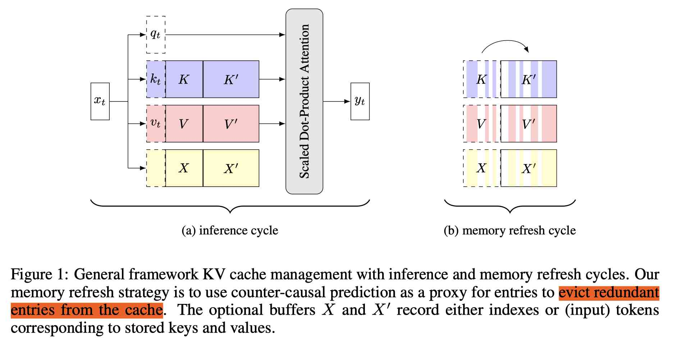

# Back from the Future: Key-Value Cache Management by Counter-Causal Surprise

> Stephen Gould, Anton van den Hengel

> 注：以下论文笔记由 AI Agent 自动生成，可能存在理解偏差或遗漏，请以原论文为准。

## Abstract

KV Cache 会随上下文和生成长度线性增长，长期解码时容易耗尽 GPU 内存。本文提出 counter-causal surprise 淘汰策略：让每个历史 token 只关注其未来上下文，评估它能否被后续 token 预测。容易被预测的 token 被视为冗余并淘汰，难以预测的 token 被保留。该方法无需训练，直接复用已有 KV；同时提出只在最后一层执行的快速近似版本，在较小精度代价下显著降低刷新成本。

## 一句话总结

用“未来上下文能否解释过去 token”的反事实预测难度衡量 KV 信息价值，避免传统 attention heavy-hitter 淘汰中的自强化偏差。

## 创新点

1. **Counter-causal surprise**：在原 token 顺序上复用缓存的 K/V，使用 upper-triangular attention mask，使位置 $i$ 只能看到未来 token；其预测 surprisal 直接反映该 token 是否包含后续上下文无法替代的独特信息。
2. **无训练、与实际 cache 对齐**：评分来自当前模型、当前输入和实际 KV 内容，不依赖额外 scorer 训练；相比累计 attention，更不容易因已保留 token 获得更多注意力而形成 self-reinforcing bias。
3. **Fast single-layer approximation**：完整方法每次刷新约为 $O(Ln^2)$；快速版本只执行最后一层，将成本降为 $O(n^2)$，并保留少量中间层激活作为辅助缓存。
4. **覆盖 prefill 与长 decode**：支持 prefill-end refresh 和每 $h$ 个 token 的 chunked refresh，可用于短答案、长文本、多跳检索和 reasoning-mode generation。

## 带来什么提升

1. 在 Qwen2.5-7B、cache size 512 的 RTX 4090 实验中，完整 counter-causal 刷新延迟为 **54 ms**（$n=512$）和 **496 ms**（$n=4096$）；快速版本为 **7.9 ms** 和 **52.6 ms**，达到约 **7--9 倍**刷新加速。
2. MATH500 上，完整方法在 Qwen2.5-3B/7B/14B 达到 **60.2%/74.4%/75.8%**，在 Llama-3.1-8B 达到 **48.2%**；除 Qwen2.5-7B 外均为测试淘汰方法最佳或接近 full-cache，快速版本在 7B 上为 **73.6%**。
3. 在 Qwen3-8B thinking mode、cache 仅保留 25% 且最多 16K 输出时，counter-causal 达到 **36.7%** AIME 准确率，是各淘汰方法中最高，较好保持 reasoning chain 连贯性。
4. 代价是完整方法需要额外 $O(Ln^2)$ 计算和中间激活；快速版本在 Qwen2.5-7B 上峰值显存约 **15.6 GB**，略高于无淘汰基线的 15.4 GB，并且 token-level scoring 可能低估短语级关键信息。

## 备注

- 代码仓库：`https://github.com/metacognitionai/counter_causal`。
- 论文实验显示 H2O 在部分任务上会因 heavy-hitter 自强化而丢失低频但关键事实；counter-causal 通过预测性信息量缓解该问题，但并非精确计算真实的 $P(x_i\mid x_{i+1:t})$。
