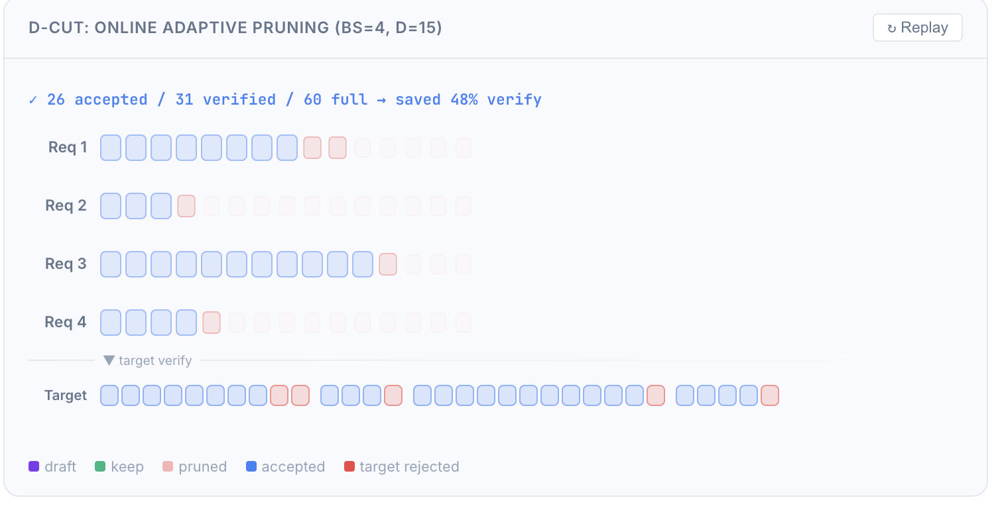

# D-Cut: Adaptive Verification Depth Pruning for Speculative Decoding

## 核心思想

D-Cut 是针对 DFlash（基于 diffusion 的投机解码）的动态剪枝优化。核心问题：DFlash 在高 batch size 下验证开销膨胀（bs=64 时 full verify 比 25% 剪枝慢 2.42×），导致投机解码退化。

## 创新点

1. **Draft Confidence 作为筛选信号**
   - 定义 prefix product score：$s_{i,k} = \prod_{t=1}^{k-1} c_{i,t}$，估计"前 k 个位置全部被接受"的概率
   - 基于此做 batch 内全局 top-K 分配（而非逐请求独立截断）
   - 相同预算下，全局 top-K 比 per-request 均匀截断多接受 20-25% 的 token

2. **硬件驱动的 Cost Model**
   - Dense 模型（Qwen3-8B）verify cost 近似 O(N)，裁剪收益大
   - MoE 模型（Qwen3.5-35B-A3B）cost 增长平缓（1.13×），更偏 memory-bound
   - Server 启动时实测 cost table，用数据而非假设做决策

3. **CUDA Graph Bucket 方案**
   - Verify 深度离散化为 4 个 ratio bucket（25%/50%/75%/100%）
   - 每个对应预 capture 的 CUDA graph shape，避免 graph miss
   - 实际不同 bs 的 ratio 存在 overlap，几乎不增加额外 capture

## 带来的提升

1. **高 batch size 下投机解码不再退化**
   - DFlash-B16 在 bs=64 时仅 0.42× AR；D-Cut-B16 提升至 0.81×
   - D-Cut-B8 在 bs=64 达 0.92×（接近 AR），bs=16 时 1.59×

2. **跨模型全面超越 baseline**
   - Dense 8B（Qwen3-8B）：D-Cut 几何均值 1.39-1.51× vs EAGLE-3 的 1.26×
   - MoE（Qwen3.5-35B-A3B）：D-Cut 全面超越 MTP
   - 无需修改 target model、无需额外训练

3. **在线自适应，启动仅需 ~30s profiling**
   - 离线：启动时 profiling cost table C(bs, ρ)
   - 在线：每步 Draft → 算 score → 全局排序选 bucket → 按 keep depth 送 verify

## 实验配置

- 硬件：H20 GPU
- 框架：vLLM 0.20.2
- 温度：0（贪心解码）
- 稳态条件：active_bs ≥ 85%
- 测试模型：Qwen3-8B (Dense TP1)、Qwen3.5-27B (Dense TP4)、Qwen3.5-35B-A3B (MoE TP2)、Qwen3.5-122B-A10B (MoE TP8)
