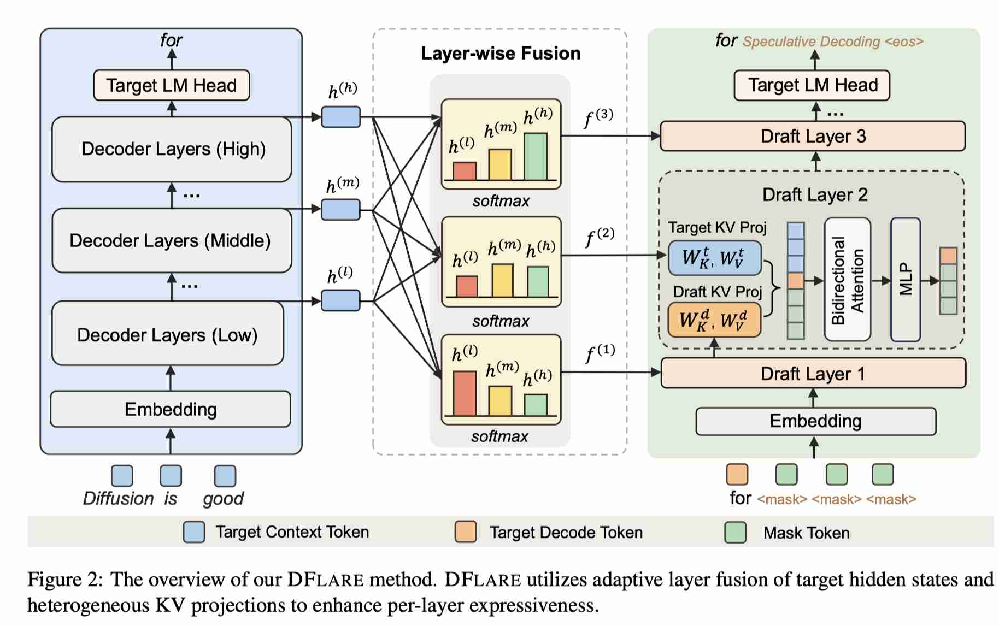

# DFlare: Scaling Up Draft Capacity for Block Diffusion Speculative Decoding

> Jiebin Zhang, Zhenghan Yu, Song Liu, Eugene J. Yu, Zheng Li, Dawei Zhu, Jiangshan Duo, Weimin Xiong, Yifan Song, Guanghua Yu, Jianchen Zhu, Sujian Li

> 注：以下论文笔记由 AI Agent 自动生成，可能存在理解偏差或遗漏，请以原论文为准。

## Abstract

Block diffusion speculative decoding 通过并行预测一个 block 内的 token，再由目标模型统一验证来加速 LLM 推理。DFlash 让所有 draft layer 共享由少数 target layer 融合出的同一个表示，限制了层间表达能力，也使 draft 深度扩展很快饱和。DFlare 引入轻量的 layer-wise fusion：每个 draft layer 学习 target 多层 hidden states 的独立组合，从而同时获得更丰富的目标知识和差异化输入；同时采用异构 KV 投影与渐进式位置加权损失，并将训练数据从 800K 扩展到 2.4M。六个数学、代码和对话 benchmark 上，DFlare 在 Qwen3-4B、Qwen3-8B 和 GPT-OSS-20B 的平均 wall-clock speedup 分别达到 5.52×、5.46× 和 3.91×，相对 DFlash 提升约 11%、8% 和 5%。代码见 https://github.com/Tencent/AngelSlim。

## 一句话总结

DFlare 把 DFlash 的共享 target conditioning 改成按 draft layer 定制的多层融合，并配合异构 KV 投影和渐进式损失，让 block-diffusion drafter 能继续扩展深度、数据和目标模型规模。

## 创新点

1. **Adaptive Layer Fusion**：为每个 draft layer 学习独立的 softmax 融合权重，对多个 target hidden states 做加权和；例如 7 个 draft layer、9 个 target layer 仅引入 63 个标量参数，推理时可预计算，额外开销近乎为零。
2. **Heterogeneous KV Projections**：target context 使用独立的 $W_K^t/W_V^t$，draft decode token 与 masked positions 使用 $W_K^d/W_V^d$，避免两种语义不同的表示被迫共享 KV 投影空间。
3. **Progressive Position-Weighted Loss**：训练早期用较小衰减参数优先学习 block 前部的高价值位置，再线性增大衰减参数，逐步覆盖更难的尾部位置。
4. **联合扩展 draft capacity**：在 7 层 draft、block size 16 和 9 个 target layer 的配置下，将训练数据由 800K 扩展到 2.4M，使 layer-wise capacity 真正得到训练信号支撑。

## 带来什么提升

1. 相比 DFlash，greedy decoding 下 Qwen3-4B、Qwen3-8B、GPT-OSS-20B 的平均 acceptance length 分别提升 15.5%、14.7%、5.8%，平均 wall-clock speedup 分别为 5.52×、5.46×、3.91×。
2. 相对 DFlash 的 speedup 提升约 10.6%、8.1% 和 5.4%；在 stochastic decoding 下仍保持清晰优势，三个目标模型的平均 acceptance length 增益约为 10.9%、11.3% 和 3.9%。
3. DFlare 的 acceptance length 和 speedup 随 draft layer 从 5 增加到 7 持续提升；target hidden layer 从 5 增加到 9 也呈单调收益，而 DFlash 在 7 层之后基本饱和。
4. 在 Qwen3-8B 的 SGLang/H20 serving 测试中，concurrency=32 时 GSM8K 吞吐达到 1,809.3 tokens/s、HumanEval 达到 1,796.9 tokens/s，明显高于 DFlash 的 1,068.6 和 1,149.9 tokens/s。

## 备注

- 论文的基线是 DFlash；DFlare 的核心增益来自“更强的 per-layer expressiveness”，而不是简单增加 draft layer 数量。
- 训练成本较高：完整 2.4M 样本训练使用 32 张 GPU，Qwen3-8B draft 约需 160 GPU-hours；论文尚未探索更大规模训练数据。
- 代码仓库为 AngelSlim；依赖包括 PyTorch 2.9.1、Transformers 4.57.1、SGLang 0.5.6 等。
