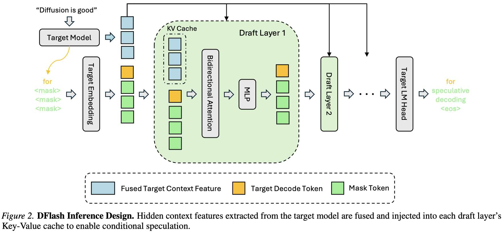

# DFlash: Block Diffusion for Flash Speculative Decoding

> Jian Chen, Yesheng Liang, Zhijian Liu

> UC San Diego (Z Lab)

> 注：以下论文笔记由 AI Agent 自动生成，可能存在理解偏差或遗漏，请以原论文为准。

## Abstract

自回归 LLM 推理存在固有的串行解码瓶颈。投机解码（speculative decoding）通过轻量 draft 模型并行提议 token 来缓解此问题，但现有方法（如 EAGLE-3）仍依赖自回归 drafting，本质上是串行的，加速上限约 2-3×。扩散语言模型（dLLM）可并行生成，但质量通常不如自回归模型。本文提出 DFlash，一个使用轻量 block diffusion 模型进行并行 drafting 的投机解码框架。通过单次前向传播生成 draft token，并利用目标模型的隐藏特征作为条件，DFlash 实现了高质量 drafting 和更高接受率。实验表明 DFlash 在多种模型和任务上实现超过 6× 无损加速，比 EAGLE-3 高出 2.5×。

## 一句话总结

DFlash 用 block diffusion 替代自回归 draft 模型做投机解码的并行 drafting，通过 KV 注入目标模型特征实现高质量条件生成，单次前向传播完成 drafting，在 Qwen3-8B 上实现 6× 加速，比 EAGLE-3 快 2.5×。

## 背景与问题

### 投机解码的核心矛盾

投机解码的加速公式：`η = L_target / (T_draft + T_verify / τ)`

其中 T_draft 是 drafting 耗时，τ 是期望接受长度。加速的关键是：**降低 T_draft** 或 **提高 τ**。

自回归 draft 模型（如 EAGLE-3）的困境：
- T_draft = γ · t_step（γ 个 token 需要 γ 次前向传播，**线性增长**）
- 为控制延迟，draft 模型必须非常浅（如单层 transformer），限制了模型容量
- 增加 γ 会增加 drafting 成本，但 τ 因容量不足很快饱和
- 实际加速天花板约 2-3×

### 扩散模型的潜力与困境

Block diffusion 可以**单次前向传播**并行生成 γ 个 token：T_draft = t_parallel ≪ γ · t_step。

但直接用小型扩散模型做 drafter（如 PARD）效果不好：
- 没有目标模型的上下文指导 → draft 质量差 → 接受长度有限
- 加速天花板约 3×

## 核心方法

### 核心洞察：The Target Knows Best

大型自回归模型的隐藏特征隐式编码了未来 token 的信息。DFlash 利用这些特征作为条件，让 draft 模型成为目标模型的"扩散适配器"。

### 推理流程（Figure 2）

1. **目标模型 prefill**：处理输入 prompt，生成第一个 token
2. **提取隐藏特征**：从目标模型的 5 个均匀采样层提取 hidden states
3. **特征融合**：拼接后通过轻量投影层融合为紧凑的 target context feature
4. **KV 注入**：将融合特征注入 draft 模型每一层的 Key 和 Value 投影中（存入 draft 模型的 KV cache）
5. **并行 drafting**：block diffusion 单次前向传播生成 γ 个 draft token
6. **验证**：目标模型并行验证所有 draft token

### 关键设计：KV 注入 vs 输入拼接

- **EAGLE-3 的做法**：将目标模型特征与 draft token embedding 拼接，仅作为 draft 模型的输入。随着 draft 模型加深，目标信息被稀释 → 增加层数收益递减。
- **DFlash 的做法**：将 target context feature 注入每一层的 KV cache，提供**持久、强条件信号**。这使得接受长度能随 draft 层数有效增长。

### 训练策略

1. **KV 注入训练**：干净序列通过目标模型提取特征，注入 draft 模型 KV
2. **随机 anchor 采样**：从 response 中随机采样 anchor token 作为 block 起点，mask 后续位置。匹配推理时行为（目标模型产生的 bonus token 作为 anchor）
3. **稀疏注意力**：block 内双向注意力 + 到 target context 的注意力，block 间不交叉。用 Flex Attention 高效实现
4. **指数衰减损失权重**：block 内早期位置更重要（错误会级联），权重 wk = exp(-(k-1)/γ)
5. **共享 embedding 和 LM head**：draft 模型与目标模型共享 embedding 层和 LM head（冻结），仅训练 draft transformer 层

## 技术细节

### Draft 模型配置

- Qwen3-4B/8B：5 层 draft 模型，block size 16
- Qwen3-Coder-30B-A3B：8 层 draft 模型
- LLaMA-3.1-8B：block size 10
- 特征提取：从目标模型的 5 个均匀采样层（第 2 层到倒数第 3 层）

### 训练数据

约 800K 样本，来自 NVIDIA Nemotron Post-Training Dataset V2 和 CodeAlpaca。使用目标模型生成的 response（而非原始数据集）以实现更好的目标对齐。

### Drafting 延迟对比

- EAGLE-3（1 层）：生成 16 个 token 约 10ms
- DFlash（5 层）：生成 16 个 token 约 8ms（更快且更深）
- DFlash 的并行性使得可以用更深的模型而不需要更多时间

## 实验设置

### 模型

- Qwen3-4B, Qwen3-8B（thinking mode disabled/enabled）
- Qwen3-Coder-30B-A3B-Instruct
- LLaMA-3.1-8B-Instruct

### 评估任务

| 类别 | 任务 |
|------|------|
| Math | GSM8K, MATH-500, AIME25 |
| Code | HumanEval, MBPP, LiveCodeBench |
| Chat | MT-Bench, Alpaca |

### 硬件

- NVIDIA H200（主要评估）
- NVIDIA B200（SGLang 评估）

### 基线

- Autoregressive decoding（baseline）
- EAGLE-3（tree size 16 和 60）

## 主要结果

### Transformers 后端（Qwen3，thinking mode off，greedy）

| 模型 | 方法 | 平均加速 | 平均 τ |
|------|------|---------|--------|
| Qwen3-4B | EAGLE-3 (16) | 1.84× | 3.05 |
| Qwen3-4B | EAGLE-3 (60) | 2.08× | 3.48 |
| Qwen3-4B | **DFlash (16)** | **4.91×** | **6.54** |
| Qwen3-8B | EAGLE-3 (16) | 1.76× | 2.96 |
| Qwen3-8B | EAGLE-3 (60) | 2.02× | 3.40 |
| Qwen3-8B | **DFlash (16)** | **4.86×** | **6.49** |

DFlash 在相同 draft budget（16 tokens）下，比 EAGLE-3 快约 **2.5×**，接受长度翻倍。

### Reasoning 模型（thinking mode enabled）

- Qwen3-4B：4.23×-4.59× 加速（greedy）
- Qwen3-8B：4.17×-4.64× 加速（greedy）
- 对长 CoT 推理场景价值显著

### SGLang 生产级评估（B200，FA4 后端）

| 模型 | 并发 1 | 并发 8 | 并发 32 |
|------|--------|--------|---------|
| Qwen3-4B Math500 | 4.8× | 4.1× | 2.9× |
| Qwen3-8B Math500 | 5.1× | 4.5× | 2.8× |
| Qwen3-Coder-30B HumanEval | 3.5× | 3.2× | 3.1× |

高并发下加速有所下降但仍稳定，验证了实际 serving 场景的实用性。

### LLaMA-3.1-8B 对比

在 SGLang 上，DFlash（block size 10）持续优于 EAGLE-3：
- DFlash 在 concurrency=1 时 2.4-2.8×，EAGLE-3 (10) 仅 1.5-2.0×
- EAGLE-3 (60) 在高并发下性能崩溃（0.6-0.9×），DFlash 仍保持 1.6-1.8×

## 优点与局限

### 优点

1. **范式创新**：首次证明 block diffusion 是 speculative decoding 的理想 drafter 形态——并行生成 + 高质量条件生成
2. **KV 注入机制**：比输入拼接更有效地传递目标模型信息，接受长度随层数线性增长
3. **延迟-质量 Pareto 最优**：5 层 DFlash 比 1 层 EAGLE-3 更快且接受率更高
4. **实际可用**：已在 SGLang 上集成评估，支持多种模型和并发级别
5. **训练高效**：共享 embedding/LM head，仅训练 draft transformer 层；随机 anchor 采样提供有效数据增强

### 局限

1. **需要训练 draft 模型**：每个目标模型需要单独训练对应的 DFlash draft 模型
2. **Block size 固定**：当前 block size 是超参数，未实现自适应调整
3. **仅与 EAGLE-3 对比**：论文提到其他 dLLM-based 方法（DiffuSpec、SpecDiff-2 等）因缺乏开源实现未纳入对比
4. **Temperature 敏感**：temperature=1 时加速有所下降（从 4.9× 降到 4.1×）
5. **长上下文场景未充分评估**：主要在标准 benchmark 上评估，长上下文/长生成场景的表现有待验证

## 与 EfficientPaper 主题的关系

本文属于 **投机解码**（speculative_decoding）方向，但引入了一个全新的 drafting 范式：

1. **突破自回归 drafting 瓶颈**：现有投机解码方法（EAGLE 系列、Medusa 等）都受限于自回归 drafting 的串行性，DFlash 用扩散模型打破了这一限制
2. **扩散模型 × 推理加速的交叉点**：将 dLLM 的并行生成能力与投机解码的无损验证结合，为扩散语言模型找到了一个实际高价值的应用场景
3. **与 serving 系统的集成**：在 SGLang 上验证，展示了与现有推理框架的兼容性

## 可复现/实现要点

1. **代码**：https://github.com/z-lab/dflash
2. **模型**：Hugging Face 上有预训练的 draft 模型（如 z-lab/Qwen3.5-35B-A3B-DFlash）
3. **Draft 模型架构**：标准 transformer，block 内双向注意力 + causal cross-block mask
4. **特征提取**：从目标模型 5 个均匀采样层提取 hidden states，拼接后线性投影
5. **训练数据**：800K 样本，使用目标模型生成的 response
6. **推理框架**：支持 Transformers 后端和 SGLang（FA4 + Spec-v2 scheduling）

## 个人备注

### 开放问题

1. DFlash 能否与 KV cache 压缩/稀疏化结合？draft 模型的 KV cache 管理开销如何？
2. 自适应 block size：根据生成难度动态调整 block 大小？
3. 多目标模型共享 draft 模型的可能性？
4. 在长上下文场景（100K+ tokens）中，特征提取的开销是否成为瓶颈？
5. 与 EAGLE-4 或其他下一代自回归 drafting 方法的对比？

### 延伸阅读

- EAGLE-3 (Li et al., 2025b)：当前 SOTA 自回归投机解码
- LLaDA (Nie et al., 2025)：大规模扩散语言模型
- Fast-dLLM v2 / SDAR：block diffusion 的自回归适配
