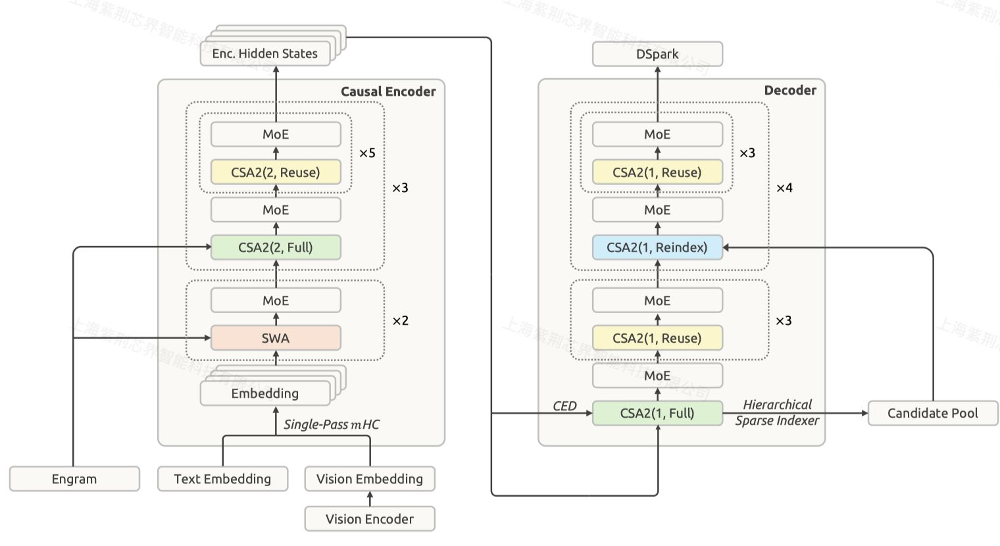

# DeepSeek-V4.1-Flash: Pushing the Limits of KV Cache Compression

> DeepSeek-AI

> 注：以下论文笔记由 AI Agent 自动生成，可能存在理解偏差或遗漏，请以原技术报告为准。

## Abstract

DeepSeek-V4.1-Flash 是一个支持最多 1M token 上下文的多模态 Mixture-of-Experts 模型，骨干参数量为 552B。报告围绕长上下文 agent 的 prefill 计算、KV cache 容量和缓存迁移带宽进行联合优化：CED 使每 token 的 prefill/decode 激活参数分别为 8B/16B；CSA2 的跨层 KV、索引和 Top-K 复用结合 FP4 主 KV cache，将常驻 HBM 的 global KV 压缩到 890 bytes/token，约为 DeepSeek-V4-Flash 的 1/4；SWA Bounded Replay 又将持久化 KV cache 压缩到约 1/8。模型使用 45T token 多模态语料训练，并在文本、多模态和 agentic 场景进行后训练与评测。

## 一句话总结

V4.1-Flash 把模型架构、稀疏注意力、KV 精度和缓存部署策略共同设计，使百万上下文 agent 在较低 prefill、KV 存储和 serving 成本下保持接近更大模型的能力。

## 创新点

1. **Causal Encoder-Decoder（CED）**：将前 20 层作为 causal encoder，decoder 的 global KV 从 encoder 最终 hidden states 投影得到，长序列 prefill 复杂度近似从 $O(NL)$ 降到 $O(NL/2)$；decoder 仍保留逐层生成的 SWA KV。
2. **Compressed Sparse Attention 2（CSA2）**：每层静态选择 Full、Reindex、Reuse 三种模式，在层维度同时复用 main KV、indexer K 和 Top-K indices；decoder 额外使用 Hierarchical Sparse Indexer，将后续索引限制在首个 Full 层构造的候选池内。
3. **端到端 KV lifecycle co-design**：global KV 使用 FP4（E2M1，每 16 channel 一个 E4M3 scale），SWA KV 保留 FP8；SWA 不再进入长生命周期持久化缓存，缺失时只 replay 最近 $n_{win}$ token 近似恢复。
4. **面向生产推理的结构扩展**：Single-Pass mHC 配合 Mega-mHC kernel 将 activation memory traffic 相对原四 kernel 实现减半；集成 Engram conditional memory 与 DSpark 半自回归 speculative decoding，并用 confidence head 和 throughput curve 动态决定 verification length。
5. **训练与数据基础设施协同**：从 64K 序列长度直接训练原生稀疏 attention，不经过 dense warmup；以 45T 多模态 token、共享 attention state、通信-计算 overlap 和大规模 agent rollout 支撑模型能力与部署效率。

## 带来什么提升

1. **KV 容量显著下降**：global KV 常驻 HBM 为 890 bytes/token，约为 DeepSeek-V4-Flash 的 1/4；persistent KV cache 约为其 1/8，并据报告相对 DeepSeek-V1 实现约 437 倍的 per-token global KV 缩减。
2. **长上下文 decode 更稳定**：上下文从 4K 扩展到 1M（256 倍）时，单 token decode FLOPs 仅增加约 1/4，接近保持常数；CED 同时将 prefill 激活参数降至 8B，适合输入密集型 agent workflow。
3. **能力/参数效率更高**：V4.1-Flash-Base 仅使用 8B/16B 激活参数，却在多数知识、推理和代码评测上接近 V4-Pro-Base；报告称 held-out 评测提升约 5%–10%，总参数约为其 1/3、激活参数约为 1/4。
4. **代表性评测结果**：HumanEval Pass@1 为 79.4，BigCodeBench Pass@1 为 60.6，GSM8K 为 93.0，MMLU-Pro 为 74.1，LongBench-V2 为 45.2；多模态 MMMU-Pro 为 56.5、CVBench 为 77.9、DocVQA 为 95.6。
5. **缓存 miss 的代价更可控**：SWA Bounded Replay 用最近窗口重算替代完整 $L\times n_{win}$ replay，报告称质量损失可忽略，同时释放 SSD/host memory；CSA2 Reuse Mode 层在 prefill/decode 分别只需 15/11 个 kernel。

## 备注

- 这是 HuggingFace 发布的技术报告，不是 arXiv 条目；官方模型 checkpoint 与报告位于同一模型仓库。
- 报告明确指出 CSA2 的选择错误和 Bounded Replay 的近似状态恢复仍可能在未覆盖的极端边界条件下造成能力下降，尤其需要继续测试长上下文 sparse retrieval 与 cache-resumption boundary。
- 对 EfficientPaper 的研究价值主要集中在：跨层稀疏 KV、FP4 cache、短 TTL SWA state、global KV 长期保留，以及 cache compression、recompute 和 prefill/decode cost 的统一建模。
