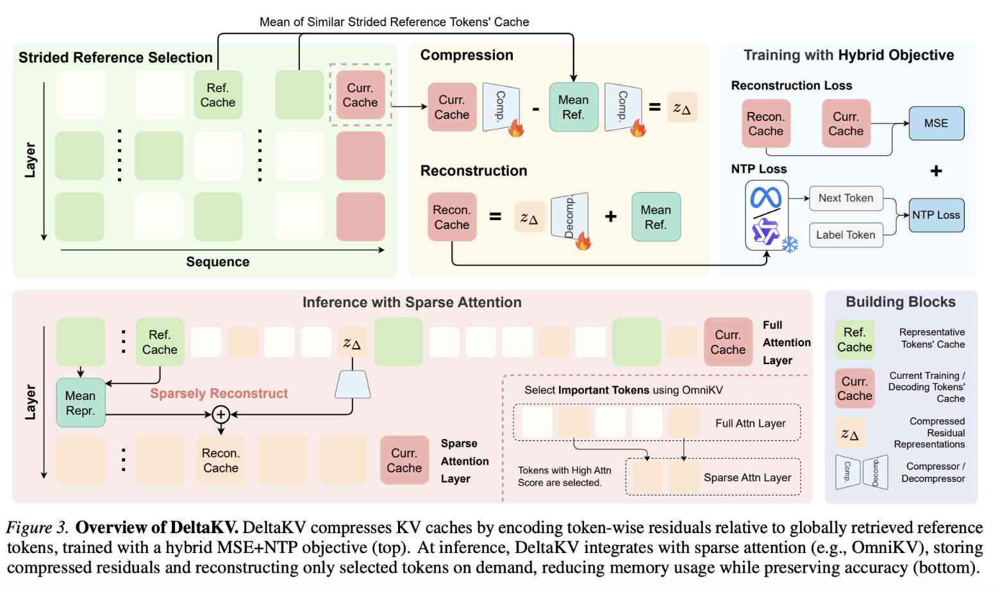

# DeltaKV: Residual-Based KV Cache Compression via Long-Range Similarity

> Jitai Hao, Qiang Huang, Yaowei Wang, Min Zhang, Jun Yu

> 注：以下论文笔记由 AI Agent 自动生成，可能存在理解偏差或遗漏，请以原论文为准。

## Abstract

The deployment of efficient long-context LLMs in applications like autonomous agents, long-chain reasoning, and creative writing is fundamentally bottlenecked by the linear growth of KV cache memory. Existing compression and eviction methods often struggle to balance accuracy, compression ratio, and hardware efficiency. We propose DeltaKV, a residual-based KV cache compression framework motivated by two empirical findings: long-range inter-token similarity and highly shared latent components in KV representations. Instead of discarding tokens, DeltaKV encodes semantic residuals relative to retrieved historical references, preserving fidelity while substantially reducing storage. To translate compression gains into real system speedups, we further introduce Sparse-vLLM, a high-performance inference engine with decoupled memory management and kernels optimized for sparse and irregular KV layouts. Experiments show that DeltaKV reduces KV cache memory to 29\% of the original while maintaining near-lossless accuracy on LongBench, SCBench, and AIME. When integrated with Sparse-vLLM, it achieves up to 2$\times$ throughput improvement over vLLM in long-context scenarios, demonstrating a practical path toward scalable long-context LLM deployment. Code, model checkpoints, and datasets are available at https://github.com/CURRENTF/Sparse-vLLM.

## 一句话总结

DeltaKV 是一个面向长上下文 LLM 推理的 KV cache 压缩框架：它不直接丢 token，也不只做局部聚类，而是从全局历史中找相似参考 token，存储当前 KV 相对参考 KV 的低维 residual，并在 Sparse-vLLM 中按 sparse attention 需要选择性重建，从而把 KV cache 内存降到原始的约 29\%，同时在长上下文场景下取得最高约 2$\times$ decoding throughput 提升。

## 背景与问题

长上下文 LLM 的推理成本主要有两个瓶颈：prefill 阶段 attention 计算随上下文长度近似二次增长，decode 阶段 KV cache 显存随序列长度线性增长。论文以 Llama-3.1-8B-Instruct 为例指出，128K 上下文、batch size 为 8 时，KV cache 可超过 130GB，单卡无法容纳。

现有方法大致分为三类：

1. **静态 eviction / pruning**：例如 SnapKV、PyramidKV、AdaKV，根据 attention score 或层/头预算丢弃 token。问题是多轮对话和复杂推理中，早期看似不重要的 token 之后可能再次变关键。
2. **动态 sparse attention**：例如 Quest、OmniKV，根据当前 query 选择 token 参与 attention。它们能减少计算，但往往仍要保留完整 KV cache，因此不能根本降低显存。
3. **KV compression / clustering**：例如 CacheGen、Chelsea、PQCache、Lexico、Palu 等。问题在于局部相似性假设、复杂 codebook 或 CPU/host-side 数据结构会带来 GPU 不友好的访问模式和系统集成开销。

DeltaKV 的出发点是：如果 KV cache 中存在跨长距离的冗余共享成分，那么压缩目标不应只是“找哪些 token 可以删”，而应改为“用少量参考 token 表达共享成分，只保存每个 token 的差异量”。

## 核心观察

论文的经验分析给出两个关键观察。

### 1. 长距离 token 间相似性

自然语言中的 token 冗余并不局限在局部邻域。论文发现，一个 token 在 KV 表示空间里的最相似历史 token 经常位于很远的位置；超过 60\% 的最相似 token 距离大于 16。这意味着只在局部窗口内做 KV 合并或 residual coding 会错过大量全局相似性。

### 2. KV 表示中存在高度共享的 latent components

原始 KV cache 具有明显 anisotropy：少数高范数 latent directions 承载了跨大量 token 共享的语言/结构信息。通过减去相似历史参考后，残差 KV 的谱更平坦、范数更小、数值分布更集中在 0 附近。这个性质使 residual 更适合低维编码与进一步量化。

这两个观察共同支持 DeltaKV 的基本判断：KV cache 的大部分容量消耗在共享结构上，真正 token-specific 的信息是低能量、低幅值且更容易压缩的 residual。

## 核心方法

DeltaKV 将 KV cache 分为两部分：

- 少量未压缩的 **reference tokens**；
- 大量以 residual code 形式存储的 **compressed tokens**。

对当前 token $i$，令 $kv_i$ 表示该 token across heads 拼接后的 key-value 状态。DeltaKV 维护一个按 stride $s$ 采样的 reference set：

$$
T = \{ kv_t \mid t \bmod s = 0,\ t < i \}.
$$

在压缩 token $i$ 时，从 $T$ 中检索 $k$ 个最近邻参考 token：

$$
R_i = \operatorname{arg\ topk}_{kv_j \in T}\left(-\lVert kv_i - kv_j \rVert_2^2\right).
$$

然后计算参考表示均值：

$$
KV_R = \frac{1}{k}\sum_{j \in R_i} kv_j.
$$

DeltaKV 不直接压缩 $kv_i$，而是先分别把当前 KV 和参考均值映射到低维空间，再保存二者差值：

$$
z_{\Delta} = f_c(KV) - f_c(KV_R),
$$

其中 $f_c: \mathbb{R}^{2d_k} \rightarrow \mathbb{R}^{d_c}$ 是轻量 compressor。重建时通过 decompressor $f_d$ 得到 residual，再加回 reference：

$$
\widehat{KV}_{\Delta} = f_d(z_{\Delta}), \qquad
\widehat{KV}_i = \widehat{KV}_{\Delta} + KV_R.
$$

一个实现细节很重要：DeltaKV 在 **pre-RoPE** 的 key-value states 上操作，以避免位置编码破坏全局相似性，使 residual compressor 更具有长度泛化能力。

## 训练目标

如果只最小化 KV 重建误差，可能会压掉数值幅度小但对 attention / generation 关键的特征。因此 DeltaKV 使用 hybrid objective：

$$
\mathcal{L} = \sum \lVert KV - \widehat{KV} \rVert_2^2 + \mathcal{L}_{\mathrm{ntp}}(\theta, \phi),
$$

其中 $\theta$ 是冻结的 LLM 参数，$\phi$ 是 DeltaKV 的可学习模块参数，$\mathcal{L}_{\mathrm{ntp}}$ 是 next-token prediction loss。论文的 ablation 显示，MSE-only 能降低 NTP loss，但 NTP-only 不一定降低 MSE；二者结合效果最好。

训练开销相对较低：标准 7B/8B 模型只需约 160M tokens，单张 NVIDIA RTX PRO 6000 上约 8 GPU hours。

## 推理与 Sparse-vLLM 系统

DeltaKV 与 OmniKV 这类 dynamic sparse attention 方法配合使用。OmniKV 在少数 filter layers 中用 full KV cache 计算全局 attention scores，其他 sparse layers 只对选中的 KV tokens 做 attention。

DeltaKV 的关键系统优势是 **selective decompression**：

- filter layers 不压缩，以避免全量重建开销；
- sparse layers 中只重建 sparse attention mask 选中的 KV pairs；
- 未被当前 query 访问的 compressed KV 不需要解压，减少 memory I/O 和 compute。

为把算法收益转化为真实吞吐，论文实现了 Sparse-vLLM。它的设计重点包括：

1. **Modular CacheManager**：解耦物理内存分配与 logical-to-physical mapping，支持 sparse/irregular KV layout。
2. **Sparse Controller**：在 forward 前构造 sparse view，在 forward 后管理 KV lifecycle。
3. **Kernel execution**：复用 LightLLM 的 token-level Triton attention operator 处理非连续内存，并把 attention score extraction 融合到 Triton kernel，避免 PyTorch 级重复计算。

这部分贡献很关键，因为很多 KV compression / sparsity 论文只报告理论或离线指标，缺少可落地 inference engine。DeltaKV 明确把 layout、lifecycle、kernel 与 compression 共同设计。

## 实验设置

论文在以下模型上评估：

- Llama-3.1-8B-Instruct；
- Qwen2.5-7B-Instruct-1M；
- Qwen2.5-32B-Instruct；
- DeepSeek-R1-Distill-Qwen-7B。

评测任务包括：

- LongBench：通用长上下文理解；
- SCBench：多轮对话与 retrieval KV 等任务；
- AIME：复杂数学推理。

对比方法分三类：

- static eviction：SnapKV、PyramidKV、AdaKV；
- dynamic sparsity：Quest、OmniKV；
- KV cache compression：Palu；同时论文在相关工作中讨论了 CacheGen、Chelsea、ClusterKV、PQCache、Lexico 等。

效率指标主要是：

- KR：KV Cache Keep Ratio；
- CR：KV Cache Compute Ratio；
- decoding throughput。

## 主要结果

### LongBench：近无损，同时显存更低

在 Llama-3.1-8B 上，Full Attention overall score 为 50.0。OmniKV 在 $CR=30\%$ 时 overall 为 50.2，但需要 $KR=100\%$，即保留完整 KV cache。DeltaKV 在 $KR=45\%, CR=30\%$ 时 overall 仍为 50.2；进一步 4-bit 量化 compressed KV 后，$KR$ 降到 29\%，overall 仍为 50.3。

这说明 DeltaKV 相比只做 sparse attention 的方法，多解决了显存问题；相比 static eviction，它在不永久丢失 token 信息的情况下保留了更好的质量。

### SCBench：多轮场景优于静态淘汰

SCBench 中 static eviction 的弱点非常明显。以 Llama-3.1-8B 的 Retrieval KV 任务为例，SnapKV 的 R.KV 分数从 full 的 79.0 降到 0.4，而 OmniKV 为 72.2，DeltaKV 为 58.0，DeltaKV$^{\dagger}$ 为 60.4。DeltaKV 仍有下降，但远好于静态丢弃，说明 residual compression 至少保留了部分未来可恢复的信息。

### AIME：复杂推理中保持较好质量

在 DeepSeek-Qwen-7B 的 AIME benchmark 上，Full 为 50.0，SnapKV 降到 33.3，OmniKV 为 46.7，DeltaKV 为 43.3。DeltaKV 低于 OmniKV，但明显优于静态 eviction；这是显存压缩与复杂推理质量之间的 trade-off。

### Sparse-vLLM：长上下文下真实吞吐提升

在单张 NVIDIA RTX PRO 6000 上，Sparse-vLLM 本身对 full attention 的 overhead 很小：128K context 下 vLLM 为 143.2 tokens/s，Sparse-vLLM full attention 为 135.0 tokens/s。

开启 DeltaKV 后，优势随上下文变长而增强：

- 128K：DeltaKV$^{\dagger}$ 达到 187.0 tokens/s；
- 256K：DeltaKV$^{\dagger}$ 为 120.6 tokens/s，而 vLLM full attention 为 70.2 tokens/s，约 1.7$\times$；
- 512K：DeltaKV$^{\dagger}$ 为 67.7 tokens/s，而 vLLM 为 33.1 tokens/s，约 2$\times$；
- 900K：DeltaKV$^{\dagger}$ 支持 batch size 2，吞吐 38.9 tokens/s，而 vLLM full attention batch size 1 为 18.6 tokens/s。

论文也坦诚指出，当前实现还没有 fully fused reconstruction-attention kernel；如果把重建和 attention 融合，仍有进一步加速空间。

## Ablation 与设计分析

1. **量化友好性**：compressed residual values 分布更均匀且集中在 0 附近，适合 token-wise quantization。使用 KIVI 风格量化进一步压缩 compressed KV 后仍基本近无损。
2. **短训长测**：compressor 只在 8,192 长度训练，却能泛化到 100K+ 上下文。论文认为原因是 pre-RoPE compression 让映射基本 position-invariant。
3. **模块消融**：去掉 compressor/decompressor 或去掉 reference tokens 都会明显降低 LongBench overall，说明 residual construction 和 learned compression 都不是可有可无的组件。
4. **reference stride trade-off**：stride 更小会带来更高精度，但 reference 存储与检索开销也会上升，吞吐下降。这暴露出 DeltaKV 的一个核心系统参数：reference density 应由质量-显存-吞吐 cost model 决定，而不是固定手调。

## 与 EfficientPaper 主题的关系

DeltaKV 属于 **KV cache management / KV cache compression / sparse attention runtime co-design**。它和 EfficientPaper 中已有方向的关系如下：

- 相比 SnapKV、PyramidKV、AdaKV：DeltaKV 不是永久性 eviction，而是 residual compression，可在需要时重建被压缩 token。
- 相比 Quest、OmniKV：DeltaKV 不只降低 attention compute，还降低 KV cache memory；但它通常需要和 sparse attention 结合，单独使用的系统收益有限。
- 相比 Chelsea / CacheGen：DeltaKV 强调全局长距离相似性，而不是局部相似或局部聚类。
- 相比 KV-CAT：KV-CAT 从训练模型本身提高 KV compressibility，DeltaKV 是后训练 compression module；两者可以视为 train-time compressibility 与 inference-time residual coding 的互补路线。
- 相比 OScaR / KIVI：量化主要降低 bitwidth，DeltaKV 先把 raw KV 变成 residual code，再进一步利用 residual 分布做量化。

因此它强化了一个趋势：KV cache 优化正在从单一“压缩率”问题，转变为 **reference selection + residual representation + sparse access + runtime memory layout + kernel fusion** 的联合设计问题。

## 优点与局限

### 优点

- **不直接丢 token**：相比 eviction，更适合多轮和复杂推理场景。
- **利用全局相似性**：突破局部窗口/邻近 token 相似性的限制。
- **与 sparse attention 兼容**：只重建当前需要的 KV，避免全量 decompression。
- **系统落地性强**：Sparse-vLLM 证明了稀疏/压缩 KV layout 可以转化为实际 throughput，而不只是理论内存节省。
- **量化友好**：residual code 分布集中，进一步 4-bit 量化效果好。

### 局限

- **仍依赖 learned compressor/decompressor**：需要额外训练，不是完全 plug-and-play；不同模型可能需要各自训练。
- **reference retrieval 有成本**：top-$k$ 检索、reference stride、reference set 存储都会影响吞吐和实现复杂度。
- **复杂推理仍有质量差距**：AIME 上 DeltaKV 低于 OmniKV，SCBench R.KV 也有明显下降。
- **filter layers 不压缩**：为了避免全量重建，部分层仍保留完整 KV，这限制了极限压缩率。
- **kernel 尚未完全融合**：当前 reconstruction 与 attention 仍有进一步 fusion 空间。

## 可复现/实现要点

如果实现 DeltaKV，关键点不是只写一个 autoencoder，而是要同时处理五件事：

1. 在 pre-RoPE KV states 上做 reference retrieval 和 residual coding；
2. 用 strided reference set 控制检索成本；
3. compressor/decompressor 采用 MSE + NTP hybrid objective 训练；
4. 推理时和 sparse attention mask 联动，只重建 selected tokens；
5. KV layout 必须支持 sparse/irregular access，否则压缩节省会被 defragmentation 和 memory movement 抵消。

代码仓库：<https://github.com/CURRENTF/Sparse-vLLM>

## 个人备注

DeltaKV 最有价值的地方不是“又一个 KV 压缩率数字”，而是把 KV compression 从 token eviction 推进到 **similarity-aware residual representation**。它和 Chelsea 代表的 token/KV clustering 方向有明显联系，但 DeltaKV 更像是在 cluster/reference 的基础上保存 residual，而不是把 cluster 内 token 合并成 centroid。

后续值得追踪的问题：

1. reference set 是否可以由 runtime cost model 自适应选择，而不是固定 stride；
2. residual compressor 是否能与 KV-CAT 这类 train-time compressibility 方法联合训练；
3. reconstruction-attention fusion 能否把 DeltaKV 的理论优势进一步转化为更高吞吐；
4. 对 agentic workload，多轮对话中 reference tokens 的生命周期是否应与 prompt cache / session cache 统一管理；
5. residual coding 是否可以与 Moment-KV / VECTOR 这类 temporal importance 或 reconstructability 信号结合，决定哪些 token retain、compress、approximate 或 evict。
