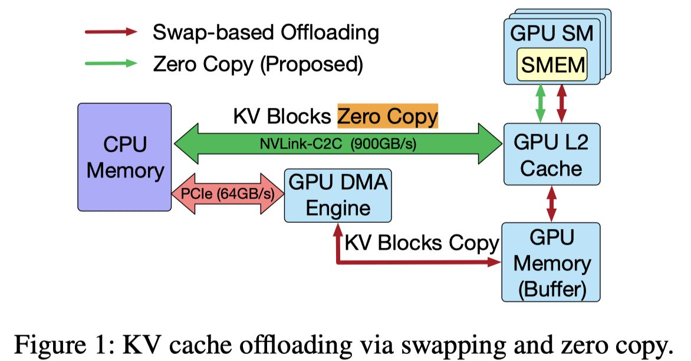

# No Buffer, No Bottleneck: Efficient Zero-Copy KV Cache Offloading for Long-Context LLMs

> Shutian Luo, Haiying Shen

> 注：以下论文笔记由 AI Agent 自动生成，可能存在理解偏差或遗漏，请以原论文为准。

## Abstract

DirectKV 面向 GH200/GB200 等高带宽 CPU–GPU superchip，将 CPU pinned memory 直接作为 KV Cache 存储层，让 GPU attention kernel 零拷贝访问 CPU-resident KV，消除 HBM staging buffer 和重复 CPU–GPU 搬运。

## 一句话总结

DirectKV 不是优化“把 KV 搬回 GPU”的策略，而是重写 attention 执行路径，让 CPU-resident KV 无需搬回 HBM 即可被 GPU 高效计算。

## 创新点

1. **零拷贝 KV offloading**：通过 `cudaHostAlloc` 分配 GPU 可寻址的 pinned host memory，KV 生成后常驻 CPU 内存，attention kernel 直接读取 device-visible pointer，彻底移除 GPU staging buffer。
2. **CPU-memory-aware tiling**：针对 naive zero-copy 重复跨互联读取和低 L2 locality 的问题，用 shared memory/register tiling 最大化每次远端 KV fetch 的片上复用，将瓶颈从 NVLink-C2C 转移到更高带宽的 GPU 内部存储层。
3. **Kernel-memory co-design**：融合 QKV projection 与 attention，使新生成 K/V 留在 shared memory 后立即参与计算；通过 warp-level pipeline 重叠 CPU KV fetch、attention compute 和 KV write-back。

## 带来什么提升

1. 在 NVIDIA GH200 上，相比现有 offloading 方案，CPU–GPU 传输量最高降低 **50%**，GPU 内存使用降低 **43%**；DirectKV 只使用约 47GB HBM，而其他 offloading 系统平均使用 74–88GB。
2. 在 Llama-3.1-8B、OPT-13B/30B 与 1K–32K 上下文测试中，平均端到端加速 **1.2×**；16K 时相对 Neo/Pie 约 **1.3×**、相对 FlexGen 约 **1.7×**，32K 时仍可运行，而 Neo、Pie、SGLang 已 OOM。
3. CPU-aware zero-copy 相比 naive zero-copy 将推理延迟最高降低 **70%**；融合 kernel 将 HBM throughput 提高最高 **3.5×**、单 token 延迟降低 **2.5–3.0×**。NVLink-C2C 相对 PCIe 将 attention 延迟最高降低 **4.2×**。

## 备注

- DirectKV 最适合 GH200/GB200 的 NVLink-C2C；在 PCIe-only 平台仍能节省 HBM，但吞吐收益受互联带宽限制。
- 它不替代 vLLM/SGLang 的 batching、prefix reuse 或 eviction policy，而是提供“KV 已位于 CPU 后如何直接计算”的 execution path，可作为现有分层 KV 管理器的底层内核。
