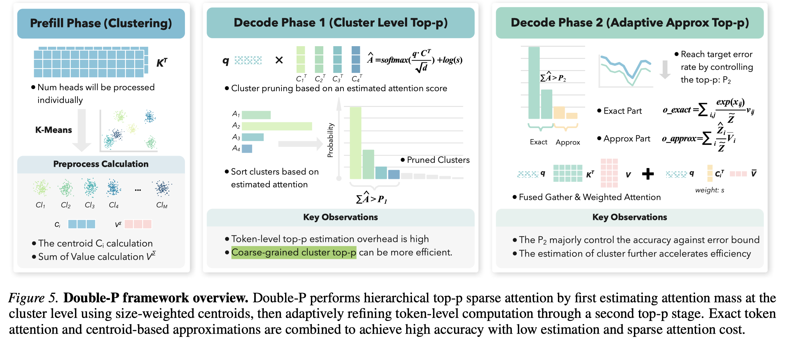

# Double-P: Hierarchical Top-P Sparse Attention for Long-Context LLMs

> Wentao Ni, Kangqi Zhang, Zhongming Yu, Oren Nelson, Mingu Lee, Hong Cai, Fatih Porikli, Jongryool Kim, Zhijian Liu, Jishen Zhao

## Abstract

As long-context inference becomes central to large language models (LLMs), attention over growing key-value caches emerges as a dominant decoding bottleneck, motivating sparse attention for scalable inference. Fixed-budget top-k sparse attention cannot adapt to heterogeneous attention distributions across heads and layers, whereas top-p sparse attention directly preserves attention mass and provides stronger accuracy guarantees. Existing top-p methods, however, fail to jointly optimize top-p accuracy, selection overhead, and sparse attention cost, which limits their overall efficiency. We present Double-P, a hierarchical sparse attention framework that optimizes all three stages. Double-P first performs coarse-grained top-p estimation at the cluster level using size-weighted centroids, then adaptively refines computation through a second top-p stage that allocates token-level attention only when needed. Across long-context benchmarks, Double-P consistently achieves near-zero accuracy drop, reducing attention computation overhead by up to 1.8x and delivers up to 1.3x end-to-end decoding speedup over state-of-the-art fixed-budget sparse attention methods.
