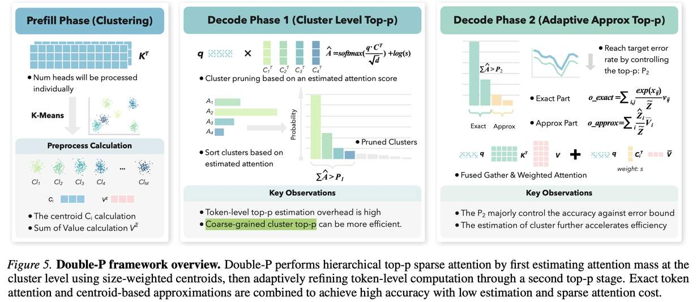

# Double-P: Hierarchical Top-P Sparse Attention for Long-Context LLMs

> Wentao Ni, Kangqi Zhang, Zhongming Yu, Oren Nelson, Mingu Lee, Hong Cai, Fatih Porikli, Jongryool Kim, Zhijian Liu, Jishen Zhao

> 注：以下论文笔记由 AI Agent 自动生成，可能存在理解偏差或遗漏，请以原论文为准。

## Abstract

As long-context inference becomes central to large language models (LLMs), attention over growing key-value caches emerges as a dominant decoding bottleneck, motivating sparse attention for scalable inference. Fixed-budget top-k sparse attention cannot adapt to heterogeneous attention distributions across heads and layers, whereas top-p sparse attention directly preserves attention mass and provides stronger accuracy guarantees. Existing top-p methods, however, fail to jointly optimize top-p accuracy, selection overhead, and sparse attention cost, which limits their overall efficiency. We present Double-P, a hierarchical sparse attention framework that optimizes all three stages. Double-P first performs coarse-grained top-p estimation at the cluster level using size-weighted centroids, then adaptively refines computation through a second top-p stage that allocates token-level attention only when needed. Across long-context benchmarks, Double-P consistently achieves near-zero accuracy drop, reducing attention computation overhead by up to 1.8× and delivers up to 1.3× end-to-end decoding speedup over state-of-the-art fixed-budget sparse attention methods.

## 一句话总结

Double-P 是一个分层 top-p 稀疏注意力框架，通过集群级和 token 级两阶段 top-p 选择，在长上下文 LLM 解码中实现近零精度损失、注意力计算开销减少 1.8×、端到端解码加速 1.3×，解决了固定预算 top-k 方法无法适应异构注意力分布的问题。

## 背景与问题

- **长上下文推理瓶颈**：随着上下文长度增长，注意力计算成为解码的主要瓶颈
- **固定预算 top-k 的局限**：
  - 无法适应注意力分布的异构性（不同 head、layer、step 的分布差异大）
  - 单一预算对某些 head 过于保守，对其他 head 又不足
  - 固定预算方法的精度损失不可控（Figure 2 显示 91.9% 的样本无法达到目标注意力质量）
- **现有 top-p 方法的局限**：
  - Token 级 top-p 估计开销高，随上下文长度线性增长
  - 集群级方法使用固定预算，无法提供 top-p 精度保证
  - 无法联合优化估计精度、选择开销和稀疏注意力成本

- **核心问题**：如何在长上下文 LLM 中实现高效、精确的稀疏注意力？

## 核心方法

### 1. 分层 Top-P 稀疏注意力框架

**核心思想**：利用现代稀疏注意力系统的分层结构，先在集群级估计注意力质量，再通过第二阶段自适应细化 token 级计算。

**两个阶段**：
1. **Stage 1: 集群级注意力分数估计**（粗粒度）
2. **Stage 2: 自适应 token 预算分配**（细粒度）

### 2. Stage 1: 集群级注意力分数估计

- **KV 缓存聚类**：在预填充阶段，使用 k-means 聚类将 KV 缓存分组
- **集群质心表示**：每个集群 i 包含质心 Ci、大小 si、值聚合 VΣi
- **集群级注意力估计**：
  - 计算集群质心的注意力分数：x̄i = qC⊤i / √d
  - 估计集群质量：Ẑi = si · exp(x̄i)
  - 归一化得到集群注意力分布：Â = softmax(qC⊤/√d + log s)
- **集群级 Top-P 选择**：选择累积注意力质量超过目标阈值 p1 的最小集群集合

### 3. Stage 2: 自适应 token 预算分配

- **自适应细化**：在第一阶段选择的集群内，进一步自适应分配 token 级注意力
- **混合精度注意力**：对高影响力 token 使用精确注意力，对剩余 token 使用基于质心的近似
- **GPU 高效内核**：最小化 top-p 选择开销，最大化稀疏注意力计算的数据局部性

### 4. 与现有方法的对比

| 方法 | 类型 | 预算 | 精度保证 | 效率 |
|------|------|------|----------|------|
| Twilight | Token 级 top-p | 固定 token 预算 | 低（91.9% 失败率） | 中 |
| SparVAR | 集群级 | 固定集群预算 | 无 top-p 保证 | 高 |
| Quest | Token 级 | 固定 token 预算 | 无 top-p 保证 | 中 |
| **Double-P** | **分层 top-p** | **自适应** | **高（近零损失）** | **高** |

## 主要结果

### 性能提升

- **注意力计算开销**：减少最高 1.8×
- **端到端解码加速**：最高 1.3×
- **自注意力加速**：最高 2.27×
- **精度**：近零精度损失（NIAH、LongBench 等长上下文基准）

### 关键发现

1. **分层 top-p 有效**：集群级粗粒度 + token 级细粒度的两阶段方法有效
2. **自适应预算**：避免固定预算的局限，自适应分配 token 预算
3. **精度-效率 Pareto 前沿**：Double-P 在准确率-效率曲线上形成优越的 Pareto 前沿（Figure 1）
4. **GPU 内核优化**：GPU 高效内核最小化 top-p 选择开销，最大化数据局部性

## 优点与局限

### 优点

1. **分层 top-p**：集群级 + token 级两阶段方法，联合优化估计精度、选择开销和稀疏注意力成本
2. **自适应预算**：避免固定预算的局限，自适应分配 token 预算
3. **近零精度损失**：在长上下文基准上实现近零精度损失
4. **GPU 高效内核**：最小化 top-p 选择开销，最大化数据局部性
5. **Pareto 前沿**：在准确率-效率曲线上形成优越的 Pareto 前沿

### 局限

1. **集群依赖**：依赖于 k-means 聚类质量，聚类效果差可能影响性能
2. **预填充开销**：预填充阶段需要额外的聚类计算
3. **Top-p 参数敏感性**：top-p 阈值的选择可能影响精度和效率的平衡
4. **评估范围**：主要在长上下文基准上评估，更复杂的工作负载需进一步测试
5. **无代码开源**：代码 URL 为空，可能尚未开源

## 与 EfficientPaper 主题的关系

Double-P 属于 **KV Cache Sparse**（`kv_cache_sparse`）领域，核心贡献包括：

- **分层 top-p 稀疏注意力**：集群级 + token 级两阶段方法
- **自适应预算分配**：避免固定预算的局限
- **精度-效率 Pareto 前沿**：优越的准确率-效率平衡

与 EfficientPaper 中已有论文的关系：
- **Quest**（2024）：token 级稀疏注意力，固定预算
- **SparKV**（2026）：KV 缓存稀疏注意力
- **SparVAR**（2026）：集群级稀疏注意力
- **Twilight**（2025）：token 级 top-p 稀疏注意力
- **FlashAttention-4**（2026）：注意力内核优化

## 可复现/实现要点

1. **KV 缓存聚类**：预填充阶段使用 k-means 聚类
2. **集群质心计算**：质心 Ci、大小 si、值聚合 VΣi
3. **集群级 Top-P**：估计集群注意力分数，选择累积质量超过阈值的集群
4. **自适应 Token 预算**：在选择的集群内自适应分配 token 级注意力
5. **GPU 高效内核**：最小化 top-p 选择开销，最大化数据局部性
6. **混合精度注意力**：精确注意力 + 基于质心的近似

## 个人备注

- Double-P 的核心洞察是：**分层 top-p 比固定预算 top-k 更有效**，因为它能适应注意力分布的异构性。
- 集群级 + token 级的两阶段方法是一个重要的设计选择，它将粗粒度估计和细粒度计算结合在一起。
- 自适应 token 预算是关键优化，它避免了固定预算的局限。
- 论文来自 UC San Diego、Michigan、Qualcomm、NVIDIA，说明这是一个多机构合作的实用系统。
- 值得关注的未来方向：(1) 在更复杂的工作负载上的验证；(2) 与其他稀疏注意力方法的结合；(3) 端到端的自动调优。
