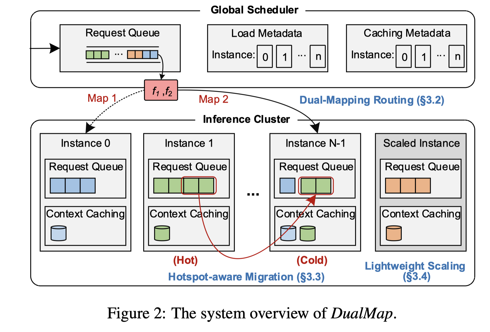

# DualMap: Enabling Both Cache Affinity and Load Balancing for Distributed LLM Serving

> Ying Yuan, Pengfei Zuo, Bo Wang, Zhangyu Chen, Zhipeng Tan, Zhou Yu

## Abstract

In LLM serving, reusing the KV cache of prompts across requests is critical for reducing TTFT and serving costs. Cache-affinity scheduling, which co-locates requests with the same prompt prefix to maximize KV cache reuse, often conflicts with load-balancing scheduling that distributes requests evenly across compute instances. Existing schedulers fail to reconcile this trade-off as they operate within a single mapping space, typically applying cache-affinity routing to a subset of requests and load-balanced routing to the rest, without a unified solution to achieve both goals. To address this limitation, we propose DualMap, a dual-mapping scheduling strategy for distributed LLM serving that achieves both cache affinity and load balancing. Its key idea is to map each request to two candidate instances via two independent hash functions based on the request prompt, then intelligently select the better candidate based on current system states. This design increases the likelihood that requests with shared prefixes are co-located, while evenly dispersing distinct prefixes across the cluster via ``the power of two choices''. To make DualMap robust under dynamic and skewed real-world workloads, we incorporate three techniques: 1) SLO-aware request routing, which prioritizes cache affinity but switches to load-aware scheduling when TTFT exceeds the SLO, enhancing load balance without sacrificing cache reuse; 2) hotspot-aware rebalancing, which dynamically migrates requests from overloaded to underloaded instances, mitigating hotspots and rebalancing the system; 3) lightweight dual-hash-ring scaling, which leverages a dual-hash-ring mapping to support fast and low-overhead instance scaling without costly global remapping. Experiments on real-world workloads show that DualMap improves effective request capacity by up to 2.25$\times$ under the same TTFT SLO constraints compared with SOTA work.

---

*以下总结由 MiMo 生成：*

这篇论文旨在解决分布式LLM服务中缓存亲和性与负载均衡之间的冲突问题。现有调度器难以同时实现这两个目标，而本文提出了DualMap双映射调度策略，通过两个独立的哈希函数为每个请求选择两个候选实例，并根据系统状态智能决策。该方法结合了SLO感知路由、热点感知重平衡和轻量级双哈希环扩展技术，在真实负载下实现了高达2.25倍的有效请求容量提升。
