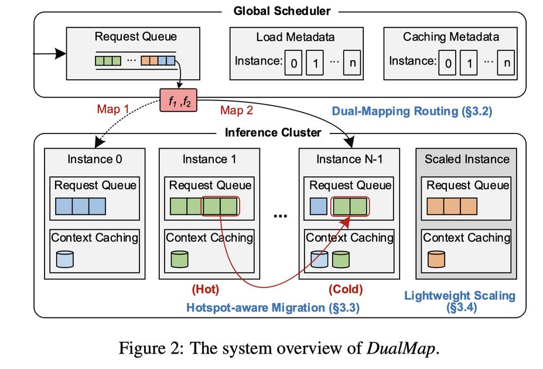

# DualMap: Enabling Both Cache Affinity and Load Balancing for Distributed LLM Serving

> Ying Yuan, Pengfei Zuo, Bo Wang, Zhangyu Chen, Zhipeng Tan, Zhou Yu

## 一句话总结

DualMap 通过双映射调度策略（两个独立哈希函数将每个请求映射到两个候选实例），在分布式 LLM 推理系统中同时实现了 KV 缓存亲和性与负载均衡，相比 SOTA 方法有效请求容量提升最高 2.25 倍。

## 摘要翻译

在 LLM 推理服务中，跨请求复用提示的 KV 缓存对于降低首 token 延迟（TTFT）和推理成本至关重要。缓存亲和性调度（将具有相同提示前缀的请求共置于同一计算实例以最大化 KV 缓存复用）通常与负载均衡调度（将请求均匀分配到计算实例）相冲突。现有调度器由于在单一映射空间内运行，无法调和这一矛盾——通常对部分请求应用缓存亲和性路由，对其余请求应用负载均衡路由，而缺乏统一的解决方案。为解决这一限制，本文提出了 DualMap，一种分布式 LLM 推理的双映射调度策略，同时实现缓存亲和性和负载均衡。其核心思想是使用两个独立的哈希函数将每个请求映射到两个候选实例，并根据当前系统状态智能选择更优的候选实例。这种设计增加了共享前缀的请求被共置的可能性，同时通过"两选一的力量"（Power of Two Choices）将不同前缀均匀分散到集群中。为使 DualMap 在动态和偏斜的真实工作负载下保持鲁棒性，本文引入了三项技术：1）SLO 感知请求路由，在 TTFT 超出 SLO 时从缓存亲和性切换到负载感知调度，在不牺牲缓存复用的前提下增强负载均衡；2）热点感知重平衡，动态将请求从过载实例迁移到欠载实例，缓解热点并重新平衡系统；3）轻量级双哈希环扩展，利用双哈希环映射支持快速低开销的实例扩展，无需代价高昂的全局重映射。在真实工作负载上的实验表明，DualMap 在相同 TTFT SLO 约束下，将有效请求容量提升最高 2.25 倍。

## 研究动机

### 核心问题
分布式 LLM 推理服务中，**缓存亲和性**（将相同前缀的请求路由到同一实例以复用 KV 缓存）与**负载均衡**（均匀分配请求以避免热点）之间存在根本性矛盾。这一矛盾源于两者都在**单一映射空间**中运行。

### 具体挑战

1. **缓存亲和性与负载均衡的冲突**：
   - 缓存亲和性策略（如 Cache Affinity）将具有共享前缀的请求路由到同一实例，最大化 KV 缓存复用，但导致负载严重不均衡（CV 值高）。
   - 负载均衡策略（如 Least Loaded）将请求分配到负载最低的实例，实现均匀负载分布，但将共享前缀的请求分散到不同实例，降低缓存命中率。

2. **现有方法的局限**：Mooncake（Min TTFT）、Preble、Dynamo 等方法尝试在单一映射空间中平衡缓存亲和性和负载均衡，但无法同时实现两者。它们通常对部分请求使用缓存感知路由，对其余请求使用负载感知路由，本质上是在两个目标之间做折衷。

3. **真实工作负载的偏斜**：实际场景中前缀流行度分布高度偏斜（如工具调用场景中某些工具提示被频繁使用），导致热点实例出现，加剧负载不均衡和尾延迟问题。

4. **静态哈希映射的弹性限制**：静态哈希映射将请求前缀绑定到特定实例，扩缩容操作（添加/移除实例）会破坏这些映射，导致缓存命中率下降和服务抖动。

### 关键观察

- 在 Conversation 数据集上，Cache Affinity 的缓存命中率比 Least Loaded 高 1.21 倍，但负载均衡性极差。
- 在 Tool&Agent 数据集上，Cache Affinity 接近理论上界，但 Least Loaded 接近下界。
- Min TTFT 和 Preble 在两者之间取得折衷，但无法同时优化两个目标。

## 方法（技术细节）

### 整体架构

DualMap 由两个主要组件构成：**全局调度器**和**推理集群**。全局调度器处理外部请求，并根据 DualMap 策略将每个请求分派到合适的推理实例。每个推理实例托管一个 LLM，并配备固定大小的主机 DRAM 用于上下文缓存。

### 核心设计：双映射调度

DualMap 的核心思想借鉴了 **Power of Two Choices（PoTC）** 原则（Mitzenmacher, 2002），使用两个独立的哈希函数 $f_1$ 和 $f_2$ 将每个请求映射到两个候选实例，然后根据当前系统状态选择更优的候选实例。

#### 为什么选择两个候选而非更多？

- 理论上，增加候选数 $d$ 可以减少负载偏差 $\frac{\log \log n}{\log d}$，但收益递减明显。
- 增加候选数会将共享前缀的请求分散到更多实例，削弱 KV 缓存局部性。
- $d=2$ 在负载均衡和缓存局部性之间取得了最佳平衡。
- 对于 $d=2$，最大负载偏差为 $\frac{m}{n} + \log \log n + O(1)$，远优于 $d=1$ 的 $\frac{m}{n} + \Theta(\sqrt{\frac{m \log n}{n}})$。

#### 缓存亲和性保证

对于 $m$ 个具有相同前缀 $p$ 的请求，DualMap 保证缓存命中率为 $\max(0, 1 - 2/m)$。当 $m$ 较大时，接近 Cache Affinity 的 $\max(0, 1 - 1/m)$。

#### 负载均衡保证

采用 PoTC 策略，最大负载偏差为 $\frac{m}{n} + \log \log n + O(1)$，远优于单选策略。

### 三大关键技术

#### 1. SLO 感知请求路由（§3.2）

**问题**：如何在两个候选实例中选择最优的实例以最大化系统有效请求容量？

**解决方案**：
- **自适应哈希前缀长度**：动态确定每个请求的哈希键前缀长度。维护请求前缀热度树，当叶子前缀变热时扩展哈希前缀长度以分散热点请求，当父前缀变冷时缩短前缀以聚合普通请求以提高缓存复用。
- **SLO 感知路由策略**：
  - 优先选择缓存复用最高的实例（缓存亲和性优先）。
  - 仅当预期 TTFT 超过 SLO 时，切换到负载感知调度，选择负载较低的实例。
  - 如果两个实例的前缀命中率相同，总是选择负载较低的实例。
  - 使用"待处理预填充 token 数"作为系统负载指标。
  - 定义 TTFT SLO 阈值，作为切换到负载感知策略的判据。

**与 Min TTFT 的区别**：Min TTFT 追求每个请求的最优 TTFT，导致在缓存感知和负载感知决策之间频繁切换，增加重计算开销并恶化整体 TTFT。DualMap 不追求每个请求的最优 TTFT，而是在负载条件允许时保留缓存复用，仅在必要时切换到负载均衡。

#### 2. 热点感知请求重平衡（§3.3）

**问题**：前缀流行度的偏斜导致某些实例过载，产生长队列和高尾延迟。

**解决方案**：
- **受 Cuckoo hashing 启发的迁移机制**：每个请求有两个候选实例（类似 Cuckoo hashing 中的两个槽位），当主实例过载时，将请求迁移到备用实例。
- **非递归、单轮批量迁移**：评估过载实例队列中多个待处理请求，将那些备用实例欠载且迁移后有净 TTFT 收益的请求迁移。
- **迁移收益计算**：$B(i \to j)_r = TTFT(r, i) - TTFT(r, j) = (T_q(r, i) + T_c(r, i)) - (T_q(r, j) + T_c(r, j))$
- **迁移条件**：仅迁移满足 $B(i \to j)_r > 0$ 且 $TTFT(r, j) < TTFT_{SLO}$ 的请求。
- **迁移策略**：按收益降序排列请求，逐个迁移直到过载实例队列中所有请求都能满足 TTFT SLO。

#### 3. 轻量级双哈希环扩展（§3.4）

**问题**：静态哈希映射将请求前缀绑定到特定实例，扩缩容操作导致全局重映射，严重破坏缓存亲和性。

**解决方案**：
- **双哈希环映射**：将 DualMap 的双映射与一致性哈希（Consistent Hashing）结合。哈希环跨越逻辑空间 $[0, M)$，每个实例根据唯一标识（如 IP 和端口）分配锚点。
- **扩展原理**：请求-实例映射由哈希环上的相对位置决定。添加实例时，仅影响哈希位置在新旧锚点之间的请求；移除实例时，仅影响映射到该实例的请求。
- **优势**：扩缩容操作仅影响少量映射，避免代价高昂的全局重映射，实现快速弹性扩展。

### 系统实现

- 基于 vLLM 引擎实现分布式 LLM 推理系统。
- 每个实例配备 8 个 Ascend NPU（910B4: 32GB HBM 或 910B3: 64GB HBM）和 1.5TB DRAM。
- 上下文缓存配置：7B 模型存储最多 100 万 token，14B 模型存储 50 万 token。
- 支持与 Prefill-Decode（PD）分解和 Attention-FFN（AF）分解架构集成。

## 实验结果

### 实验设置

- **模型**：Qwen2.5-7B 和 Qwen2.5-14B
- **数据集**：Mooncake 的 Conversation（多轮对话）和 Tool&Agent（工具/代理）真实工作负载
- **集群**：8 个推理实例
- **指标**：有效请求容量（TTFT < 5s 的请求比例）、Goodput、P50/P90 TTFT、E2E 延迟、缓存命中率、负载均衡比
- **基线**：Cache Affinity、Least Loaded、Min TTFT（Mooncake）、Preble

### 主要结果

#### 有效请求容量（SLO 达标率）

| 数据集 | 模型 | 相比最佳基线提升 |
|--------|------|------------------|
| Conversation | Qwen2.5-7B | +80%（相比 Cache Affinity） |
| Tool&Agent | Qwen2.5-7B | +125%（相比 Cache Affinity） |
| Conversation | Qwen2.5-14B | +40.6%（相比 Cache Affinity） |
| Tool&Agent | Qwen2.5-14B | +55%（相比 Cache Affinity） |

#### Goodput（峰值可持续请求率）

- Tool&Agent 上改善 16.7%–48%
- Conversation 上改善 14.3%–40%

#### TTFT 和 E2E 延迟

- **P50 TTFT**：在高 QPS 场景下，相比最佳基线降低 55.4%–97.4%（通过缓存亲和性实现高缓存命中率，减少冗余计算）
- **P90 TTFT**：降低 82.3%–97%（通过负载均衡避免请求在单个实例上累积，减少尾排队时间）
- E2E 延迟与 TTFT 趋势一致
- 在 QPS 翻倍时，DualMap 仍能保持接近低 QPS 的延迟，展示出强大的稳定性

#### 缓存命中率

- DualMap 在两种工作负载下均实现了接近 Cache Affinity 策略的缓存命中率，达到理论上界的 62.5%–96.4%
- Conversation：29.5%（接近 Cache Affinity 的 29.6%，远超 Least Loaded 的 13.2%）
- Tool&Agent：65.4%（接近 Cache Affinity 的 64.1%，远超 Least Loaded 的 56.5%）

#### 负载均衡

- DualMap 在整个实验中保持一致低且稳定的系统负载
- DualMap 的待处理 token 数显著低于基线方法（由于高效缓存复用减少了计算负载）
- 热点感知迁移机制在检测到过载时主动将请求从过载实例迁移到轻负载实例

#### 消融实验（Conversation + Qwen2.5-14B）

| 配置 | P50 TTFT | P90 TTFT | 说明 |
|------|----------|----------|------|
| DualMap-cache-affinity | 2.8s | 20s | 最高延迟，严重负载不均衡（CV=1.24） |
| DualMap-least-loaded | 1.8s | 6.8s | 缓存复用低 |
| DualMap-min-ttft | 1.7s | 6.5s | 频繁切换导致缓存命中率低 |
| DualMap-no-rebalance | 1.3s | 5.3s | 通过 SLO 感知调度提升 |
| **DualMap（完整版）** | **1.2s** | **4.7s** | 最低延迟，热点感知重平衡进一步降低 P90 TTFT 11.3% |

#### 弹性扩展实验

- **扩容**（4→8 实例）：系统从过载快速恢复，SLO 达标率提升至 90%
- **缩容**（8→4 实例）：在降低负载后渐进缩容，保持 90% SLO 达标率
- 扩缩容对缓存命中率的影响极小（仅影响局部映射）

#### 可扩展性

- 从 8 到 32 个实例，DualMap 的 Goodput 近线性增长
- 路由延迟约 0.6ms/请求，重平衡延迟约 2.2–2.5ms/次，KV 缓存访问延迟约 0.2ms/次
- 元数据开销极小（32 实例集群仅需 4.57MB）

## 优势

1. **同时实现缓存亲和性和负载均衡**：打破单一映射空间的限制，通过双映射策略在两个目标之间取得平衡。
2. **理论保证**：基于 PoTC 原则，最大负载偏差为 $\frac{m}{n} + \log \log n + O(1)$，远优于单选策略。
3. **SLO 感知路由**：在负载条件允许时保留缓存复用，仅在必要时切换到负载均衡，避免 Min TTFT 的频繁切换问题。
4. **热点感知重平衡**：动态迁移过载实例的请求到欠载实例，同时保持缓存亲和性。
5. **轻量级扩展**：双哈希环设计支持快速低开销的实例扩缩容，无需全局重映射。
6. **显著性能提升**：有效请求容量提升最高 2.25 倍，P90 TTFT 降低 82.3%–97%。
7. **可扩展性强**：近线性 Goodput 增长，调度开销低（路由 0.6ms，重平衡 2.2–2.5ms）。
8. **架构兼容性**：与 PD 分解和 AF 分解架构兼容，无需侵入性修改。
9. **鲁棒性**：在 NPU 内存竞争和解码瓶颈场景下通过重平衡机制保持高 SLO 达标率。

## 局限

1. **缓存命中率仍有损失**：与纯缓存亲和性策略相比，DualMap 的缓存命中率仍有小幅损失（理论上界为 $1-1/m$，DualMap 为 $1-2/m$），尤其在请求量较小时。
2. **前缀热度自适应依赖阈值**：自适应哈希前缀长度机制依赖滑动窗口和流量比阈值（$\rho > 2/n$ 为热前缀），阈值选择可能影响性能。
3. **仅考虑单目标 SLO**：当前仅优化 TTFT SLO，未考虑其他 SLO（如吞吐量、E2E 延迟）。
4. **假设所有实例同构**：实验在同构集群上进行，未讨论异构集群（不同硬件配置）的场景。
5. **静态工作负载假设**：实验使用固定工作负载 trace，未充分考虑动态变化的工作负载模式。
6. **解码瓶颈处理依赖启发式**：检测解码瓶颈依赖于预填充间隔阈值（T=3s），可能在不同场景下需要调优。
7. **未考虑跨节点通信开销**：在大规模集群中，全局调度器与实例之间的通信可能成为瓶颈。
8. **依赖 vLLM 后端**：虽然 DualMap 设计为架构无关，但当前实现基于 vLLM，迁移到其他后端可能需要额外工作。

## 与 EfficientPaper 相关的研究方向

DualMap 的关键词为 `kv_cache_management` 和 `deployment`，属于 LLM 推理系统优化领域。以下与 EfficientPaper 相关的研究方向：

1. **KV 缓存管理**：DualMap 专注于分布式 KV 缓存复用调度，与 KV 缓存压缩、量化、淘汰等技术互补。例如，可以结合 KV 缓存量化（kv_cache_quant）或 KV 缓存稀疏化（kv_cache_sparse）进一步降低内存占用。
2. **推理调度与部署**（deployment）：DualMap 解决了分布式 LLM 推理中的调度问题，与 Prefill-Decode 分解（DistServe）、弹性扩展（LoongServe）等系统级优化密切相关。
3. **性能建模**（performance_modeling）：DualMap 的 TTFT 估计和 SLO 感知路由依赖于准确的性能建模，可以与现有性能建模工作结合。
4. **推理系统设计**（structure_design）：DualMap 的双映射框架可以与其他系统设计（如注意力分解、调度策略）结合，进一步提升推理效率。
5. **架构兼容性**：DualMap 与 Prefill-Decode 分解和 Attention-FFN 分解架构兼容，为更细粒度的推理系统优化提供了基础。

---

*以下总结由 MiMo 生成：*

本文提出 DualMap 双映射调度策略，通过两个独立哈希函数将每个请求映射到两个候选实例，并根据系统状态智能选择，同时实现缓存亲和性和负载均衡。核心创新在于打破单一映射空间的限制，结合 SLO 感知路由、热点感知重平衡和轻量级双哈希环扩展三项技术。在真实工作负载下，DualMap 有效请求容量提升最高 2.25 倍，P90 TTFT 降低 82.3%–97%，展示了在分布式 LLM 推理调度中的显著优势。

*注：本 note 由 AI Agent 自动生成，基于论文全文内容撰写。生成时间：2026 年 6 月。*
