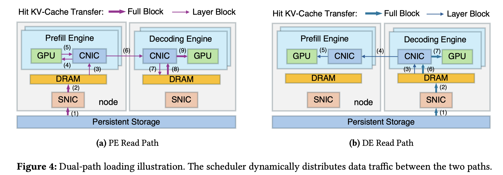

# DualPath: Breaking the Storage Bandwidth Bottleneck in Agentic LLM Inference

> Yongtong Wu, Shaoyuan Chen, Yinmin Zhong, Rilin Huang, Yixuan Tan, Wentao Zhang, Liyue Zhang, Shangyan Zhou, Yuxuan Liu, Shunfeng Zhou, Mingxing Zhang, Xin Jin, Panpan Huang

## Abstract

The performance of multi-turn, agentic LLM inference is increasingly dominated by KV-Cache storage I/O rather than computation. In prevalent disaggregated architectures, loading the massive KV-Cache from external storage creates a fundamental imbalance: storage NICs on prefill engines become bandwidth-saturated, while those on decoding engines remain idle. This asymmetry severely constrains overall system throughput.
  We present DualPath, an inference system that breaks this bottleneck by introducing dual-path KV-Cache loading. Beyond the traditional storage-to-prefill path, DualPath enables a novel storage-to-decode path, in which the KV-Cache is loaded into decoding engines and then efficiently transferred to prefill engines via RDMA over the compute network. DualPath combines this optimized data path -- which inherently avoids network congestion and avoids interference with latency-critical model execution communications -- with a global scheduler that dynamically balances load across prefill and decode engines.
  Our evaluation on three models with production agentic workloads demonstrates that DualPath improves offline inference throughput by up to 1.87$\times$ on our in-house inference system. It can also improve online serving throughput by an average factor of 1.96$\times$ without violating SLO.
