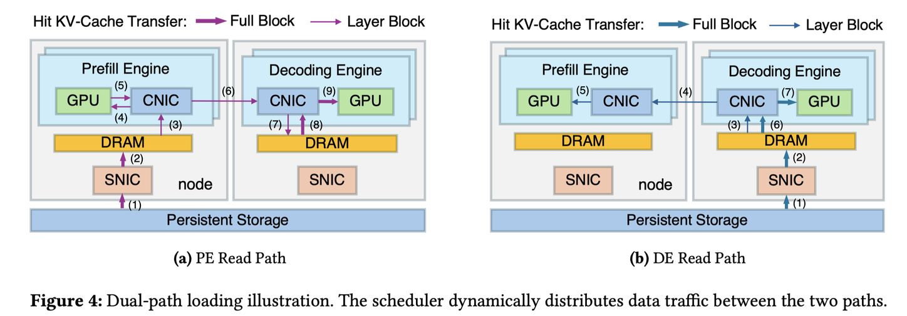

# DualPath: Breaking the Storage Bandwidth Bottleneck in Agentic LLM Inference

> Yongtong Wu, Shaoyuan Chen, Yinmin Zhong, Rilin Huang, Yixuan Tan, Wentao Zhang, Liyue Zhang, Shangyan Zhou, Yuxuan Liu, Shunfeng Zhou, Mingxing Zhang, Xin Jin, Panpan Huang

> ⚠️ 本文档由 AI Agent 自动生成，生成时间：2026-06-04。内容基于论文全文阅读，仅供参考。

---

## 一句话总结

DualPath 通过引入双路径 KV-Cache 加载机制（存储→解码引擎→填充引擎），打破了 Agentic LLM 推理中存储带宽瓶颈，将离线推理吞吐量提升最高 1.87×，在线服务吞吐量平均提升 1.96×。

---

## 摘要翻译

多轮 Agentic LLM 推理的性能越来越受 KV-Cache 存储 I/O 而非计算的限制。在主流的分离式架构中，从外部存储加载大量 KV-Cache 导致了一个根本性的不平衡：填充引擎（Prefill Engine）的存储网卡被带宽饱和，而解码引擎（Decode Engine）的存储网卡却处于空闲状态。这种不对称严重限制了整体系统吞吐量。

本文提出了 DualPath，一种通过引入双路径 KV-Cache 加载来突破该瓶颈的推理系统。除了传统的"存储→填充"路径外，DualPath 还支持一条全新的"存储→解码"路径：将 KV-Cache 先加载到解码引擎，再通过计算网络上的 RDMA 高效传输到填充引擎。DualPath 将这一优化数据路径——天然避免网络拥堵且不干扰延迟敏感的模型执行通信——与全局调度器相结合，动态平衡填充引擎和解码引擎之间的负载。

在三种模型上的评估结果表明，DualPath 在内部推理系统上将离线推理吞吐量提升最高 1.87×，同时在不违反 SLO 的前提下将在线服务吞吐量平均提升 1.96×。

---

## 研究动机

### 1. Agentic LLM 推理的本质特征

现代 LLM 正从单轮聊天机器人演变为能够自主规划、调用工具、通过多轮交互解决实际任务的 Agentic 系统。这类 Agentic 工作负载具有以下特征：

- **长上下文、短追加、多轮交互**：单次 Agent 运行包含几十到几百轮交互，上下文可达百万 token。
- **极高的 KV-Cache 命中率**：通常 ≥95%（甚至高达 98.7%），意味着绝大部分 token 可从缓存中复用，仅少量新追加的 token 需要预填充计算。
- **I/O 密集型**：缓存与计算的比率（cache-compute ratio）极高，例如 DeepSeek-V3.2 约为 22 GB/PFLOP，使得存储带宽成为主要瓶颈。

### 2. 硬件趋势的不匹配

从 NVIDIA Ampere 到 Blackwell，GPU FLOPS 增长了 28.8×，而网络带宽仅增长 2.0×，HBM 容量仅增长 2.4×。I/O 与计算的比率下降了 14.4×，导致在 Agentic 推理场景下 GPU 利用率严重不足。

### 3. 现有架构的根本缺陷

在 PD 分离式（Prefill-Decode Disaggregation）架构中，KV-Cache 仅由填充引擎从远程存储加载，导致：

- **填充引擎的存储网卡（SNIC）被带宽饱和**（100% 利用率）
- **解码引擎的存储网卡处于空闲状态**（几乎未使用）
- **存储网络带宽无法被充分利用**，系统吞吐量受限于填充侧的单条存储链路

现有优化方法（如 Mooncake 的分布式 DRAM 缓存、KV-Cache 压缩等）无法解决不同引擎之间存储 I/O 不平衡的根本问题。

---

## 方法（技术细节）

### 核心思想：双路径 KV-Cache 加载

DualPath 的核心洞察是：KV-Cache 加载不必以填充引擎为中心。通过启用"存储→解码引擎→填充引擎"的第二条路径，系统可以聚合所有引擎的存储网卡带宽，消除传统架构的不对称带宽饱和。

### 1. 系统架构

DualPath 系统包含三个核心组件：

- **推理引擎（Inference Engines）**：每个引擎管理一个 GPU，分为填充引擎（PE）和解码引擎（DE）。
- **流量管理器（Traffic Manager）**：每个引擎包含一个流量管理器，负责主机-设备内存拷贝（H2D/D2H）、PE 和 DE 之间的 KV-Cache 传输、以及通过存储网卡的 KV-Cache 读写。
- **请求调度器（Request Scheduler）**：中央调度器，接收客户端请求并在引擎间分配，同时动态分配两条路径之间的数据流量。

### 2. 双路径加载的具体数据流

**PE 读取路径（传统路径）**：
1. 命中 token 的 KV-Cache 从持久存储读入 PE 缓冲区
2. 在计算某一层注意力之前，该层的 KV-Cache 从 PE 缓冲区传输到 PE HBM
3. 计算完成后，所有 KV-Cache（命中 + 未命中）传输到 DE 缓冲区
4. 该过程重复 `n_layer` 次，传输与计算重叠

**DE 读取路径（创新路径）**：
1. 命中 token 的 KV-Cache 先从持久存储读入 DE 缓冲区
2. 在 PE 填充过程中，从 DE 缓冲区读取对应层的 KV-Cache，与计算重叠
3. 该过程重复 `n_layer` 次
4. 计算完成后，仅未命中 token 的 KV-Cache 传输到 DE 缓冲区并合并

**解码阶段**：在收到完整的提示 KV-Cache 后，DE 分配 HBM 并执行 H2D 传输，然后开始解码。每当累积一个完整的 token 块（如 64 个 token）时，立即持久化到磁盘。

### 3. 无瓶颈分析

论文通过数学分析证明，在合理的 P/D（填充/解码）比率下，系统可以完全饱和所有存储网卡而不引入计算网卡或 DRAM 瓶颈。对于 (g=8, s=1) 的配置，无瓶颈范围为 1/7 ≤ P/D ≤ 7/2，覆盖大多数实际配置。

### 4. CNIC 中心的流量管理器

**核心挑战**：DualPath 引入的额外 KV-Cache 传输流量可能干扰延迟敏感的集合通信（如 AllToAll、ReduceScatter/AllGather）。

**解决方案**：
- **CNIC 中心数据传输**：所有进出 GPU 的数据流量（包括本地 H2D/D2H 拷贝）都通过 GPU 配对的计算网卡（CNIC）进行 GPUDirect RDMA 传输，利用计算网络的原生 QoS 能力。
- **流量隔离**：利用 InfiniBand 虚拟通道（VL）机制，将模型推理通信流量分配到高优先级 VL，KV-Cache 传输分配到低优先级 VL。高优先级 VL 占用约 99% 带宽，低优先级 VL 占用剩余 1%。
- **CNIC 辅助的 KV-Cache 拷贝**：先将 KV-Cache 从存储读入主机 DRAM，再通过 CNIC 的 RDMA Write 请求执行本地 H2D 拷贝。相比 GPUDirect Storage，该方法是唯一能确保 KV-Cache 加载/存储不影响关键模型执行通信的实用方法。
- **性能优势**：CNIC 辅助的 H2D/D2H 在处理大量小数据块时优于 CUDA Copy Engine（单次 RDMA Write 提交约 1μs，vs cudaMemcpyAsync 约 5-7μs）。

### 5. 自适应请求调度器

**两层调度结构**：
- **引擎间调度（Inter-Engine Scheduling）**：
  - 引擎分组，仅 Leader Engine 与调度器交互
  - PE 调度：基于未完成 token 数和磁盘读取队列长度，将引擎分为三类（过载、短队列、长队列），优先分配给短队列引擎
  - DE 调度：两级（组间 + 组内），通过 token 计数平衡 GPU 和 NIC 负载
  - KV-Cache 读取任务调度：选择读取队列较短的一侧

- **引擎内调度（Intra-Engine Scheduling）**：
  - 仅 PE 需要，基于计算配额（Compute Quota）进行批量选择
  - 通过 FIFO 打包和二分搜索决定每批请求，确保注意力层执行时间不超过预定义上限
  - 最小化 GPU 间等待气泡

### 6. KV-Cache 块布局

采用两种块布局：
- **Layer Block**：形状 [1, tokens, bytes]，存储单层 KV-Cache
- **Full Block**：形状 [layer, tokens, bytes]，存储所有层的 KV-Cache
- 存储交互使用 Full Block，层内传输使用 Layer Block，避免手动内存布局转换

---

## 实验结果

### 实验设置
- **硬件**：集群，每节点 8× NVIDIA Hopper GPU，8× 400Gbps InfiniBand 计算网卡 + 1× 存储网卡（连接 3FS）
- **模型**：DeepSeek V3.2 660B（MoE）、DS 27B（降尺度版）、Qwen2.5-32B（Dense）
- **数据集**：3 个 Agentic RL 训练工作负载的轨迹数据（500 轨迹/数据集）
- **基线**：SGL(MC)（SGLang + Mooncake）、Basic（未修改的内部推理框架）、Oracle（零 I/O 开销上限）

### 离线批推理（Offline Batch Inference）
- **DS 660B**：DualPath 相比 Basic 最高提升 **1.87×**（JCT 降低 45.62%）
- **DS 27B**：最高提升 **1.78×**
- **Qwen 32B**：类似趋势
- **消融研究**：
  - 层级预填充：JCT 降低 17.21%
  - 双路径加载（核心贡献）：JCT 降低 38.19%
  - 调度算法：JCT 降低 45.62%（相比 Basic）
- **负载均衡**：存储网卡流量 Max/Avg 比从 1.53 降至 1.18，注意力层执行时间 Max/Avg 比保持在 1.06

### 在线服务（Online Serving）
- **DS 27B**：APS（每秒 Agent 到达率）提升 1.67×
- **DS 660B**：APS 提升 2.25×
- **平均提升 1.96×**
- TTFT（首 token 时间）：DualPath 在不同 APS 下保持稳定，而 Basic 的排队时间急剧增长
- TPOT（token 间时间）：DualPath 不引入额外解码开销

### 大规模可扩展性
- 从 2P4D（2K agents）扩展到 48P96D（48K agents，1152 GPU），JCT 接近线性加速（3167s vs 3201s）
- 在线服务 44P88D 达到 22× 吞吐量（8.8 vs 0.4 APS），延迟保持相似
- 调度器 CPU 使用率 < 10 核，非瓶颈

---

## 优势

1. **根本性解决存储 I/O 不平衡**：通过双路径加载，聚合所有引擎的存储网卡带宽，而非仅依赖填充引擎的存储带宽。
2. **无侵入性流量隔离**：利用 CNIC 中心的流量管理，将 KV-Cache 传输与模型推理通信隔离，不影响延迟敏感的集合操作。
3. **显著的性能提升**：离线推理最高 1.87×，在线服务平均 1.96×，且不违反 SLO。
4. **与现有技术兼容**：可与层级预填充（LayerKV/PrefillOnly）、PD 分离式架构无缝结合。
5. **良好的可扩展性**：大规模实验（1152 GPU）验证了近线性加速和良好的负载均衡。
6. **低调度开销**：调度器 CPU 使用率低，不构成瓶颈。
7. **工程实现可行**：仅需约 5K 行代码修改，基于现有推理框架实现。

---

## 局限

1. **仅适配 Agentic 工作负载**：该方法依赖于高 KV-Cache 命中率和短追加长度的特征，对于传统单轮或低命中率场景优势有限。
2. **需要额外的 DRAM 缓冲区**：在 PE 和 DE 上都需要分配少量 DRAM 作为缓冲区，增加了内存开销。
3. **CNIC 路径的额外开销**：虽然 CNIC 辅助传输在处理大量小数据块时更快，但比 GPUDirect Storage 多了一次 H2D 拷贝路径。
4. **P/D 比率敏感**：无瓶颈范围受 P/D 比率限制（1/7 ≤ P/D ≤ 7/2），需要合理的配置。
5. **未开源**：基于内部推理框架实现，代码未开源，难以复现。
6. **实验场景有限**：主要在 RL 训练的 rollout 场景下评估，对于其他 Agentic 应用场景的泛化性有待验证。
7. **硬件依赖**：需要 InfiniBand 或类似支持 QoS 的 RDMA 网络。
8. **未考虑与 DRAM 缓存结合的优化**：虽然可与 Mooncake 等 DRAM 缓存结合，但论文中提到性能增益边际。

---

## 与 EfficientPaper 相关的研究方向

1. **KV-Cache 管理优化**：DualPath 关注 KV-Cache 的存储 I/O 优化，与 KV-Cache 压缩、量化（如 TailorKV）、分层缓存（如 Strata、LMCache）等方向互补。
2. **推理系统架构**：基于 PD 分离式架构的优化，与 DistServe、Splitwise 等工作相关，代表了 LLM 推理系统的发展趋势。
3. **Agentic 推理的系统设计**：随着 Agentic LLM 应用的普及，如何在系统层面优化多轮推理的性能（如 CONCUR 的并发控制），是当前的热门方向。
4. **硬件-软件协同设计**：论文揭示了 GPU 计算能力与存储带宽之间的不匹配问题，对硬件-软件协同设计（如新的网络协议、PCIe QoS）提出了新的需求。
5. **大规模分布式推理调度**：自适应调度算法在大规模集群中的应用，与负载均衡、资源调度等系统研究方向密切相关。
6. **RL 训练中的推理优化**：DualPath 在 RL rollout 场景下的应用，为 agent LLM 训练的推理系统提供了新的优化思路。
7. **数据传输优化**：CNIC 中心的流量管理方法，对 RDMA、GPU Direct 等数据传输技术的系统设计有参考价值。
