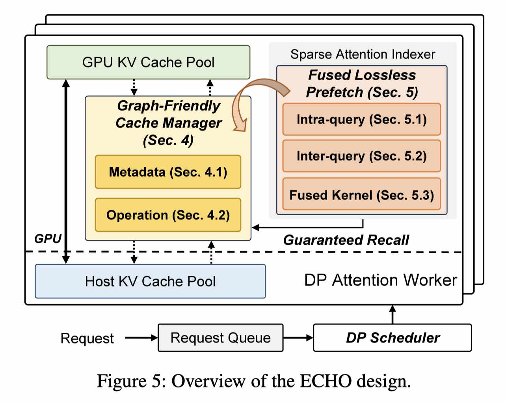

# ECHO: Efficient KV Cache Offloading with Lossless Prefetching for Serving Native Sparse Attention LLMs

> Guangda Liu, Wenhao Chen, Chengwei Li, Zhenyu Ning, Jing Lin, Yiwu Yao, Quan Chen, Shixuan Sun, Jieru Zhao, Minyi Guo

> 注：以下论文笔记由 AI Agent 自动生成，可能存在理解偏差或遗漏，请以原论文为准。

## Abstract

ECHO 面向原生稀疏注意力 LLM 的长上下文 serving：将完整 KV Cache 放到主机内存，只将被稀疏选择的 KV 按需召回 GPU，并通过图友好的动态 cache manager 和无损预取降低管理及 PCIe recall 开销。

## 一句话总结

ECHO 把 sparse indexer 的选择信号变成 KV 预取信号，在不改变稀疏注意力结果的前提下，用 host KV pool 扩大有效 batch，并把 recall 隐藏在 indexer 计算之后。

## 创新点

1. **Graph-friendly cache manager**：消除动态长度 tensor，用定长元数据和全并行 GPU 操作执行 allocate、free、evict、recall，使 decoding 路径可完整封装进单个 CUDA Graph，避免动态稀疏 cache 管理破坏 graph replay。
2. **两类无损预取**：decode 阶段利用相邻 step 的 index-score 数值可预测性估计 top-k 边界，执行 intra-query prefetch；prefill 阶段利用 query block 的顺序处理执行 inter-query prefetch。预测只决定“提前搬哪些 KV”，最终仍做 guaranteed recall，因此不引入额外精度损失。
3. **Indexer-prefetch 融合流水线**：基于 DeepGEMM indexer kernel，使用 warp specialization 和软件流水构造 TMA、GEMM、prefetch 三阶段 pipeline，使主机到 GPU 的 KV recall 与 index-score 计算重叠。

## 带来什么提升

1. 在 8×H20、DeepSeek-V3.2-Exp、80K–100K InfiniteBench 请求上，满负载时相对 SGLang/vLLM 最高分别达到 **2.15×/4.1× generation throughput**；当 GPU KV pool 限制到 110K token 时，相对 SGLang 最高 **4.12×**。
2. ECHO 使用约 1.8M-token host KV pool，将并发容量从 GPU-only 系统的数个长请求扩展到更大有效 batch；大部分层的 GPU-pool hit rate 为 **0.97–0.99**，动态 offloading 专属操作仅占 all-layer decode latency 的 **0.28%**。
3. Intra-query prefetch 在 hit rate 0.5/0.9 时将 indexer+recall 延迟最高降低 **1.29×/1.51×**，端到端吞吐最高提高 **4%**；prefill inter-query prefetch 的微基准提升最高约 **1.1×**。

## 备注

- 收益主要来自突破 HBM 容量、扩大并发，而非降低单请求 ITL。轻载时端到端延迟增加 15.9%–19.2%；请求率达到 0.5 以上后增幅低于 4.6%，更适合吞吐优先的长上下文服务。
- Cache manager 可泛化到多种动态 sparse attention，但无损预取依赖 DSA 类 indexer 的可预测选择边界或 early-selection signal。
