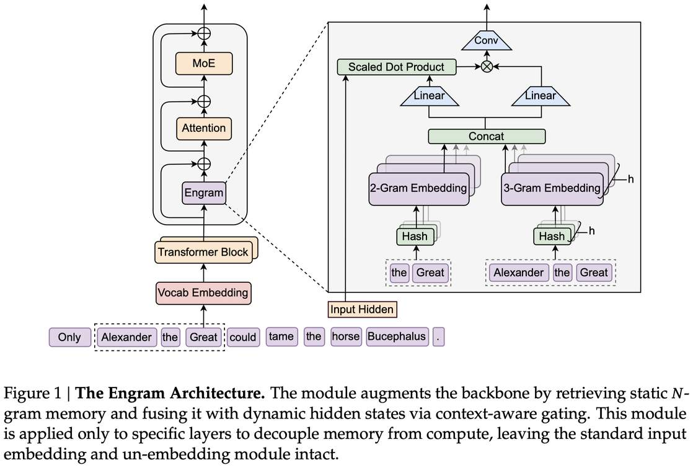

# Engram: Conditional Memory via Scalable Lookup

> Xin Cheng, Wangding Zeng, Damai Dai, Qinyu Chen, Bingxuan Wang, Zhenda Xie, Kezhao Huang, Xingkai Yu, Zhewen Hao, Yukun Li, Han Zhang, Huishuai Zhang, Dongyan Zhao, Wenfeng Liang

> 注：以下论文笔记由 AI Agent 自动生成，可能存在理解偏差或遗漏，请以原论文为准。

## Abstract

While Mixture-of-Experts (MoE) scales capacity via conditional computation, Transformers lack a native primitive for knowledge lookup, forcing them to inefficiently simulate retrieval through computation. To address this, we introduce conditional memory as a complementary sparsity axis, instantiated via Engram, a module that modernizes classic N-gram embedding for O(1) lookup. By formulating the Sparsity Allocation problem, we uncover a U-shaped scaling law that optimizes the trade-off between neural computation (MoE) and static memory (Engram). Guided by this law, we scale Engram to 27B parameters, achieving superior performance over a strictly iso-parameter and iso-FLOPs MoE baseline. Most notably, while the memory module is expected to aid knowledge retrieval (e.g., MMLU +3.4; CMMLU +4.0), we observe even larger gains in general reasoning (e.g., BBH +5.0; ARC-Challenge +3.7) and code/math domains (e.g., HumanEval +3.0; MATH +2.4). Mechanistic analyses reveal that Engram relieves the backbone's early layers from static reconstruction, effectively deepening the network for complex reasoning.

## 一句话总结

Engram 是 DeepSeek-AI 和北京大学提出的条件记忆模块，将经典 N-gram 嵌入与现代 Transformer 结合，作为 MoE 的互补稀疏轴，通过 O(1) 查找静态知识来释放网络深度用于复杂推理，在 iso-parameter iso-FLOPs 对比下超越纯 MoE 基线。

## 背景与问题

- **MoE 的局限**：MoE 通过条件计算（conditional computation）扩展容量，但缺乏原生的知识查找（knowledge lookup）能力，Transformer 只能通过计算来模拟检索，浪费了宝贵的网络深度。
- **语言的双重性**：语言建模包含两个质上不同的子任务：
  - **组合推理**（compositional reasoning）：需要深度、动态的计算
  - **知识检索**（knowledge retrieval）：如命名实体、公式化模式，是局部的、静态的、高度刻板的
- **N-gram 的启示**：经典 N-gram 模型在捕捉局部依赖方面非常有效，暗示这些规律性可以通过计算廉价的查找来表示。
- **Sparsity Allocation 问题**：在固定参数预算下，如何在 MoE 专家和 Engram 嵌入之间分配稀疏容量？

## 核心方法

### 1. Engram 架构

Engram 是一个条件记忆模块，通过结构化地将静态模式存储与动态计算分离来增强 Transformer backbone：

**三个阶段**：
1. **稀疏检索**（Sparse Retrieval via Hashed N-grams）：
   - **Tokenizer 压缩**：通过 NFKC 归一化等操作，将原始 token ID 映射为规范 ID，实现 23% 的词汇表缩减（128k tokenizer）
   - **Multi-Head Hashing**：使用 K 个不同的哈希头（每个 N-gram 阶数 n），通过确定性哈希函数将压缩后的上下文映射到嵌入表索引。最终记忆向量 e_t ∈ R^{d_mem} 由所有检索到的嵌入拼接而成
   - **O(1) 查找**：每个位置的检索是确定性的，只需一次哈希计算

2. **上下文感知门控**（Context-aware Gating）：
   - 使用当前隐藏状态 h_t 作为动态 Query，检索到的记忆 e_t 作为 Key/Value 投影源
   - 计算标量门控 α_t ∈ (0,1)，通过 RMSNorm 确保梯度稳定性
   - 如果检索的记忆与当前上下文矛盾，门控趋向于零，有效抑制噪声

3. **卷积增强**（Conv1D + Residual）：
   - 引入短的、深度可分离的因果卷积（kernel size=4, dilation=max N-gram 阶数）
   - 最终输出通过残差连接集成到 backbone

### 2. Sparsity Allocation 问题

**关键发现：U 型缩放律**

- **Allocation ratio ρ** ∈ [0,1]：分配给 MoE 专家的不活跃参数比例
  - ρ = 1：纯 MoE 模型
  - ρ < 1：减少路由专家数量，释放参数给 Engram 嵌入
- **实验结果**：
  - 在 5.7B 和 9.9B 两个计算规模下，验证损失与 ρ 呈 **U 型关系**
  - 最佳性能出现在 ρ ≈ 75-80%（即 20-25% 参数给 Engram）
  - 纯 MoE（ρ=100%）被证明是次优的

### 3. Infinite Memory Regime

- Engram 的 O(1) 开销意味着可以无限制扩展内存而不增加计算
- 实验验证：增加嵌入槽数量（从 2.58×10^5 到 1.0×10^7）呈现严格的幂律缩放
- Engram 比 OverEncoding（直接平均 N-gram 嵌入）在相同内存预算下释放更大的缩放潜力

### 4. 系统效率

- **训练**：标准模型并行，将嵌入表分片到多个 GPU，使用 All-to-All 通信
- **推理**：确定性检索支持从主机内存异步预取（prefetch-and-overlap），通过 PCIe 传输
- **层级缓存**：利用 N-gram 的 Zipf 分布，频繁访问的嵌入缓存在快速存储层（HBM/DRAM），罕见模式存储在大容量存储（NVMe SSD）
- **100B 参数嵌入表**离线到主机内存，开销 < 3%

### 5. Multi-branch 架构集成

- 使用 Manifold-Constrained Hyper-Connections（M=4 branches）
- 参数共享策略：单一嵌入表和 Value 投影共享，M 个不同的 Key 投影用于分支特定门控
- 线性投影可融合为单一 FP8 矩阵乘法，最大化 GPU 计算利用率

## 技术细节

### Engram 模块位置

- 在 30-block Transformer 中，Engram 放置在第 2 层和第 15 层
- 最大 N-gram 阶数为 3，头数为 8，维度为 1280
- 优化器：嵌入参数使用 Adam（学习率 5× 缩放，无权重衰减），卷积参数零初始化

### 模型配置

| 模型 | 总参数 | 激活参数 | 专家数 | Engram 参数 |
|------|--------|----------|--------|-------------|
| Dense-4B | 4.1B | 3.8B | - | - |
| MoE-27B | 26.7B | 3.8B | 72 routed + 2 shared (top-6) | - |
| Engram-27B | 26.7B | 3.8B | 55 routed + 2 shared (top-6) | 5.7B |
| Engram-40B | 39.5B | 3.8B | 55 routed + 2 shared (top-6) | 18.5B |

## 实验设置

- **训练数据**：262B tokens，相同数据课程（token 预算和顺序）
- **Tokenizer**：DeepSeek-v3，128k 词汇表
- **架构**：30-block Transformer，hidden size 2560，MLA（32 heads），mHC（expansion rate 4）
- **优化器**：Muon
- **评估基准**：
  - 语言建模：The Pile, Validation Set
  - 知识与推理：MMLU, MMLU-Redux, MMLU-Pro, CMMLU, C-Eval, AGIEval, ARC, TriviaQA, BBH, HellaSwag, PIQA, WinoGrande
  - 阅读理解：DROP, RACE, C3
  - 代码与数学：HumanEval, MBPP, CruxEval, GSM8K, MGSM, MATH
- **长上下文评估**：LongPPL（32k）, RULER（32k）

## 主要结果

### 预训练性能对比

| 基准 | Dense-4B | MoE-27B | Engram-27B | Engram-40B |
|------|----------|---------|------------|------------|
| Pile loss | - | 2.091 | 1.960 | 1.942 |
| Validation loss | - | 1.768 | 1.634 | 1.610 |
| MMLU (5-shot) | 48.6 | 57.4 | **60.4** | 60.6 |
| CMMLU (5-shot) | 47.9 | 57.9 | **61.9** | 63.4 |
| BBH (3-shot) | 42.8 | 50.9 | **55.9** | 57.5 |
| ARC-Challenge (25-shot) | 59.3 | 70.1 | **73.8** | 76.4 |
| HumanEval (0-shot) | 26.8 | 37.8 | **40.8** | 38.4 |
| MATH (4-shot) | 15.2 | 28.3 | **30.7** | 30.6 |
| GSM8K (8-shot) | 35.5 | 58.4 | **60.6** | 62.6 |

### 关键发现

1. **知识推理增强**：MMLU +3.4, CMMLU +4.0（相比 MoE-27B）
2. **通用推理提升更大**：BBH +5.0, ARC-Challenge +3.7
3. **代码数学领域**：HumanEval +3.0, MATH +2.4
4. **长上下文**：Multi-Query NIAH 84.2 → 97.0（Engram-27B）
5. **机制分析**：Engram 解除了 backbone 早期层的静态重建负担，有效加深网络深度用于复杂推理

### 长上下文性能

| 模型 | LongPPL Book | RULER MQ | RULER VT |
|------|-------------|----------|----------|
| MoE-27B (50k) | 4.38 | 84.2 | 77.0 |
| Engram-27B (41k) | 4.37 | **97.0** | **89.0** |

Engram-27B 仅用 82% 的预训练 FLOPs（41k vs 50k），在长上下文指标上显著超越 MoE-27B。

## 优点与局限

### 优点

1. **新颖的稀疏轴**：提出 conditional memory 作为 MoE 的互补稀疏轴，而非简单的计算扩展
2. **U 型缩放律**：首次揭示 MoE/Engram 分配的 U 型关系，为稀疏模型设计提供理论指导
3. **系统效率**：确定性检索支持从主机内存异步预取，突破 GPU HBM 容量限制
4. **全面的实验**：在知识、推理、代码、数学、长上下文等多个维度全面验证
5. **工程可行性**：100B 参数嵌入表离线到主机内存，开销 < 3%

### 局限

1. **MoE 架构特定**：Engram 与 DeepSeekMoE 架构紧密耦合，是否适用于其他 MoE 变体有待验证
2. **N-gram 的局限**：基于 N-gram 的查找机制可能无法处理复杂的长距离依赖
3. **训练开销**：大规模嵌入表的 All-to-All 通信可能成为训练瓶颈
4. **评估范围**：未在实际应用（如 RAG、多轮对话）中验证
5. **与 OverEncoding 的比较**：Engram 优于 OverEncoding，但 OverEncoding 的设计可能不是最优基线

## 与 EfficientPaper 主题的关系

Engram 属于 **模型/系统结构设计**（`structure_design`）和 **稀疏剪枝**（`sparse_pruning`）领域，核心贡献包括：

- **条件记忆**：将 N-gram 嵌入作为 O(1) 查找的条件记忆模块，作为 MoE 的互补稀疏轴
- **稀疏分配**：U 型缩放律揭示了 MoE 专家与 Engram 嵌入之间的最优分配
- **系统效率**：确定性检索支持异步预取，突破 GPU HBM 限制

与 EfficientPaper 中已有论文的关系：
- **MoE 相关**：DySHARP（MoE 通信优化）、DeepEP（MoE 专家并行）
- **稀疏注意力**：SparseForcing（可训练稀疏 attention）
- **模型结构**：与 MLP-Mixer、RWKV 等非 Transformer 架构有互补关系

## 可复现/实现要点

1. **Tokenizer 压缩**：通过 NFKC 归一化等操作实现 23% 词汇表缩减
2. **Multi-Head Hashing**：使用确定性哈希函数，K 个头，每个头映射到素数大小的嵌入表
3. **门控机制**：RMSNorm + softmax，确保梯度稳定
4. **卷积层**：kernel size=4, dilation=max N-gram 阶数, SiLU 激活
5. **Engram 位置**：在 30-block Transformer 中放置在第 2 层和第 15 层
6. **训练配置**：Muon 优化器，嵌入参数 Adam（lr 5×），卷积参数零初始化
7. **推理优化**：嵌入表离线到主机内存，异步预取与计算重叠

## 个人备注

- Engram 的核心洞察是：**静态知识应该通过查找而非计算来获取**。这与人类大脑中"自动化记忆"vs"有意识推理"的分工非常相似。
- U 型缩放律是一个重要的发现：MoE 和 Engram 不是互斥的，而是互补的。纯 MoE 在静态知识检索方面浪费了宝贵的网络深度。
- 条件记忆作为一个新概念，可能在未来与 MoE、RAG、记忆增强等方向产生有趣的交叉。
- 论文来自 DeepSeek-AI，但代码开源在 GitHub，值得注意的是这是一篇技术报告（GitHub 发布），而非传统会议论文。
- 值得关注的未来方向：(1) Engram 与 RAG 的结合；(2) 动态 N-gram 阶数选择；(3) 在长上下文场景下的进一步优化。
