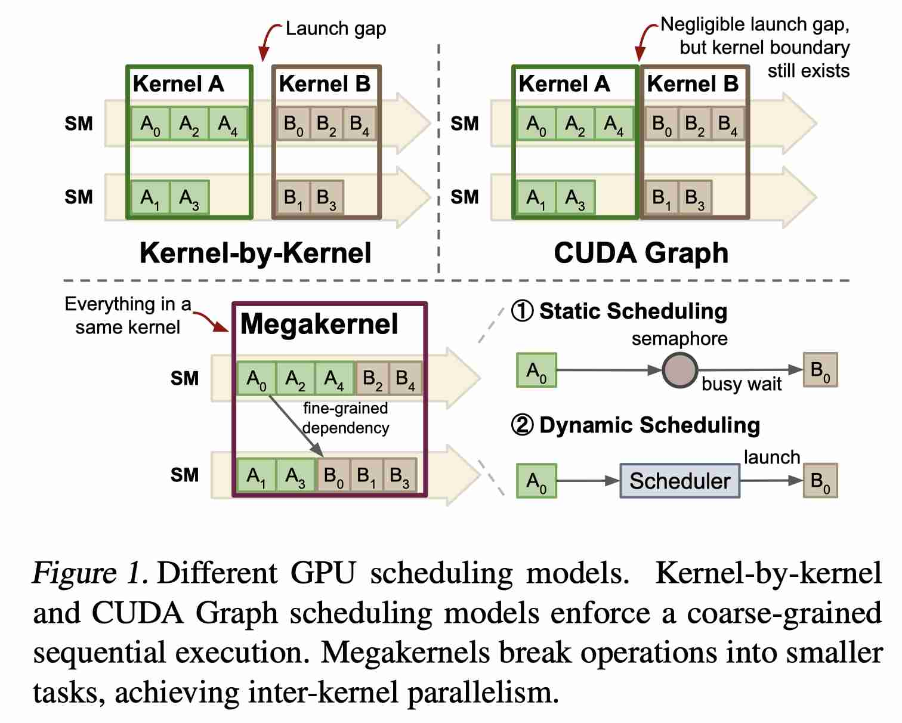

# Event Tensor: A Unified Abstraction for Compiling Dynamic Megakernel

> Hongyi Jin, Bohan Hou, Guanjie Wang, Ruihang Lai, Jinqi Chen, Zihao Ye, Yaxing Cai, Yixin Dong, Xinhao Cheng, Zhihao Zhang, Yilong Zhao, Yingyi Huang, Lijie Yang, Jinchen Jiang, Gabriele Oliaro, Jianan Ji, Xupeng Miao, Vinod Grover, Todd C. Mowry, Zhihao Jia, Tianqi Chen
> 
> Carnegie Mellon University, NVIDIA, UC Berkeley, Shanghai Jiao Tong University, Princeton University, Tsinghua University, Peking University
> 
> arXiv: 2604.13327, MLSys 2026

> 注：以下论文笔记由 AI Agent 自动生成，可能存在理解偏差或遗漏，请以原论文为准。

## Abstract

Modern GPU workloads, especially large language model (LLM) inference, suffer from kernel launch overheads and coarse synchronization that limit inter-kernel parallelism. Recent megakernel techniques fuse multiple operators into a single persistent kernel to eliminate launch gaps and expose inter-kernel parallelism, but struggle to handle dynamic shapes and data-dependent computation in real workloads. We present Event Tensor, a unified compiler abstraction for dynamic megakernels. Event Tensor encodes dependencies between tiled tasks, and enables first-class support for both shape and data-dependent dynamism. Built atop this abstraction, our Event Tensor Compiler (ETC) applies static and dynamic scheduling transformations to generate high-performance persistent kernels. Evaluations show that ETC achieves state-of-the-art LLM serving latency while significantly reducing system warmup overhead.

## 一句话总结

Event Tensor 通过将细粒度同步事件建模为支持符号 Shape 的张量，实现了动态 MegaKernel 的统一编译抽象，使 ETC 编译器能自动生成静态/动态调度的持久化内核，在 LLM 推理中实现通信-计算重叠、MoE 动态路由优化和端到端延迟降低，同时将系统预热开销降低一个数量级。

## 背景与问题

现代 GPU 工作负载（尤其是 LLM 推理）面临两大核心瓶颈：

### 1. 内核启动开销（Kernel Launch Overhead）

- 每次内核发射需穿越 PCIe 总线、更新硬件状态、设置参数，累积约 5-10μs
- LLM 解码步骤涉及数百个细粒度算子，最快的 GEMM/Norm 内核仅需 2μs
- GPU 超过一半时间在等待 CPU 发号施令，而非实际计算

### 2. 内核边界强制的隐式同步

- 传统 kernel-by-kernel 模型中，每个内核必须完全结束后，下一个才能开始
- 后续算子往往只依赖前序算子的部分输出，理论上可流水线并行
- 内核边界像一道"柏林墙"，阻断了细粒度的内核间并行性

### 3. CUDA Graph 的权宜之计与致命短板

- CUDA Graph 通过录制和重放静态执行图谱降低启动开销
- **致命假设**：计算图必须是静态的（所有 Shape、控制流、指针地址在录制时确定）
- Shape 变化（如 Batch Size 32→33）需重新捕获整个 Graph
- MoE 数据依赖控制流直接"缴械投降"——无法为依赖输入 Token 内容的专家路由网络预录静态图

### 4. 超级内核的"动态困局"

- 超级内核将所有算子塞进一个持久化内核，消除 CPU 侧启动开销
- **动态 Shape 难题**：编译时需确定任务网格大小，Batch Size 变化要么重新编译，要么为每种 Shape 预编译（不现实）
- **数据依赖难题**：MoE 层中 Token 分配由前一层输出动态决定，哪些 Tile 任务依赖哪些事件在编译时未知

## 核心方法

### Event Tensor 抽象

Event Tensor 的本质是将传统并行编程中散落各处的、手工管理的信号量，提升到编译器 IR 的层面，赋予其张量的代数结构与符号能力。

#### 核心洞察

> 既然同步事件本身可以看作任务完成状态的集合，为什么不将它们组织成与数据张量同构的多维数组，享受符号 Shape 和编译器优化的全套红利？

#### 语言构造三板斧

1. **Device Function（设备函数）**：定义在 GPU 上并行启动的 Tile 任务网格，每个任务由多维坐标标识，运行在一个 SM 上

2. **Event Tensor（事件张量）**：多维结构，元素代表"一组任务的完成状态"
   - 每个事件元素维护初始等待计数器（Wait Count），记录依赖的任务数量
   - 支持两个核心操作：
     - `E[i].notify()`：信号完成，计数器减 1
     - `E[i].wait()`：阻塞直至计数器归零
   - 在动态调度模式下，可主动触发依赖它的任务

3. **Graph Function（图函数）**：描述整体计算图，包含 `call_device` 调用
   - 不仅包含数据张量，还显式包含 Event Tensor
   - 每次设备函数启动可标注输入/输出依赖，并通过坐标映射精确描述任务间同步关系

#### 驯服 Shape 动态性

- Event Tensor 的维度可以是符号变量（如 Batch Size $B$）
- 符号化的图在编译时定义"依赖关系的生成规则"，而非具体依赖边
- 运行时当具体 Shape（如 $B=1$ 或 $B=2$）传入时，规则动态实例化出对应规模的依赖图
- **关键优势**：不重新编译、不重新捕获 Graph 的前提下，彻底摆脱 CUDA Graph 需重复捕获的缺陷

#### 拥抱数据依赖（MoE）

Event Tensor 通过两个核心机制应对 MoE 数据依赖：

1. **数据依赖的事件更新（Data-Dependent Event Update）**
   - 事件计数器初始值不再是编译时常量，而是根据运行时 `topk` 结果动态计算
   - 每个专家的事件计数器初始化为路由到该专家的 Token 数量

2. **数据依赖的任务触发（Data-Dependent Task Triggering）**
   - 一个事件可触发数量不等的消费者任务
   - 张量 `exp_indptr` 存储每个专家需要触发的 GroupGEMM Tile 的起止索引
   - 专家 $i$ 的事件触发范围在 `(exp_indptr[i], exp_indptr[i+1])` 内的所有 Tile

### 编译器（ETC）

ETC 提供从 Event Tensor 抽象到具体调度策略的自动化变换流水线。

#### 静态调度（Static Scheduling）

适用于 Tile 执行时间相对均匀、依赖模式固定的工作负载（如密集模型的 MLP 层）。

**三步走变换**：
1. 构建每 SM 执行队列：编译器在 Host 端预先计算每个 SM 应执行的任务序列
2. 生成持久化主循环：生成"永不退出"的 GPU 内核，每个 SM 循环从私有队列取出任务并执行
3. 降低 Event Tensor 依赖：将高层 `out_edges` 和 `in_edges` 注解具体化为 `notify()` 和 `wait()` 调用

**SM 级别细粒度交叠**：
- SM0 完成 MM0 后通知事件（计数器减 1），RS 任务进入自旋等待
- SM1 继续执行 MM0，GPU 保持忙碌
- SM1 完成后，计数器归零，SM0 上的 RS 任务被唤醒执行

#### 动态调度（Dynamic Scheduling）

适用于 MoE 等 Tile 执行时间高度不确定、任务图拓扑运行时才揭晓的场景。

**核心机制**：
- 编译器为每个任务引入 `push` 和 `pop` 操作，与全局任务队列关联
- **Producer 任务**：执行完毕后原子更新事件计数器，归零时调用 `scheduler.push_tasks` 推入就绪队列
- **Consumer 任务**：SM 空闲并从队列 `pop` 到任务时，先执行 `event.wait()` 确保所有 Producer 已完成，再执行计算

**动态调度天然实现负载均衡**：执行快的 SM 会自然拉取更多任务。

#### 极简运行时

ETC 将调度逻辑编译进内核本身：
- Event Tensor 直接降低为整数张量，复用现有张量数据结构
- `notify()` 实现为 `atomicSub`（原子减）
- `wait()` 实现为对计数器值的自旋循环
- 运行时状态仅由整数张量和调度器任务队列组成

## 技术细节

### 端到端编译流程

1. 从带 Event Tensor 注解的计算图出发
2. 标准图优化（内存规划）
3. Tile 级优化（硬件指令映射、流水线策略）
4. 调度变换（静态或动态 Pass）
5. 生成融合设备函数，以持久化内核形式输出 GPU 代码
6. 可选预取（Prefetching）Pass，插入权重预取逻辑

### 静态/动态调度权衡

| 调度策略 | 优势 | 劣势 | 适用场景 |
|---------|------|------|---------|
| 静态调度 | 零开销 | 不灵活，需预知形状 | 规则负载（密集 MLP、通信模式固定） |
| 动态调度 | 灵活负载均衡 | 有队列 Push/Pop 开销 | 不规则负载（MoE 数据依赖路由） |

## 实验设置

### 硬件环境
- 8 张 NVIDIA B200 GPU，通过 NVLink 连接
- Ubuntu 24.04，PyTorch 2.8.0，CUDA 13.0，驱动 580.82.07

### 评估模型
- Qwen3-30B-A3B（MoE，128 专家，Top-8 路由）
- Qwen3-32B（Dense）
- TP=1 和 TP=4 配置

### 基线系统
- **通信-计算重叠**：cuBLAS+NCCL、TP-Async、Triton Distributed v0.0.2-rc、cuBLASMp
- **MoE 层**：Triton 3.4.0、FlashInfer 0.2.14.post1
- **端到端服务**：vLLM (v0.11.0rc2)、SGLang (v0.5.3rc0)，均使用 CUDA Graph 和 torch.compile

### 评估指标
- 执行时间（通信-计算重叠、MoE 层）
- TPOT（Time Per Output Token，端到端延迟）
- 预热时间（从引擎启动到首次服务的总耗时）

## 主要结果

### 1. 通信与计算重叠（8 张 B200）

**GEMM + Reduce-Scatter**：
- ETC 在所有 MLP 配置上均优于所有基线
- 最大配置相比 cuBLAS+NCCL 基线实现最高 **1.40x** 执行时间加速
- TP-Async 粗粒度切分导致 Tile 过小或过大，重叠效果不佳

**All-Gather + GEMM**：
- 趋势一致，ETC 同样在大多数配置下保持领先，最高加速同样达到 **1.40x**

### 2. MoE 层性能（单张 B200）

- ETC 在不同 Token 数量下均显著超越 Triton 和 FlashInfer
- 最高较基线提速 **1.23x**（1024 tokens 时）
- FlashInfer 在大 Token 数下 GroupGEMM 优化更好，Triton 在融合 gather/scatter 上有优势
- ETC 优势来源：
  1. 打破 MoE 两阶段 GroupGEMM 间的全局同步屏障，实现细粒度流水线
  2. 片上动态调度器为不规则专家负载提供比静态分配更优的负载均衡

### 3. 端到端低 Batch 服务性能

**Qwen3-30B-A3B (MoE, TP=1)**：
- Batch Size=1 时，ETC 的 TPOT 比 vLLM 快 **1.48x**，比 SGLang 快 **1.20x**

**Qwen3-32B (Dense, TP=1)**：
- 所有 Batch Size 下均保持最低延迟
- Batch Size=1 时比 vLLM 快 **1.15x**，Batch Size=64 时比 SGLang 快 **1.09x**

**Qwen3-32B (TP=4)**：
- ETC 性能与 vLLM 持平（0.99x - 1.06x）
- SGLang 在此场景表现更优（高度优化的 CPU 侧调度器）

### 4. 预热开销

| 方法 | 预热时间 (s) | JIT Graph 捕获次数 |
|------|-------------|-------------------|
| SGLang (JIT) | 583 | 51 |
| vLLM (JIT) | 123 | 67 |
| **ETC (AOT)** | **35** | **0** |

- ETC 凭借 AOT 编译，预热时间从分钟级拉低到秒级
- 完全消除 JIT 编译和 CUDA Graph 捕获开销

### 5. 静态/动态调度对比

**MoE 层（表 2）**：
- 动态调度在 128-4096 tokens 场景下最优（最高 1.08x vs unfused）
- 静态调度仅小幅提升（1.02-1.04x）
- 数据依赖类负载中，动态调度的负载均衡优势显著

**张量并行 TP=4（表 3）**：
- 静态调度完胜（1.06-1.09x）
- 动态调度性能下降（0.82-0.89x）
- 分布式环境中动态调度的任务队列推送/弹出产生远程通信开销

## 优点与局限

### 优点

1. **统一抽象**：首次在 MegaKernel 框架下系统性解决 Shape 动态性和数据依赖两大挑战
2. **编译器驱动**：自动化将复杂的手工融合工程转化为可复用的编译 Pass
3. **动静双态调度**：同一套 Event Tensor 描述可无缝切换静态/动态调度策略
4. **极简运行时**：将调度逻辑编译进内核，无需重量级运行时库
5. **AOT 编译**：完全消除运行时 JIT 编译和 CUDA Graph 捕获开销
6. **已集成开源系统**：ETC 已被纳入主要开源系统

### 局限

1. **CPU 端调度开销未解决**：TP=4 时 SGLang 仍占优，作者将此归因于 SGLang 高度优化的 CPU 调度器和 ETC 当前服务引擎中较高的 CPU 侧开销
2. **静态调度对动态 Shape 的妥协**：采用"向上对齐"策略，未见过的 Shape 复用下一个更大采样 Shape 的执行队列，可能导致 SM 队列中存在大量空任务槽
3. **动态调度的竞争热点**：全局任务队列在 SM 数量激增时可能成为新瓶颈
4. **AOT 编译时间可能很长**：Qwen3-32B 离线编译需 107 秒
5. **指令缓存压力**：超级内核将大量代码塞进单个函数，可能对 I-Cache 造成压力（论文未深入讨论）
6. **Triton 生成的 GEMM tile 不如 cuBLAS 在某些配置下优化**：导致 ETC 在 TP=4 场景下偶有落后

## 与 EfficientPaper 主题的关系

本文属于 **kernel_generation** 类别，与 EfficientPaper 的核心主题高度相关：

- **MegaKernel 编译与融合**：系统性解决 GPU 内核融合中的动态 Shape 和数据依赖挑战
- **LLM 推理优化**：直接提升 vLLM/SGLang 等主流推理系统的性能
- **通信-计算重叠**：在 Tensor Parallel 场景下实现细粒度计算-通信重叠
- **MoE 优化**：将整个 MoE 数据流融合进单个超级内核
- **与相关工作的关系**：与 Mirage Persistent Kernel、FlashDMoE、Luminal 等 MegaKernel 工作形成互补

## 可复现/实现要点

1. **编译器基础设施**：ETC 基于 Apache TVM 构建，但 Event Tensor 抽象本身 DSL-agnostic
2. **硬件要求**：实验在 B200 上进行，但 Event Tensor 在编译器 IR 层面工作，不依赖特定 GPU 代
3. **实现依赖**：需要 TVM-based DSL 编写 device functions（支持标准 tile-based 编程）
4. **分布式支持**：Event Tensor 支持分布式张量（shard），通过 `shard="S[0]"` 参数声明
5. **动态调度实现**：使用集中式全局队列（在全局内存中），简单但可能在规模扩展时产生竞争
6. **预取优化**：可选的预取 Pass 插入权重预取逻辑，在输入激活到来前提前加载权重

## 个人备注

- Event Tensor 的核心贡献在于将细粒度同步提升为编译器 IR 的一等公民，这为未来 GPU 编程模型的设计提供了重要启示
- 论文坦诚地指出了 CPU 端调度开销未解决的问题，这可能是下一步优化的重点方向
- 静态/动态调度的权衡分析非常有参考价值，展示了没有银弹，只有针对特定负载的最优选择
- 与 vLLM/SGLang 的端到端对比（尤其 TP=4 场景）表明，ETC 的 GPU 内核性能已与最强基线无本质差距，但 CPU 侧调度仍有提升空间
- 相关工作中提到的 Mirage、FlashDMoE、Luminal 等 MegaKernel 工作值得关注，它们与 Event Tensor 形成互补的技术路线
- 论文提到 ETC 已被纳入主要开源系统，这表明其实际影响力正在扩大
- 未来工作方向：自动从标准计算图生成 Event Tensor 任务图的高级编译 Pass，以及更多领域特定语言（DSL）的集成