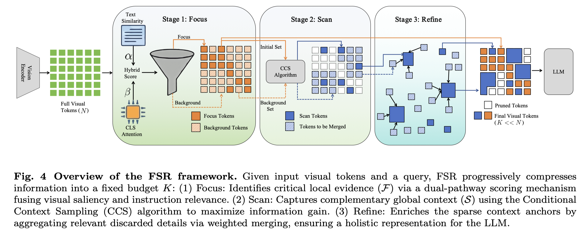

# Focus-Scan-Refine: From Human Visual Perception to Efficient Visual Token Pruning

> Enwei Tong, Yuanchao Bai, Yao Zhu, Junjun Jiang, Xianming Liu

## Abstract

Vision-language models (VLMs) often generate massive visual tokens that greatly increase inference latency and memory footprint; while training-free token pruning offers a practical remedy, existing methods still struggle to balance local evidence and global context under aggressive compression. We propose Focus-Scan-Refine (FSR), a human-inspired, plug-and-play pruning framework that mimics how humans answer visual questions: focus on key evidence, then scan globally if needed, and refine the scanned context by aggregating relevant details. FSR first focuses on key evidence by combining visual importance with instruction relevance, avoiding the bias toward visually salient but query-irrelevant regions. It then scans for complementary context conditioned on the focused set, selecting tokens that are most different from the focused evidence. Finally, FSR refines the scanned context by aggregating nearby informative tokens into the scan anchors via similarity-based assignment and score-weighted merging, without increasing the token budget. Extensive experiments across multiple VLM backbones and vision-language benchmarks show that FSR consistently improves the accuracy-efficiency trade-off over existing state-of-the-art pruning methods. The source codes can be found at https://github.com/ILOT-code/FSR

- VLM 任务上对vision token进行pruning