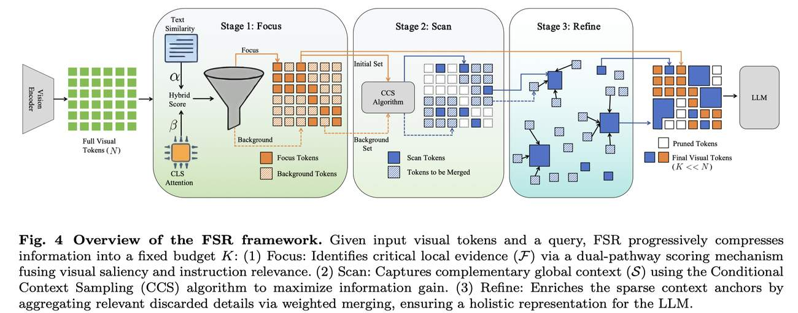

# Focus-Scan-Refine: From Human Visual Perception to Efficient Visual Token Pruning

> Enwei Tong, Yuanchao Bai, Yao Zhu, Junjun Jiang, Xianming Liu

> 注：以下论文笔记由 AI Agent 自动生成，可能存在理解偏差或遗漏，请以原论文为准。

## Abstract

Vision-language models (VLMs) often generate massive visual tokens that greatly increase inference latency and memory footprint; while training-free token pruning offers a practical remedy, existing methods still struggle to balance local evidence and global context under aggressive compression. We propose Focus-Scan-Refine (FSR), a human-inspired, plug-and-play pruning framework that mimics how humans answer visual questions: focus on key evidence, then scan globally if needed, and refine the scanned context by aggregating relevant details. FSR first focuses on key evidence by combining visual importance with instruction relevance, avoiding the bias toward visually salient but query-irrelevant regions. It then scans for complementary context conditioned on the focused set, selecting tokens that are most different from the focused evidence. Finally, FSR refines the scanned context by aggregating nearby informative tokens into the scan anchors via similarity-based assignment and score-weighted merging, without increasing the token budget. Extensive experiments across multiple VLM backbones and vision-language benchmarks show that FSR consistently improves the accuracy-efficiency trade-off over existing state-of-the-art pruning methods.

## 一句话总结

FSR 是一个受人类视觉感知启发的训练无关视觉 token 剪枝框架，通过 Focus-Scan-Refine 三阶段动态分配局部证据和全局上下文，在多个 VLM 骨干和视觉语言基准上一致优于现有 SOTA 剪枝方法。

## 背景与问题

- **VLM 视觉 token 瓶颈**：
  - 现代 VLM 生成大量视觉 token（高分辨率编码、tiling 策略）
  - 注意力机制二次复杂度导致推理延迟和内存占用高
- **现有方法的局限**：
  - **注意力剪枝**：偏向视觉显著但查询无关区域
  - **相似性剪枝**：偏向全局区域，忽略细粒度局部细节
  - **联合注意力-相似性剪枝**：仍难以在固定预算下同时保留查询关键局部证据和互补全局上下文
- **核心问题**：如何在固定 token 预算下有效平衡局部证据和全局上下文？

## 核心方法

### 1. Focus-Scan-Refine 三阶段框架

**核心思想**：受人类视觉感知启发，模拟人类回答视觉问题的过程：关注关键证据 → 全局扫描 → 细化上下文。

**三阶段**：

**阶段 1：Focus（关注）**
- **双路径评分机制**：融合视觉显著性和指令相关性
- **避免偏差**：避免偏向视觉显著但查询无关的区域
- **关键证据选择**：保留 top token 直到累积信息密度阈值满足
- **动态分配**：根据任务复杂度动态分配局部证据和全局上下文

**阶段 2：Scan（扫描）**
- **条件采样策略**：基于关注集选择互补 token
- **多样性**：选择与关注证据最不同的 token，且 token 间多样
- **无冗余**：确保添加的 token 覆盖缺失上下文，无冗余

**阶段 3：Refine（细化）**
- **聚合模块**：将附近信息 token 聚合到扫描锚点
- **相似性分配**：基于相似性的分配
- **分数加权合并**：分数加权聚合
- **不增加预算**：保持 token 预算不变

### 2. 动态分配机制

- **任务依赖**：根据任务复杂度动态分配局部证据和全局上下文
- **简单查询**：集中于小局部区域（Focus = 9, Scan = 23）
- **复杂推理**：关注多个线索（Focus = 15, Scan = 17）
- **固定预算**：在固定 token 预算下动态调整

## 主要结果

### 性能提升

- **准确率-效率权衡**：一致优于现有 SOTA 剪枝方法
- **多 VLM 骨干**：在多个 VLM 骨干上验证
- **多基准**：在多个视觉语言基准上验证
- **动态分配**：有效平衡局部证据和全局上下文

### 关键发现

1. **FSR 有效**：三阶段框架有效平衡局部证据和全局上下文
2. **动态分配有效**：任务依赖的动态分配优于静态方法
3. **人类启发有效**：受人类视觉感知启发的框架有效
4. **无训练**：训练无关，可无缝集成到现有 VLM 中
5. **开源**：代码开源，可复现

## 优点与局限

### 优点

1. **人类启发**：受人类视觉感知启发的三阶段框架
2. **动态分配**：任务依赖的动态分配，平衡局部证据和全局上下文
3. **无训练**：训练无关，可无缝集成到现有 VLM 中
4. **一致优于 SOTA**：在多个 VLM 骨干和基准上一致优于现有方法
5. **开源**：代码开源，可复现
6. **高效**：在固定 token 预算下实现准确率-效率权衡

### 局限

1. **视觉 token 依赖**：依赖于视觉 token 的重要性和相关性评分
2. **预算依赖**：性能依赖于 token 预算的设置
3. **评估范围**：主要在特定 VLM 骨干和基准上评估，其他场景需进一步测试
4. **计算开销**：三阶段框架可能引入额外计算开销

## 与 EfficientPaper 主题的关系

FSR 属于 **Sparse Pruning**（`sparse_pruning`）和 **KV Cache Sparse**（`kv_cache_sparse`）领域，核心贡献包括：

- **人类启发的视觉 token 剪枝**：Focus-Scan-Refine 三阶段框架
- **动态分配**：任务依赖的局部证据和全局上下文分配

与 EfficientPaper 中已有论文的关系：
- **FastV**（2024）：注意力剪枝
- **LLaVA-PruMerge**（2024）：注意力剪枝+token 合并
- **SparseVLM**（2024）：文本引导注意力评分
- **VisionZip**（2025）：注意力-相似性联合剪枝
- **HoloV**（2025）：分区分配+连通性感知选择

## 可复现/实现要点

1. **Focus 阶段**：双路径评分（视觉显著性 + 指令相关性）
2. **Scan 阶段**：条件采样（与关注证据最不同，token 间多样）
3. **Refine 阶段**：相似性分配 + 分数加权聚合
4. **动态分配**：根据任务复杂度动态调整 Focus/Scan 比例
5. **固定预算**：在固定 token 预算下实现动态分配
6. **开源**：代码开源，可复现

## 个人备注

- FSR 的核心洞察是：**人类视觉感知的三阶段（关注-扫描-细化）可以有效平衡局部证据和全局上下文**。
- 双路径评分机制是关键设计选择，它避免了偏向视觉显著但查询无关区域。
- 动态分配是关键优化，它根据任务复杂度动态调整 Focus/Scan 比例。
- 论文来自 Harbin Institute of Technology 和 Zhejiang University，且代码开源，说明这是一个实用的系统。
- 值得关注的未来方向：(1) 在更多 VLM 骨干上的验证；(2) 与其他剪枝方法的结合；(3) 端到端的优化。
