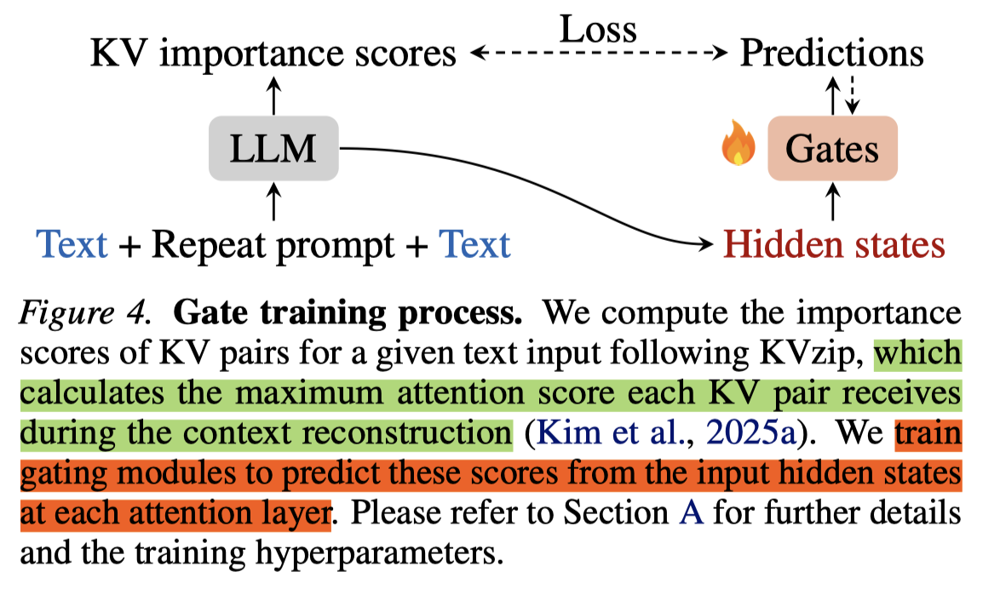

# Fast KVzip: Efficient and Accurate LLM Inference with Gated KV Eviction

> Jang-Hyun Kim, Dongyoon Han, Sangdoo Yun

## Abstract

Efficient key-value (KV) cache management is crucial for the practical deployment of large language models (LLMs), yet existing compression techniques often incur a trade-off between performance degradation and computational overhead. We propose a novel gating-based KV cache eviction method for frozen-weight LLMs that achieves high compression ratios with negligible computational cost. Our approach introduces lightweight sink-attention gating modules to identify and retain critical KV pairs, and integrates seamlessly into both the prefill and decoding stages. The proposed gate training algorithm relies on forward passes of an LLM, avoiding expensive backpropagation, while achieving strong task generalization through a task-agnostic reconstruction objective. Extensive experiments across the Qwen2.5-1M, Qwen3, and Gemma3 families show that our method maintains near-lossless performance while evicting up to 70% of the KV cache. The results are consistent across a wide range of tasks, including long-context understanding, code comprehension, and mathematical reasoning, demonstrating the generality of our approach.

和kvzap非常像