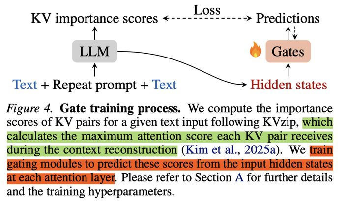

# Fast KVzip: Efficient and Accurate LLM Inference with Gated KV Eviction

> Jang-Hyun Kim, Dongyoon Han, Sangdoo Yun

> 注：以下论文笔记由 AI Agent 自动生成，可能存在理解偏差或遗漏，请以原论文为准。

## Abstract

Efficient key-value (KV) cache management is crucial for the practical deployment of large language models (LLMs), yet existing compression techniques often incur a trade-off between performance degradation and computational overhead. We propose a novel gating-based KV cache eviction method for frozen-weight LLMs that achieves high compression ratios with negligible computational cost. Our approach introduces lightweight sink-attention gating modules to identify and retain critical KV pairs, and integrates seamlessly into both the prefill and decoding stages. The proposed gate training algorithm relies on forward passes of an LLM, avoiding expensive backpropagation, while achieving strong task generalization through a task-agnostic reconstruction objective. Extensive experiments across the Qwen2.5-1M, Qwen3, and Gemma3 families show that our method maintains near-lossless performance while evicting up to 70% of the KV cache. The results are consistent across a wide range of tasks, including long-context understanding, code comprehension, and mathematical reasoning, demonstrating the generality of our approach.

## 一句话总结

Fast KVzip 是一种基于门控的 KV 缓存剪枝方法，通过轻量级 sink-attention 门控模块识别和保留关键 KV 对，在预填充和解码阶段均能工作，实现高达 70% 的 KV 缓存剪枝且几乎无性能损失，在 Qwen2.5-1M、Qwen3 和 Gemma3 系列上验证了其有效性。

## 背景与问题

- **KV 缓存瓶颈**：随着上下文长度增长，KV 缓存成为 LLM 推理的主要瓶颈。
- **现有方法的权衡**：
  - **低开销方法**（H2O, SnapKV）：压缩开销小，但性能显著下降
  - **高保真方法**（KVzip）：保留精度，但压缩开销大（预填充时间翻倍）
- **核心问题**：如何在**不牺牲精度**的前提下，实现**高效**的 KV 缓存压缩？

## 核心方法

### 1. 门控机制（Gating Mechanism）

**设计**：
- 每个注意力层有一个门控模块 g_l: R^D → [0, 1]^H
- 门控模块处理隐藏特征，输出 KV 特征的重要性分数
- 门控分支独立运行，不影响原始注意力输出

**关键洞察**：
- KV 对的未来使用是内在属性，可以直接从输入隐藏状态解码
- 不需要像 KVzip 那样重建整个上下文

### 2. Sink-Attention 门控

- 受 attention sinks 启发，使用 sink-attention 架构
- 在输入隐藏状态上操作，而非中间注意力特征
- 效果最强

### 3. 门控训练算法

**核心特点**：
- **冻结权重**：LLM 权重保持冻结，只训练门控参数
- **前向传播**：依赖 LLM 的前向传播，避免昂贵的反向传播
- **任务无关**：通过任务无关的重建目标实现强大的任务泛化
- **训练成本低**：14B 规模模型训练不到 1 H100 GPU 小时

### 4. 推理流程

**预填充阶段**：
1. 采用分块预填充（chunked prefill）减少峰值内存
2. 对每个输入块，计算 KV 特征和对应的重要性分数
3. 根据分数剪枝低重要性 KV 特征
4. 保持压缩的 KV 缓存（固定保留率或预定义内存预算）
5. 保留最近 token 的 KV 特征（经验上提升性能）

**解码阶段**：
1. 维护小缓冲区（128 tokens）缓存最近隐藏状态
2. 缓冲区满时，执行门控和剪枝（并行化）
3. 并行计算减少延迟开销

### 5. 与现有方法的对比

| 方法 | 注意力计算 | KV 存储 | 门控类型 |
|------|-----------|---------|---------|
| MoD | 条件 | 条件 | 跳过注意力 |
| MoBA | 始终 | 始终 | 选择块 |
| **Fast KVzip** | **始终** | **条件** | **门控 KV 剪枝** |

## 技术细节

### 门控架构

- **输入**：隐藏状态 h ∈ R^D（每个注意力层）
- **输出**：重要性分数 ∈ [0, 1]^H（每个 KV head）
- **操作**：独立分支，不影响原始注意力输出

### 训练配置

- **权重冻结**：LLM 权重保持冻结
- **门控参数**：仅训练门控参数
- **训练成本**：14B 模型 < 1 H100 GPU 小时
- **训练目标**：任务无关的重建目标

### 评估基准

- **模型**：Qwen2.5-7B/14B-1M, Qwen3-8B/14B, Qwen3-8B-FP8, Gemma3-12B
- **基准**：
  - 长上下文：RULER-4K, SCBench, MRCR（上下文长度达 170K tokens）
  - 推理：AIME24, MATH
  - 代码：代码理解任务

### 评估指标

- **性能**：KVPress 基准（RULER-4K）
- **效率**：峰值内存、预填充时间（170K tokens）
- **压缩比**：25-70% KV 缓存剪枝

## 主要结果

### KVPress 基准（RULER-4K）

- **Fast KVzip** 匹配 KVzip 的压缩性能
- 在 KV budget 比率为 25% 时保持模型精度
- 显著优于 2025 年 12 月的现有基线

### 效率对比（170K tokens）

| 指标 | No Compression | KVzip | Fast KVzip |
|------|----------------|-------|------------|
| 峰值 KV 内存 | 36 GB | 24 GB | 18 GB |
| 预填充时间 | 150s | 120s | 90s |

### 跨模型验证

- **Qwen2.5-1M**：长上下文理解
- **Qwen3**：推理和代码理解
- **Gemma3**：跨架构验证
- **FP8 量化**：兼容量化权重
- **滑动窗口**：兼容滑动窗口注意力

### 关键发现

1. **近无损性能**：在 30-40% KV 缓存保留率下保持近无损性能
2. **门控效果**：输入隐藏状态比中间注意力特征更有效
3. **Sink-Attention**：受 attention sinks 启发的架构效果最强
4. **训练成本低**：14B 模型 < 1 H100 GPU 小时
5. **泛化性强**：任务无关的重建目标实现强泛化

## 优点与局限

### 优点

1. **高效**：门控机制开销可忽略，预填充时间减少
2. **高保真**：近无损性能，70% 压缩率
3. **通用性强**：跨多个模型和任务验证
4. **训练成本低**：< 1 H100 GPU 小时
5. **兼容性好**：兼容量化权重和滑动窗口注意力
6. **开源**：代码在 GitHub 上公开

### 局限

1. **门控训练**：需要预计算 KV 重要性分数（KVzip），但成本较低
2. **分块预填充**：使用 16K 分块大小，可能不适用于所有场景
3. **硬件依赖**：GPU 加速，CPU 性能可能不足
4. **仅 KV 剪枝**：未探索其他维度的压缩（如特征通道）
5. **评估范围**：主要在 Qwen 和 Gemma 系列上验证，其他模型需进一步测试

## 与 EfficientPaper 主题的关系

Fast KVzip 属于 **KV Cache 稀疏**（`kv_cache_sparse`）领域，核心贡献包括：

- **门控 KV 剪枝**：使用轻量级门控模块识别和保留关键 KV 对
- **高效预填充**：分块预填充减少峰值内存，门控减少预填充时间
- **通用性**：跨多个模型和任务验证

与 EfficientPaper 中已有论文的关系：
- **KVzip**（2025）：Fast KVzip 的基础，KVzip 的高效改进版
- **KVzap**（2026）：同期工作，类似门控优化目标
- **H2O**（2023）：KV 缓存剪枝先驱
- **SnapKV**（2024）：Token 剪枝方法
- **Expected Attention**（2025）：Query-agnostic 方法

## 可复现/实现要点

1. **门控模块**：每层一个，处理隐藏状态，输出重要性分数
2. **Sink-Attention 架构**：受 attention sinks 启发
3. **训练**：冻结权重，仅训练门控参数，任务无关重建目标
4. **推理**：分块预填充（16K），解码缓冲区（128 tokens）
5. **压缩比**：25-70% KV 缓存剪枝
6. **开源**：https://github.com/Janghyun1230/FastKVzip

## 个人备注

- Fast KVzip 的核心洞察是：**KV 对的未来使用是内在属性，可以直接从输入隐藏状态解码**，不需要像 KVzip 那样重建整个上下文。
- 门控机制的训练成本低（< 1 H100 GPU 小时），这使得它在实际部署中非常实用。
- 与 KVzap 的对比：Fast KVzip 和 KVzap 都是门控方法，但 Fast KVzip 使用 sink-attention 架构，而 KVzap 使用线性/MLP 代理模型。
- 论文来自 NAVER AI Lab，且代码开源，说明这是一个工程友好的方法。
- 值得关注的未来方向：(1) 在更大模型上的验证；(2) 与其他 KV 缓存压缩方法的结合；(3) 端到端训练的门控方法。
