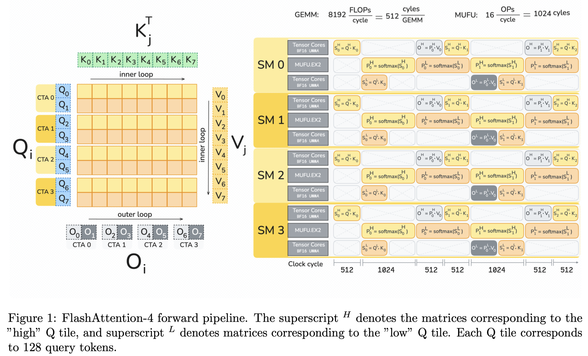

# FlashAttention-4: Algorithm and Kernel Pipelining Co-Design for Asymmetric Hardware Scaling

> Ted Zadouri, Markus Hoehnerbach, Jay Shah, Timmy Liu, Vijay Thakkar, Tri Dao

## Abstract

Attention, as a core layer of the ubiquitous Transformer architecture, is the bottleneck for large language models and long-context applications. While FlashAttention-3 optimized attention for Hopper GPUs through asynchronous execution and warp specialization, it primarily targets the H100 architecture. The AI industry has rapidly transitioned to deploying Blackwell-based systems such as the B200 and GB200, which exhibit fundamentally different performance characteristics due to asymmetric hardware scaling: tensor core throughput doubles while other functional units (shared memory bandwidth, exponential units) scale more slowly or remain unchanged. We develop several techniques to address these shifting bottlenecks on Blackwell GPUs: (1) redesigned pipelines that exploit fully asynchronous MMA operations and larger tile sizes, (2) software-emulated exponential and conditional softmax rescaling that reduces non-matmul operations, and (3) leveraging tensor memory and the 2-CTA MMA mode to reduce shared memory traffic and atomic adds in the backward pass. We demonstrate that our method, FlashAttention-4, achieves up to 1.3$\times$ speedup over cuDNN 9.13 and 2.7$\times$ over Triton on B200 GPUs with BF16, reaching up to 1613 TFLOPs/s (71% utilization). Beyond algorithmic innovations, we implement FlashAttention-4 entirely in CuTe-DSL embedded in Python, achieving 20-30$\times$ faster compile times compared to traditional C++ template-based approaches while maintaining full expressivity.
