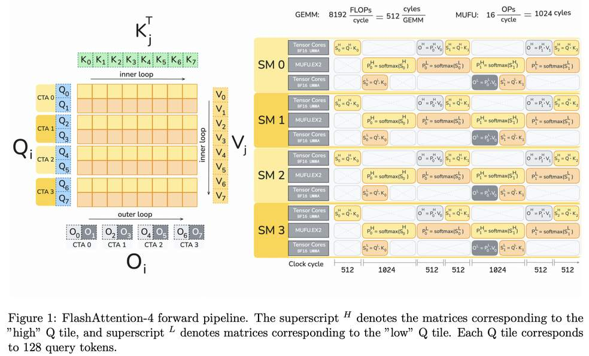

# FlashAttention-4: Algorithm and Kernel Pipelining Co-Design for Asymmetric Hardware Scaling

> Ted Zadouri, Markus Hoehnerbach, Jay Shah, Timmy Liu, Vijay Thakkar, Tri Dao

> ⚠️ **本文档由 AI Agent（Hermes）自动生成，仅供参考。生成时间：2026 年 6 月。**

---

## 一句话总结

FlashAttention-4 针对 NVIDIA Blackwell GPU（B200/GB200）的非对称硬件缩放特性，通过算法与内核管线的协同设计，利用异步 MMA 操作、软件模拟指数函数、条件 softmax 重缩放、tensor memory 及 2-CTA MMA 模式等技术，将注意力计算性能提升至最高 1613 TFLOPs/s（理论峰值的 71%），较 cuDNN 9.13 加速 1.3×，较 Triton 加速 2.7×，并完全使用 Python 中的 CuTe-DSL 实现，编译时间比 C++ 模板方案快 20-30×。

---

## 摘要翻译

注意力机制作为 Transformer 架构的核心层，是大语言模型和长上下文应用的瓶颈。虽然 FlashAttention-3 通过异步执行和 warp 特化为 Hopper GPU 优化了注意力计算，但其主要针对 H100 架构。AI 行业已迅速转向部署 Blackwell 系统（如 B200 和 GB200），这些系统由于非对称硬件缩放而表现出根本不同的性能特征：tensor core 吞吐量翻倍，而其他功能单元（共享内存带宽、指数单元）缩放更慢或保持不变。我们开发了几种技术来应对 Blackwell GPU 上这些不断变化的瓶颈：（1）重新设计的管线，利用完全异步的 MMA 操作和更大的 tile 尺寸，（2）软件模拟指数函数和条件 softmax 重缩放，减少非矩阵乘法操作，（3）利用 tensor memory 和 2-CTA MMA 模式，减少反向传播中的共享内存流量和原子加法。我们证明 FlashAttention-4 在 B200 GPU 上使用 BF16 可达到最高 1.3×（较 cuDNN 9.13）和 2.7×（较 Triton）的加速，最高达到 1613 TFLOPs/s（71% 利用率）。在算法创新之外，FlashAttention-4 完全使用嵌入 Python 的 CuTe-DSL 实现，编译时间比传统 C++ 模板方法快 20-30×，同时保持完整的表达能力。

---

## 研究动机

1. **Transformer 注意力瓶颈**：注意力机制在序列长度上呈二次方缩放，是 LLM 和长上下文应用的主要计算瓶颈。随着上下文长度的增加（多文档推理、代码建模、高分辨率视频处理），加速注意力计算至关重要。

2. **硬件非对称缩放**：Blackwell B200 相比 Hopper H100 的 tensor core 吞吐量翻倍（2.25 PFLOPS vs. 1 PFLOPS），但共享内存带宽（128 bytes/clock/SM）和指数单元（16 ops/clock/SM）保持不变或缩放更慢。这导致非矩阵乘法资源成为瓶颈——roofline 分析表明，共享内存流量和指数操作执行时间超出 MMA 计算 25-60%。

3. **新硬件特性未被利用**：Blackwell 引入了 tensor memory（TMEM，每 SM 256KB）、128×128 MMA tile（Hopper 为 64×128）、完全异步 tensor core 操作（直接写入 TMEM），以及 2-CTA MMA 模式。现有算法无法直接移植，或无法充分利用这些特性。

4. **FlashAttention-3 局限**：FA-3 针对 H100 架构优化，无法在 B200 上运行，且不涉及 Blackwell 特有的 TMEM、大 tile 和 2-CTA 模式。

---

## 方法（技术细节）

### 3.1 前向传播

#### 3.1.1 Roofline 分析与瓶颈识别

对注意力前向传播进行 roofline 分析，考虑三种资源：

- **MMA 计算**：每次迭代执行两次 MMA（QK^⊤ 和 PV），计算量为 4MNd，tensor core 吞吐量 8192 FLOPs/clock，时间 T_MMA = 4MNd/8192 cycles
- **共享内存流量**：两个 MMA 的总读取量为 3MNd/8192 cycles（假设 M、N、d 均为 128 的倍数）
- **指数单元**：softmax 的指数运算，吞吐量 16 ops/clock，时间 T_exp = MN/16 cycles

| 资源 | M=N=d=128 | M=256, N=d=128 |
|---|---|---|
| MMA 计算 | 1024 cycles | 2048 cycles |
| 共享内存 | 768 cycles | 1536 cycles |
| 指数单元 | 1024 cycles | 2048 cycles |

MMA 和指数单元是主要瓶颈，共享内存流量在大 tile 时也显著增加。

#### 3.1.2 新管线设计（Ping-Pong 调度）

- **双 warpgroup 架构**：使用两个 128 线程的 softmax warpgroup，每个线程处理整行（128 元素），消除 inter-warp shuffle 和多统计量寄存器
- **TMEM 优势**：Blackwell tensor core 直接将累加器写入 TMEM（而非寄存器），消除寄存器压力，支持更大 tile（128×128）
- **管线重叠**：一个 tile 执行 tensor core 操作时，另一个 tile 计算 softmax
- **解耦输出重缩放**：通过 TMEM 传递 P，将输出重缩放到独立的"correction" warpgroup，从关键路径中移出
- **寄存器压力管理**：BF16 输入需要 128 寄存器，输出需要 64 寄存器，通过分阶段存储 P（前 3/4 一次存储，最后 1/4 单独存储）来降低压力
- **TMEM 分区**：选择两个 S tile 重叠 P 的方案（而非一个 S + 两个 P），可立即计算两个 S tile

#### 3.1.3 软件模拟指数函数

**问题**：MUFU 指数单元吞吐量（16 ops/clock）远低于 tensor core（8192 ops/clock），成为瓶颈。

**解决方案**：使用浮点 FMA 单元进行多项式近似，与 MUFU 并行运行。

- **范围缩减**：使用 Cody-Waite 技术将 x 分解为整数部分和小数部分
- **整数部分**：2^⌊x⌋ 通过 IEEE 754 浮点表示的位操作（指数位移和加法）高效计算
- **小数部分**：使用多项式近似 2^x_frac ≈ Σ p_i * x_frac^i（p0=1.0，使用 Horner 法和 FMA 指令）
- **精度**：度数 3 多项式的最大相对误差为 8.8×10^-5（FP32），但 BF16 量化误差主导（~3.9×10^-3），与硬件 MUFU 无显著差异
- **部分模拟**：仅对每行 softmax 的 10-25% 条目使用软件模拟，其余使用硬件 MUFU，以平衡吞吐量和寄存器压力

#### 3.1.4 条件 Softmax 重缩放

**标准 FlashAttention 在线 softmax**：当遇到更大值时，需要对之前结果进行重缩放（乘以 e^(m_j-1 - m_j)）。

**条件重缩放**：仅在 m_j - m_{j-1} > τ 时执行重缩放（τ 通常设为 log2(256) = 8.0）。跳过不必要的重缩放，最终通过 m_final 和 ℓ_final 归一化保证正确性。

此修改显著减少重缩放操作次数，同时保持数值精度。为避免 warp 分歧，当 warp 中任何线程需要重缩放时才执行。

### 3.2 反向传播

#### 3.2.1 Roofline 分析

反向传播执行五次 MMA 操作，M = N = d = 128 时：

- **MMA 计算**：2560 cycles
- **共享内存流量**：3328 cycles（**主要瓶颈**，超出 MMA 计算约 30%）
- **指数单元**：1024 cycles

#### 3.2.2 新管线（MMA 与 softmax 重叠）

- 利用 TMEM 实现前一次迭代的 dQ 和 dK MMA 与当前迭代的 softmax 重叠
- S 和 P 共享一个 TMEM 块（offset 0），dP、dS 和 dQ 共享另一个
- 实现计算图中的重叠：dP 计算（当前 tile）与 dQ MMA（上一个 tile）并行

#### 3.2.3 2-CTA 反向传播

**问题**：共享内存流量仍是反向传播瓶颈（8 个 BF16 操作数需要从共享内存加载）。

**解决方案**：使用 Blackwell 的 2-CTA MMA 模式，输出累加器在 M 维度分区（M=256, N=K=128）：

- **共享内存减少**：每个 CTA 只需加载和存储 B 操作数的一半，共享内存流量大幅减少
- **dQ MMA 处理**：使用分布式共享内存（DSMEM）在 CTA 对之间交换一半 dS，将 dQ MMA 的 tile 形状调整为 (M/2, 2N) × (2N, d)
- **原子加法减半**：每个 CTA 只写入一半 dQ tile，原子全局还原数量减半
- **DSMEM 延迟隐藏**：通过重新排序管线（先计算当前 tile 的 dP，再计算上一个 tile 的 dQ），将元素级 dS 与 dQ MMA 并行

#### 3.2.4 确定性反向传播

为保证可重复训练（尤其是强化学习应用），提供确定性执行模式：

- 使用信号量锁序列化全局还原（每个 CTA 按预定顺序获取锁）
- CTA 调度优化：在 head 和 batch 维度进行 CTA swizzling 以减少等待
- 因果掩码：KV 块降序启动，查询块从对角线升序遍历，dQ 还原按查询块降序排列（SPT 调度）
- 确定性模式性能为非确定性 1-CTA 反向传播的 75%

### 3.3 调度策略

#### LPT（最长处理时间优先）调度

- **因果掩码**：标准网格按 (mblocks, heads, batches) 从左到右递增处理，但因果掩码导致效率低下。LPT 方案：按 batch 为最外层维度，head 分区（不超过 L2 缓存），mblocks 降序遍历
  - BF16 head 128：MHA 获得 4-8% FLOPS 提升，MQA 8 获得 7-14% 提升（H200 测量）
- **变长序列**：预处理内核按最大每个 tile 执行时间排序 batch，输出虚拟-实际 batch 索引映射，元数据可缓存

---

## 实验结果

### 前向传播

- 在 B200 GPU 上，BF16 输入，head 维度 128
- **较 cuDNN 9.13 加速 1.1-1.3×**
- **较 Triton 加速 2.1-2.7×**
- 中长序列（4k 及以上）在不同 head 维度和因果掩码设置下均一致优于所有基线
- 因果掩码场景增益更大（LPT 调度效果显著）

### 反向传播

- 2-CTA 模式在长序列长度和因果掩码下一致加速
- 确定性反向传播性能为非确定性 1-CTA 的 75%（非常高效）

### 吞吐量

- 最高达到 **1613 TFLOPs/s**，约为 B200 理论峰值的 **71%**

### 编译时间

- FlashAttention-4：前向 2.5s，反向 1.4s
- FlashAttention-3：前向 55s，反向 45s
- 加速 **22×（前向）和 32×（反向）**

### 基线对比

| 方法 | 前向加速 | 反向加速 | 说明 |
|---|---|---|---|
| cuDNN 9.13 | 1.1-1.3× | 一致 | 后续 cuDNN 版本已融入 FA-4 技术 |
| Triton | 2.1-2.7× | 一致 | 使用 B200 特定指令 |
| PyTorch | 显著快于 | — | 标准实现 |
| Gluon | 有竞争力 | — | 底层 GPU 编程语言 |

---

## 优势

1. **针对非对称硬件缩放的创新设计**：不简单移植现有算法，而是深入分析 Blackwell 的性能瓶颈（共享内存和指数单元），进行算法-内核协同设计

2. **显著性能提升**：BF16 下达到 1613 TFLOPs/s（71% 利用率），较 cuDNN 和 Triton 均有显著加速

3. **软件模拟指数函数**：通过 FMA 单元的多项式近似，与 MUFU 并行运行，有效提升指数运算吞吐量，同时保证 BF16 精度

4. **条件 softmax 重缩放**：跳过不必要的重缩放操作，减少非矩阵乘法操作，保持数值精度

5. **2-CTA MMA 模式**：利用 Blackwell 的双 CTA tensor core 模式，减少共享内存流量（约 30%），并将原子加法数量减半

6. **确定性反向传播**：提供可重现的训练模式，性能损失仅约 25%，对强化学习应用尤为重要

7. **高效编译**：完全使用 Python CuTe-DSL 实现，编译时间比 C++ 模板方法快 20-30×，大幅提高开发效率

8. **模块化设计**：将常见功能（块稀疏模式、掩码策略、变长处理、工作调度）作为可组合原语，支持快速构建各种注意力变体

9. **LPT 调度**：适用于因果掩码和变长序列的负载均衡，4-14% FLOPS 提升

10. **开源与易用性**：使用宽松许可证开源，降低 GPU 编程门槛，使具有几个月 GPU 编程经验的研究人员也能贡献有意义的扩展

---

## 局限

1. **仅针对 Blackwell 架构优化**：论文主要针对 B200/GB200 设计，虽然部分算法可推广到其他加速器，但 TMEM、2-CTA MMA 等特性是 Blackwell 特有的

2. **B300/GB300 可能需要调整**：B300 指数单元吞吐量翻倍至 32 ops/clock，可能需要调整软件模拟指数函数的策略

3. **确定性模式性能损失**：尽管仅 25%，但对于追求极致性能的场景仍有一定影响

4. **软件模拟指数函数的寄存器压力**：多项式近似需要额外寄存器和系数，可能在某些配置下导致寄存器溢出

5. **仅支持 BF16/FP16**：论文未涉及 FP8/FP4 低精度注意力（SageAttention 系列已探索）

6. **编译时间虽快但仍有优化空间**：CuTe-DSL 编译仍需 1-2.5 秒，在频繁迭代中可能仍需进一步优化

7. **未详细讨论 GQA/MQA 的完整性能**：论文提到 LPT 在 MQA 上有 7-14% 提升，但缺乏 GQA/MQA 的全面性能分析

8. **与 cuDNN 后续版本的性能差距可能缩小**：论文提到 cuDNN 9.13/9.14 已融入 FA-4 的部分技术，后续版本可能性能趋同

---

## 与 EfficientPaper 相关的研究方向

1. **硬件感知的注意力算法设计**：FA-4 的核心理念是根据硬件特性（非对称缩放）进行算法-内核协同设计，这是高效注意力研究的重要方向

2. **注意力机制的硬件-算法协同优化**：FA-4 展示了如何针对特定硬件瓶颈（共享内存、指数单元）进行算法创新，这对未来 GPU 架构的注意力优化具有指导意义

3. **低精度注意力**：FA-4 专注于 BF16，但 SageAttention 系列已探索 INT8/INT4/FP4/FP8 量化，未来可结合低精度和异步执行

4. **长上下文注意力优化**：FA-4 的大 tile 和 LPT 调度对长序列特别有益，是长上下文 LLM 和多模态模型的关键技术

5. **可组合注意力框架**：FA-4 的模块化设计（块稀疏、掩码、变长、调度）为构建各种注意力变体提供了基础框架

6. **确定性训练**：FA-4 的确定性反向传播模式对强化学习和可重现训练很重要，是高效训练的重要方向

7. **编译器与 DSL**：CuTe-DSL 的成功（20-30× 编译加速）表明 Python DSL 在 GPU 内核开发中的巨大潜力，可能推动更多 GPU 编程框架的发展

8. **与 FlashAttention-3 的关联**：FA-4 是 FA-3 的继任者，专注于 Blackwell 架构，体现了 FlashAttention 系列的持续演进
