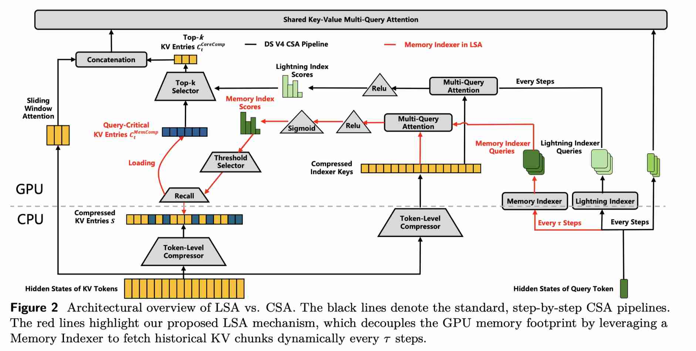

# FlashMemory-DeepSeek-V4: Lightning Index Ultra-Long Context via Lookahead Sparse Attention

> Yan Wang, Qifan Zhang, Jiachen Yu, Tian Liang, Dongyang Ma, Xiang Hu, Zibo Lin, Chunyang Li, Zhichao Wang, Miao Peng, Nuo Chen, Jia Li, Yujiu Yang, Haitao Mi, Dong Yu

> 注：以下论文笔记由 AI Agent 自动生成，可能存在理解偏差或遗漏，请以原论文为准。

## Abstract

Conventional LLMs keep the full KV cache loaded during decoding, causing a severe GPU memory bottleneck for ultra-long context serving. This paper proposes Lookahead Sparse Attention (LSA), a novel inference paradigm powered by a Neural Memory Indexer built upon the DeepSeek-V4 architecture. Rather than passively attending to all historical tokens, LSA proactively predicts future context demands and preserves only the query-critical KV chunks in the GPU memory. The architecture is instantiated via a backbone-free decoupled training strategy, where the indexer is formulated as a standard dual-encoder architecture and trained independently using standard retrieval training frameworks without ever loading the massive backbone model into GPU memory. This "less is more" paradigm significantly maximizes serving efficiency while acting as an effective attention denoiser in tasks that rely on long-term global memory.

## 一句话总结

FlashMemory-DeepSeek-V4 通过前瞻稀疏注意力（LSA）和神经记忆索引器，在仅使用 13.5% KV 缓存内存的情况下，实现了与全上下文基线相当或更好的长上下文性能，最高可节省 90% 的 GPU 内存。

## 背景与问题

1. **长上下文服务的内存瓶颈**：现代 LLM 在解码时需要将完整的 KV 缓存保留在 GPU 内存中，导致超长上下文服务的严重内存瓶颈。即使使用稀疏注意力机制减少计算 FLOPs，KV 缓存的 GPU 内存占用仍然与序列长度线性增长。

2. **资源浪费问题**：通过分析实际推理日志发现，超过 90% 的长上下文请求（>64K tokens）只需要最后 8K tokens 就能准确解决，这意味着大量 GPU 内存被浪费在无关的历史上下文上。

3. **矛盾困境**：简单丢弃历史（滑动窗口注意力）会在需要全局上下文的任务上完全失败，而保留完整上下文又需要付出高昂的 GPU 内存代价。

## 核心方法

### Lookahead Sparse Attention (LSA)

LSA 是一种全新的推理范式，通过预测未来上下文需求，动态加载仅与查询相关的关键 KV 块到 GPU 内存中。

**核心机制**：
- **前瞻预测**：在解码步骤 $t$（当 $t \mod \tau = 0$ 时），使用神经记忆索引器评估当前隐藏状态，预测未来 $\tau$ 步（默认 $\tau = 64$）内需要的历史 KV 块。
- **阈值选择**：使用 Sigmoid 函数将索引器得分归一化到 $(0,1)$ 范围，然后基于阈值（0.5）动态选择需要加载的 KV 块，而非固定 Top-k 选择。
- **分层架构**：在 DeepSeek-V4 的压缩稀疏注意力（CSA）层上实现，保留了高度压缩的 HCA 层（128:1 压缩比）以维持全局上下文感知。

### 神经记忆索引器（Memory Indexer）

**架构设计**：
- **双编码器架构**：索引器被构建为标准的双编码器检索模型，与主 LLM 主干完全解耦。
- **低秩投影**：使用查询编码器将当前隐藏状态 $h_t$ 映射到低秩索引器查询空间，通过下投影矩阵 $W_{DQ}$ 和上投影矩阵 $W_{IUQ}$ 实现。
- **多头注意力**：使用 $n_h$ 个索引器头，通过路由头权重 $w_t^h$ 动态缩放各头的重要性。
- **分层索引器**：在 3 个战略中间层（层 10、12、20）部署独立索引器，使用 OR 模式路由（至少一个层索引器预测得分 ≥0.5 即加载）。

**前瞻数据构建**：
- **跨层多数投票**：使用三步去噪管道识别真正的"黄金条目"：
  1. Softmax 归一化
  2. Top-p 阈值化（p=0.6）
  3. 跨层多数投票（θ=3 层共识）
- **训练数据**：约 10,000 篇长文档，上下文长度 16K 到 512K tokens。

### 解耦训练策略

- **独立训练**：索引器与主 LLM 主干完全解耦，仅需加载预计算的隐藏状态和标签，无需加载千亿参数模型。
- **二元交叉熵损失**：使用 Focal Loss 替代标准 BCE，防止简单负样本主导梯度。
- **高效训练**：整个索引器在单个 H20 GPU 小时内收敛，支持每周约 500 次不同训练运行。

## 技术细节

### 架构公式

1. **索引器查询计算**：
   $$cQ_t = h_t \cdot W_{DQ}$$
   $$[q_t^{l,1}, q_t^{l,2}, \ldots, q_t^{l,n_h}] = q_t^l = cQ_t \cdot W_{IUQ}$$

2. **前瞻索引得分**：
   $$I_{t,s} = \sigma\left(\sum_{h=1}^{n_h} w_{t,h}^l \cdot \text{ReLU}\left(q_t^{l,h} \cdot (K_{\text{IComp}}^s)^T\right)\right)$$

3. **阈值选择**：
   $$C_{\text{MemComp}}^t = \{C_{\text{Comp}}^s | I_{t,s} \geq 0.5\}$$

### 跨层多数投票

1. **Softmax 归一化**：$P_{i,l,s} = \frac{\exp(S_{i,l,s})}{\sum_j \exp(S_{i,l,j})}$
2. **Top-p 阈值化**：保留累积概率质量前 60% 的条目
3. **跨层投票**：$V_{i,s} = \sum_{l=1}^L \mathbb{I}(s \in M_{i,l})$
4. **黄金条目**：$A_{\text{golden}}^i = \{s | V_{i,s} \geq 3\}$

### 训练策略

- **Focal Loss**：$L_{\text{FL}} = \frac{1}{|S|} \sum_{s \in S} w_{t,s} (1 - p_{\text{correct}}^{t,s})^\gamma \ell_{\text{BCE}}(I_{t,s}, y_{t,s})$，其中 $\gamma = 2$
- **负样本比例**：3:1（每个正样本 3 个负样本）
- **随机初始化**：从头训练，不使用对齐偏置权重
- **查询低秩条件化**：使用 DeepSeek-V4 的 MLA/MQA 设计，查询向量通过内部低瓶颈（r=2048）投影

### 最优配置

- **层配置**：在层 10、12、20 部署独立索引器，使用 OR 模式路由
- **解码间隔**：$\tau = 64$ 步
- **分类阈值**：0.5

## 实验设置

### 评估基线

- **DS-V4-Flash**：标准 DeepSeek-V4-Flash 模型，100% 全 KV 缓存分配
- **FM-DS-V4（Ours）**：DS-V4-Flash 主干 + 内存索引器，每 64 步触发一次前瞻检索
- **Recency Only**：滑动窗口回退控制，仅保留最近 8K 上下文和已解码 token
- **Random 10%**：随机选择 10% 历史上下文作为非预测随机基线

### 评估基准

- **LongBench-v2**：长上下文多任务基准（S: 46K, M: 179K, L: 493K tokens）
- **LongMemEval**：长期交互记忆基准（S: 125K, M: 500K tokens）
- **RULER**：长上下文评估基准（64K, 128K, 256K, 512K tokens）

### 硬件环境

- 8×NVIDIA H20 GPU 服务器
- 使用 sglang 部署日志测量 KV 缓存内存占用

## 主要结果

### 性能与效率

| 基准 / 数据集 | DS-V4-Flash | FM-DS-V4 (Ours) | Recency Only | Random 10% |
|--------------|-------------|-----------------|--------------|------------|
| LongBench-v2-S (46K) | 68.9 (0.17 GB) | 70.2 (0.04 GB) | 50.0 (0.03 GB) | 53.3 (0.04 GB) |
| LongBench-v2-M (179K) | 67.6 (0.65 GB) | 68.9 (0.08 GB) | 54.4 (0.03 GB) | 48.9 (0.09 GB) |
| LongBench-v2-L (493K) | 68.1 (1.80 GB) | 70.0 (0.18 GB) | 54.3 (0.04 GB) | 46.9 (0.22 GB) |
| LongMemEval-S (125K) | 80.6 (0.46 GB) | 82.0 (0.06 GB) | 19.2 (0.04 GB) | 20.1 (0.07 GB) |
| LongMemEval-M (500K) | 39.3 (1.82 GB) | 40.2 (0.17 GB) | 23.1 (0.04 GB) | 25.7 (0.22 GB) |
| RULER (64K) | 94.7 (0.23 GB) | 95.0 (0.04 GB) | 36.6 (0.03 GB) | 52.8 (0.05 GB) |
| RULER (128K) | 94.3 (0.47 GB) | 93.2 (0.06 GB) | 21.6 (0.03 GB) | 32.3 (0.08 GB) |
| RULER (256K) | 90.5 (0.94 GB) | 88.2 (0.09 GB) | 20.6 (0.04 GB) | 41.2 (0.12 GB) |
| RULER (512K) | 88.3 (1.87 GB) | 89.6 (0.18 GB) | 18.8 (0.04 GB) | 27.2 (0.22 GB) |
| **平均** | **76.9 (0.93 GB)** | **77.5 (0.10 GB)** | **33.3 (0.04 GB)** | **38.7 (0.12 GB)** |

### 关键发现

1. **内存效率**：FM-DS-V4 仅使用 13.5% 的基线 GPU 内存，实现 86.5% 的 KV 缓存减少。
2. **性能提升**：平均准确率提升 0.6%（77.5% vs 76.9%）。
3. **极端缩放**：在 500K 上下文长度时，内存减少达到 90%。
4. **注意力去噪**：LSA 作为有效的注意力去噪器，过滤掉数千个不相关的历史块，防止注意力点积中的事实幻觉。
5. **对比基线崩溃**：Recency Only 和 Random 10% 在全局上下文合成任务上完全崩溃，证明索引器掌握了复杂的预测时序路由。

### 局限性分析

1. **上下文无关开销**：对于上下文无关查询，点式 Sigmoid 门控未能保持恒定内存开销，随序列长度增长而增加（500K 时物理绝对块保留量膨胀约 2.5×）。
2. **密集全局记忆崩溃（MRCR 失败案例）**：在 MRCR 基准上准确率从 76.0% 骤降至 48.0%，原因是 MRCR 展现出激进的全局密集记忆依赖性。
3. **长度泛化上限**：索引器仅能安全泛化到训练上下文长度的 2×，超过此边界会导致准确率急剧下降，前瞻块选择退化为近随机采样。

## 优点与局限

### 优点

1. **创新性前瞻稀疏注意力范式**：提出 LSA 通过预测未来上下文需求，动态加载关键 KV 块，解决了长上下文建模能力与硬件效率之间的矛盾。
2. **解耦训练策略**：索引器与主 LLM 完全解耦，仅需单个 H20 GPU 小时训练，支持每周约 500 次不同训练运行。
3. **显著效率提升**：在保持或提升性能的同时，将 GPU 内存减少到基线的 13.5%（最高 90%），实现"少即是多"的反直觉现象。
4. **注意力去噪效果**：LSA 作为有效的注意力去噪器，过滤不相关的历史块，防止事实幻觉。
5. **鲁棒的分层架构**：在 3 个战略中间层部署索引器，使用 OR 模式路由提供异常稳健的回退保护边界。

### 局限

1. **资源限制**：项目因组织重组而暂停，未能进行系统性消融研究，关键超参数（如 τ=64、阈值 0.5）基于初步探索性运行选择。
2. **冻结键表示**：由于计算预算限制，从未调整或优化原生 DeepSeek-V4 压缩索引键（KIComp），仅微调查询投影编码器。
3. **浅层交叉交互**：索引器仅通过 64 步粗点积相似度运行，缺乏多轮交互能力，需要引入 Late-Interaction 架构（如 ColBERT 风格的 token 级交叉匹配）来解开复杂密集检索模式。
4. **长度泛化上限**：索引器仅能安全泛化到训练上下文长度的 2×，超过此边界会导致准确率急剧下降。
5. **上下文无关开销**：对于上下文无关查询，点式 Sigmoid 门控未能保持恒定内存开销，随序列长度增长而增加。

## 与 EfficientPaper 主题的关系

本文属于 **KV 缓存管理（kv_cache_management）** 领域，通过前瞻稀疏注意力（LSA）和神经记忆索引器，实现了超长上下文服务的高效内存管理。其核心贡献在于：

1. **KV 缓存优化**：通过预测性上下文选择，仅加载与查询相关的 KV 块，显著减少 GPU 内存占用（86.5% 减少）。
2. **稀疏注意力机制**：在 DeepSeek-V4 的压缩稀疏注意力层上实现，保留高度压缩的 HCA 层以维持全局上下文感知。
3. **高效推理服务**：通过解耦训练策略和分层索引器，实现超长上下文的高效服务，适用于 500K+ tokens 的场景。

该工作与 EfficientPaper 的高效 AI 主题高度相关，特别是 KV 缓存管理和稀疏注意力方向，为超长上下文服务提供了新的解决方案。

## 与 HiSparse 的区别和联系

FlashMemory/LSA 和 SGLang HiSparse 都在回答同一个核心问题：**长上下文服务中，不应该把全部历史 KV 常驻 GPU HBM**。但二者处在不同层级，解决问题的方式也不同。

### 核心区别

1. **决策信号不同**：FlashMemory 使用训练出来的 Memory Indexer，基于当前 hidden state 预测未来 $\tau=64$ 步会用到哪些历史 KV chunk；HiSparse 更偏 serving runtime，根据 sparse attention 的 active/hot region、top-k/active set 和在线访问模式，把冷 KV offload 到 host，只保留高频 KV region 在 HBM。
2. **训练依赖不同**：FlashMemory 需要为 DeepSeek-V4-Flash 训练额外的索引器，虽然训练是 backbone-free、decoupled 的；HiSparse 通常不要求重新训练模型，更像系统级、runtime 侧的分层 KV 驻留与 swap-in/swap-out 优化。
3. **预测时间尺度不同**：FlashMemory 是 lookahead selection，提前预测未来一个 decoding window 的上下文需求；HiSparse 更偏在线执行时的 hot/cold residency、host offload、hot device buffer 和高效 swap-in kernel。
4. **作用位置不同**：FlashMemory 改的是 attention 路径里的“哪些历史块参与注意力”；HiSparse 改的是 KV cache 在 GPU/CPU 等层次之间如何放置、加载和恢复。
5. **主要风险不同**：FlashMemory 的风险在于索引器的训练分布、长度泛化和 dense-memory 任务召回不足；HiSparse 的风险更多来自系统路径，包括 swap-in latency、host-GPU 带宽、热区判断错误、batch 调度干扰和 kernel/layout 开销。

### 关系与组合方式

二者不是互斥方案，而是互补关系：

- **FlashMemory 是 learned selector**：负责产生更高质量的未来 KV importance mask，回答“未来应该取哪些 KV chunk”。
- **HiSparse 是 runtime substrate**：负责把这些 active chunk 在 HBM/host 之间高效调度，回答“这些 chunk 应该放在哪里、何时加载、如何 swap-in 才不拖慢 serving”。
- 组合后的理想路径可以是：`FlashMemory Memory Indexer → 预测 query-critical KV chunks → HiSparse/HiCache runtime → host offload + hot device buffer + efficient swap-in → sparse attention execution`。
- 反过来，HiSparse 的 runtime 统计也可以反哺 FlashMemory：哪些预测导致 stall、哪些 chunk 实际被频繁 swap-in、哪些层/头的活跃模式稳定，这些都可以成为索引器校准或在线策略调整的信号。

因此，更准确的定位是：**FlashMemory 把 KV 管理变成可学习的未来记忆检索问题；HiSparse 把稀疏注意力下的 KV 管理变成可部署的分层内存系统问题。** FlashMemory 更偏算法/模型侧创新，HiSparse 更偏 runtime/系统侧能力，二者合起来才接近完整的 long-context KV lifecycle optimizer。

## 可复现/实现要点

1. **架构配置**：在 DeepSeek-V4-Flash 主干上部署 LSA，使用 3 个战略中间层（层 10、12、20）的独立索引器。
2. **训练策略**：使用解耦训练策略，仅训练查询投影编码器，无需加载主 LLM 模型。
3. **数据构建**：使用跨层多数投票机制构建黄金标签，过滤噪声样本。
4. **训练超参数**：使用 Focal Loss（γ=2），负样本比例 3:1，随机初始化，查询低秩条件化（r=2048）。
5. **部署环境**：使用 8×NVIDIA H20 GPU 服务器，通过 sglang 部署。
6. **评估基准**：在 LongBench-v2、LongMemEval、RULER 上进行评估。

## 个人备注

1. **项目状态**：该项目因组织重组而暂停，但技术报告记录了初步突破和已验证的检查点。
2. **未来方向**：报告提出了三个关键改进方向：
   - 优化冻结键表示（KIComp）
   - 引入 Late-Interaction 架构（如 ColBERT 风格）
   - 实现端到端联合优化
3. **合作机会**：报告结尾提到，如果组织对支持或合作下一阶段（如计算赞助、缩放测试或研究集成）感兴趣，可以联系项目负责人。
4. **代码与模型**：报告提到代码和模型，但未提供具体 URL。
5. **与其他方法的比较**：与 DeepSeek-V4 的压缩稀疏注意力（CSA）相比，LSA 通过预测性上下文选择实现了更好的效率-性能权衡。
