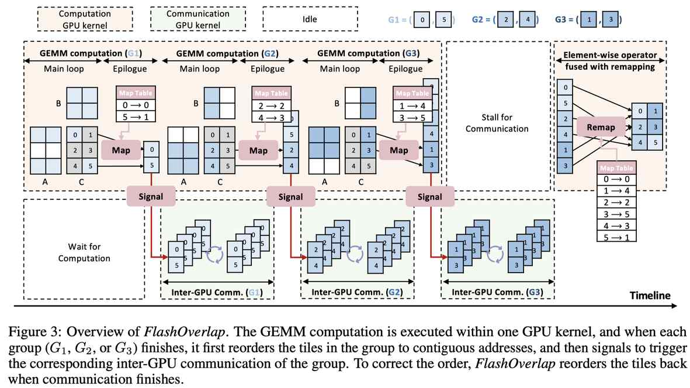

# FlashOverlap: A Lightweight Design for Efficiently Overlapping Communication and Computation

> Ke Hong, Xiuhong Li, Minxu Liu, Qiuli Mao, Tianqi Wu, Zixiao Huang, Lufang Chen, Zhong Wang, Yichong Zhang, Zhenhua Zhu, Guohao Dai, Yu Wang

## 一句话总结

FlashOverlap 提出了一种基于信号机制（signaling-based）的轻量级计算-通信重叠设计方案，通过 tile-wise 分组、无干扰计算和通信无关性三大特性，在无需修改 GEMM 计算内核的前提下，实现高达 1.65× 的加速比，显著优于现有的分解式和融合式方法。

## 摘要翻译

生成式模型在各种应用中取得了显著成功，推动了对多 GPU 计算的需求。在多 GPU 计算系统中，GPU 间的通信成为瓶颈，尤其是在消费级 GPU 上尤为突出。通过利用硬件的并发执行能力，重叠计算与通信延迟是一种缓解通信开销的有效技术。我们发现，一个高效且可适应的重叠设计应满足以下三点：(1) tile-wise 重叠，以最大化重叠机会；(2) 无干扰计算，以维持原始计算性能；(3) 通信无关性，以降低针对不同通信原语的开发负担。然而，现有设计未能同时优化这三个特性。

为解决这一问题，我们提出了 FlashOverlap，这是一种以 tile-wise 重叠、无干扰计算和通信无关性为特征的轻量级设计。FlashOverlap 利用一种新颖的信号机制，在不中断计算过程的情况下识别 tile-wise 数据依赖关系，并将数据重新排列到连续地址，从而只需调用 NCCL API 即可进行通信。实验表明，这种轻量级设计实现了高达 1.65× 的加速比，在大多数情况下优于现有工作。

## 研究动机

随着生成式模型（如 DeepSeek-V3 的 671B 参数、Llama 4 Behemoth 的 2T 参数）规模的不断增长，单 GPU 无法容纳全部参数，多 GPU 并行计算（TP、PP、EP）成为必需。然而，多 GPU 计算中的集合通信操作（AllReduce、ReduceScatter、All-to-All）引入了不可忽视的通信开销，特别是在消费级 GPU（如 RTX 4090）上通过 PCIe 互联（16-64 GB/s）时尤为严重。

计算-通信重叠是一种有效的缓解技术，其核心思想是让计算（GEMM）和通信异步执行，充分利用 GPU 的异构硬件资源（Tensor Core 用于计算，NVLink/PCIe 用于通信）。然而，计算与通信之间的数据依赖性阻碍了并发执行。

现有方法存在两类：

1. **分解式方法**（如 CoCoNet、Domino、Async-TP、MegaScale）：将计算输出张量分解为多个子张量，实现异步重叠。但由于受限于张量分解模式，无法实现 tile-wise 细粒度重叠，且在规模不足时可能导致 GPU 计算资源利用不充分。

2. **融合式方法**（如 FLUX、Comet、TileLink）：将计算算子与通信算子融合到单一 GPU 内核中。但需要手动实现通信原语（无法利用 NCCL 等高性能通信库），且修改计算逻辑可能影响计算性能。

FlashOverlap 的设计目标是同时满足三个理想特性：tile-wise 重叠、无干扰计算和通信无关性。

## 方法（技术细节）

### 3.1 总体架构

FlashOverlap 的核心思想是：GEMM 计算保持为单一 GPU 内核（不中断主循环），通过信号机制触发通信，同时通过预通信重排和后通信重排确保通信的连续性。

### 3.2 信号机制（Signaling）

**核心洞察**：GEMM 计算中存在固有的"波"（wave）模式。由于 GPU 的流式多处理器（SM）并行执行，tile 的完成时间呈现明显的波状分布（如图 2 所示，4 个 wave）。

**从 tile 到 wave，从 wave 到 group**：
- 直接使用 tile-wise 信号会导致通信碎片化（communication fragmentation）。
- FlashOverlap 利用 wave 模式：同一 wave 中的 tile 在 5% 的波持续时间内完成，因此可以将 wave 作为信号绑定单元。
- 进一步定义 group（分组）：一个 group G 包含 |G| ≥ 1 个 wave，每个 group 完成计算后触发通信。group 大小是可调配置参数。

**实现方式**：
- 引入 tile 计数表（counting table），大小为 P（P 为 group 数量）。
- 当一个 group G_i 中的所有 tile 完成计算（计数达到 |G_i|）后，触发该 group 的通信。
- 通过 tile 索引识别 tile 属于哪个 group。

### 3.3 重排（Reordering）

**动机**：通信需要连续地址（contiguous addresses）。NCCL 等通信库要求发送和接收缓冲区的地址连续，不连续地址会导致多次通信调用和带宽利用不足。实验显示，当数据量低于阈值时，带宽急剧下降（Fig. 8）。

**挑战**：GEMM 中的 tile 执行顺序不规则（由于 block swizzling 优化），导致先完成的 tile 在地址上不连续。

**关键洞察**：通信正确性不要求严格的数据顺序：
- AllReduce：只需保持 tile 顺序在所有 GPU 上一致，但不必与原始 GEMM 输出矩阵的 tile 顺序相同。
- ReduceScatter：行按 GPU 切分，但哪一行分配到哪个 GPU 并不重要。
- All-to-All：数据在 token 粒度划分，每行对应特定 GPU。

**实现方式**：
- **预通信重排**：在 GEMM epilogue 中融合，将 tile 重新排列到连续地址。映射表（map table）记录原始 tile 索引到重排后索引的映射，大小相对于矩阵可忽略不计。
- **后通信重排**：在后续的逐元素算子（如 RMSNorm）中融合，通过修改数据加载索引来恢复原始顺序，利用映射表（map table）进行索引转换。
- 不同通信原语的重排策略：
  - AllReduce：按 tile 粒度重排
  - ReduceScatter：按 subtile 粒度重排（每个 tile 按行切分为 GPU 数量的 subtile）
  - All-to-All：按 token 粒度重排（为每个目标 GPU 设置专用内存池）

### 3.4 设计空间（Design Space）

- 将 group 选择建模为二值离散决策优化问题：每个 wave 后决定是否触发通信（"1"或"0"）。
- 设计空间大小为 2^T - 1（T 为 wave 总数）。
- 示例：5 个 wave，16 个候选分区，如 wave partition (1, 2, 2) 或 (2, 3)。

### 3.5 预测搜索（Predictive Search）

**动机**：需要调优 group 分区以获得最优性能。实验证明，仅使用每个 wave 一个 group 的基准分区在 50+ 种 GEMM 形状中只有 4% 的情况最优，平均导致 17.34% 性能下降。但在线 profiling 开销巨大（>1 分钟，超过 100× 前向推理延迟）。

**设计空间剪枝**：限制首尾 group 大小（|G_1| ≤ S_1, |G_P| ≤ S_P），使用 S_1=2, S_P=4，将设计空间从 2^T-1 减少到 O(2^{T-2})。

**延迟预测器**：
- GEMM 计算延迟：根据 SM 资源竞争调整波数来估计。
- 通信延迟：基于带宽曲线（数据量 vs. 带宽）进行插值。
- 累积延迟计算：计算延迟（acc_comp_dur）和通信延迟（acc_comm_dur）分别累积，确保前一组的计算完成后再进行通信。

**离线阶段**：获取 GEMM 配置、通信带宽曲线、SM 资源竞争信息。
**在线阶段**：生成候选分区，基于延迟预测进行搜索，返回最优分区。

### 3.6 实现细节

- 基于 CUTLASS 3.4.0 实现，保持 GEMM 主循环不变。
- 映射操作融合到 GEMM epilogue（遵循 EVT 方法）。
- 信号机制通过 GPU 内核实现，周期性查询计数表。
- 通信直接调用 NCCL API。
- 使用 CUDA Stream API 管理并发执行：GEMM 在一个 stream，信号和通信在另一个 stream。

## 实验结果

### 实验设置
- **硬件**：NVIDIA A800（NVLink 互联）和 RTX 4090（PCIe 互联）
- **软件**：CUDA 12.2、NCCL 2.19.3、PyTorch 2.5.1、CUTLASS 3.4.0
- **基准**：非重叠基线、Async-TP（分解式）、FLUX（融合式）、VanillaDecomposition（自定义分解式）
- **通信原语**：AllReduce、ReduceScatter、All-to-All
- **GEMM 规模**：200+ 种真实工作负载的 GEMM 尺寸

### 核心结果

1. **整体性能**：FlashOverlap 实现 69-98% 的理论性能，平均加速比 1.07-1.31×。
2. **RTX 4090 上**：
   - 对比非重叠基线：1.02-1.65× 加速
   - 对比分解式方法（Async-TP）：0.93-1.46× 加速
3. **A800 上**：由于 NVLink 高带宽减少了通信时间占比，加速比相对较低，但相对于理论加速比的比率仍然竞争力强。
4. **AllReduce + RTX 4090**：最大加速比 1.65×。
5. **在 50+ 种 GEMM 形状中**，仅 4% 的情况需要基准分区（每个 wave 一个 group），大多数情况下需要调优 group 大小。

### 预测搜索效果
- 预测误差比平均为 3.41%（RTX 4090）和 3.44%（A800）。
- 基于预测搜索的分区达到最优分区的 99% 以上性能。

### 开销分析
- 重排操作融合到 RMSNorm 内核，带来约 3%-13% 的额外延迟。
- token 级别重排开销相对较高（更不规则的内存访问），但考虑到逐元素算子的延迟本身很小，整体开销可以接受。

## 优势

1. **同时满足三个理想特性**：tile-wise 重叠（最大化重叠机会）、无干扰计算（保持 GEMM 主循环性能）、通信无关性（直接调用 NCCL API，无需手动实现通信原语）。
2. **轻量级设计**：不需要修改 GEMM 计算内核，仅在 epilogue 中添加映射操作，保持了原始计算性能。
3. **通信无关性**：支持 AllReduce、ReduceScatter、All-to-All 等多种通信原语，通过标准 API 调用即可，无需为每种原语单独实现融合。
4. **可调优**：通过 wave 分组机制，设计空间灵活，且通过预测搜索实现快速调优（避免在线 profiling 的开销）。
5. **高效率**：实现 69-98% 的理论性能，平均加速比 1.07-1.31×，最高 1.65×。
6. **实际适用性**：特别适合消费级 GPU（如 RTX 4090）上的 PCIe 互联场景，通信瓶颈更为显著时效果更明显。
7. **与现有通信库兼容**：可无缝集成 NCCL、MSCCLang、DeepEP 等通信库。

## 局限

1. **硬件依赖性**：对不同 GPU（如 A800 vs. RTX 4090）的性能模式不同，需要分别调优。
2. **GEMM 形状敏感性**：加速效果与 GEMM 形状（M×N×K）密切相关，在某些尺寸下（如较小的 M×N）效果有限，因为数据量小导致带宽利用不足。
3. **重排开销**：尽管通过 kernel fusion 优化，但重排操作仍带来 3%-13% 的额外延迟，特别是 token 级别重排。
4. **设计空间剪枝**：使用固定参数（S_1=2, S_P=4）进行剪枝，可能遗漏某些最优配置。
5. **预测模型精度**：虽然平均误差较低（~3.4%），但实际延迟始终略高于预测延迟，表明存在非理想实现的影响。
6. **仅适用于 GEMM+通信模式**：主要针对 GEMM 后接通信的模式（如 GEMM+AllReduce、GEMM+ReduceScatter、GEMM+All-to-All），对其他计算模式的适用性未验证。
7. **多数据流调度未涵盖**：论文指出多数据流调度（如前向/反向传播间的重叠）未是主要关注点，可能限制其在复杂训练场景中的应用。

## 与 EfficientPaper 相关的研究方向

### 相关 baseline 方法
- **2024/Async-TP**：PyTorch 的异步张量并行方法，属于分解式方法。
- **2024/FLUX**：融合式方法，将通信融合到 GEMM 内核的 tile 级别。

### 相关研究方向
1. **计算-通信重叠**：这是论文的核心主题，与 EfficientPaper 中的"overlap"关键词直接相关。
2. **多 GPU 通信优化**：NCCL、AllReduce、ReduceScatter、All-to-All 等集合通信原语的优化。
3. **GEMM 优化**：tile 分区、block swizzling、epilogue 融合等 GPU 计算优化技术。
4. **消费级 GPU 部署**：在 PCIe 互联的消费级 GPU（如 RTX 4090）上优化多 GPU 推理/训练。
5. **MoE 模型的通信优化**：All-to-All 通信原语在 Mixture-of-Experts 模型中的优化。
6. **预测搜索与自动调优**：基于成本模型的实时参数调优，避免在线 profiling 开销。
7. **GPU 内核融合**：kernel fusion 在计算与通信重叠中的应用，特别是 epilogue 融合。

### 与现有工作的关系
- 与分解式方法（CoCoNet、Domino、Async-TP、MegaScale、Centauri）相比，FlashOverlap 实现了 tile-wise 重叠，克服了分解式方法无法实现细粒度重叠的局限。
- 与融合式方法（FLUX、Comet、TileLink、cuBLASMp）相比，FlashOverlap 不需要手动实现通信原语，保持了通信无关性，同时避免了对计算逻辑的修改。
- 与多数据流调度方法（Lancet、FasterMoE 等）互补，FlashOverlap 专注于单数据流内的计算-通信重叠。

---

*本 note 由 AI Agent 自动生成，基于论文全文阅读与分析。生成时间：2026 年 6 月。*
