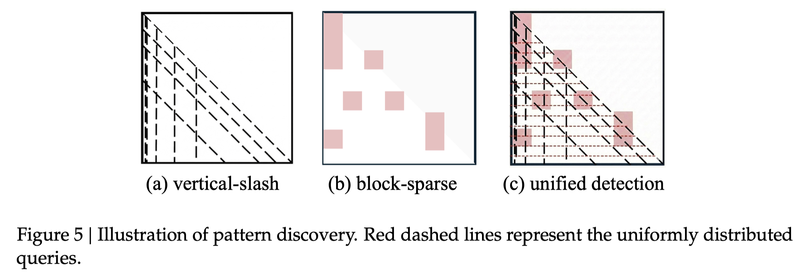

# FlashPrefill: Instantaneous Pattern Discovery and Thresholding for Ultra-Fast Long-Context Prefilling

> Qihang Fan, Huaibo Huang, Zhiying Wu, Juqiu Wang, Bingning Wang, Ran He

## Abstract

Long-context modeling is a pivotal capability for Large Language Models, yet the quadratic complexity of attention remains a critical bottleneck, particularly during the compute-intensive prefilling phase. While various sparse attention mechanisms have been explored, they typically suffer from either significant search latency or insufficient sparsity. In this paper, we propose FlashPrefill, a framework enabling ultra-fast prefilling via instantaneous pattern discovery and thresholding. FlashPrefill leverages a fast block-searching technique to simultaneously locate dynamic vertical, slash, and block-sparse attention patterns. Crucially, it introduces a dynamic thresholding mechanism that bypasses the prohibitive overhead of sorting or accumulating attention scores while effectively eliminating the long-tail distribution to enhance sparsity. Extensive evaluations demonstrate that FlashPrefill achieves a substantial leap in efficiency, delivering an unprecedented 27.78x speedup on 256K sequences. Notably, unlike existing methods that incur efficiency degradation on shorter contexts, FlashPrefill maintains a 1.71x speedup even at a 4K context length, demonstrating its robustness and practical utility across varying sequence scales.
