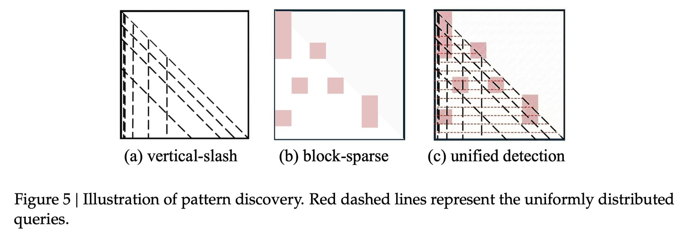

# FlashPrefill: Instantaneous Pattern Discovery and Thresholding for Ultra-Fast Long-Context Prefilling

> Qihang Fan, Huaibo Huang, Zhiying Wu, Juqiu Wang, Bingning Wang, Ran He

> 注：以下论文笔记由 AI Agent 自动生成，可能存在理解偏差或遗漏，请以原论文为准。

## Abstract

Long-context modeling is a pivotal capability for Large Language Models, yet the quadratic complexity of attention remains a critical bottleneck, particularly during the compute-intensive prefilling phase. While various sparse attention mechanisms have been explored, they typically suffer from either significant search latency or insufficient sparsity. In this paper, we propose FlashPrefill, a framework enabling ultra-fast prefilling via instantaneous pattern discovery and thresholding. FlashPrefill leverages a fast block-searching technique to simultaneously locate dynamic vertical, slash, and block-sparse attention patterns. Crucially, it introduces a dynamic thresholding mechanism that bypasses the prohibitive overhead of sorting or accumulating attention scores while effectively eliminating the long-tail distribution to enhance sparsity. Extensive evaluations demonstrate that FlashPrefill achieves a substantial leap in efficiency, delivering an unprecedented 27.78× speedup on 256K sequences. Notably, unlike existing methods that incur efficiency degradation on shorter contexts, FlashPrefill maintains a 1.71× speedup even at a 4K context length, demonstrating its robustness and practical utility across varying sequence scales.

## 一句话总结

FlashPrefill 是一个超快长上下文预填充框架，通过瞬时模式发现和动态阈值机制，在 256K 序列上实现 27.78× 加速，同时在 4K 上保持 1.71× 加速，解决了现有稀疏注意力方法的搜索延迟高和稀疏性不足问题。

## 背景与问题

- **长上下文建模挑战**：
  - 自注意力的二次复杂度是关键瓶颈
  - 预填充阶段计算密集
- **现有方法的局限**：
  - **搜索延迟高**：粗粒度估计引入不可忽略的计算延迟
  - **排序开销高**：Top-k/Top-p 需要显式排序，GPU 架构上开销大
  - **Top-p 累加开销**：累积求和是固有串行过程，难以并行化
  - **稀疏性不足**：Top-k/Top-p 无法有效剪枝长尾分布
- **核心问题**：如何在长上下文预填充中实现超快加速？

## 核心方法

### 1. 瞬时模式发现（Instantaneous Pattern Discovery）

**核心思想**：使用快速块搜索技术同时定位动态垂直、斜线和块稀疏注意力模式。

**三种稀疏模式**：
- **垂直模式（列不变性）**：特定"锚点"token 无论查询位置如何都吸引大量注意力
- **斜线模式（平移对称性）**：局部语法依赖和相对位置偏差产生的对角线模式
- **块稀疏模式（空间连续性）**：局部能量簇，具有空间连续性

**发现策略**：
- **骨架查询集**：均匀分布的查询集足以同时解决三种模式
- **平均池化键**：使用平均池化键 k̄ = 1/n Σk 来减少计算
- **块近似策略**：优化计算内核，减少内存访问开销

### 2. 基于 Max 的动态阈值（Max-based Dynamic Thresholding）

**核心思想**：绕过 Top-k/Top-p 的排序或累积开销，使用基于 Max 的动态阈值机制。

**方法**：
- **动态阈值**：根据注意力分数的最大值动态调整阈值
- **避免排序**：绕过 Top-k/Top-p 的排序开销
- **消除长尾**：有效消除注意力分数的长尾分布
- **稀疏性增强**：提高稀疏性，减少计算冗余

### 3. FlashPrefill 框架

**组件**：
1. **瞬时模式发现**：快速块搜索，识别垂直、斜线和块稀疏模式
2. **基于 Max 的动态阈值**：绕过排序开销，消除长尾分布
3. **稀疏注意力计算**：在选定的块上计算注意力

**优势**：
- **超快加速**：256K 序列上 27.78× 加速
- **鲁棒性**：4K 上保持 1.71× 加速
- **无搜索延迟**：瞬时模式发现
- **无排序开销**：基于 Max 的动态阈值

## 主要结果

### 性能提升

- **操作加速**：256K 序列上 27.78×（相比 Flash Attention）
- **端到端 TTFT 加速**：最大 7.22×（在 vLLM 框架中）
- **短序列加速**：4K 上 1.71×（保持鲁棒性）
- **模型性能**：Needle In A Haystack 测试中保持近似相同的性能

### 关键发现

1. **瞬时模式发现有效**：均匀分布的查询集足以同时解决三种模式
2. **动态阈值有效**：基于 Max 的动态阈值绕过排序开销，消除长尾分布
3. **鲁棒性**：在短序列和长序列上均保持高性能
4. **集成 vLLM**：集成到 vLLM 推理框架，测量端到端 TTFT

## 优点与局限

### 优点

1. **超快加速**：256K 序列上 27.78× 加速，端到端 TTFT 最大 7.22× 加速
2. **瞬时模式发现**：快速块搜索，无搜索延迟
3. **动态阈值**：绕过排序开销，消除长尾分布
4. **鲁棒性**：短序列和长序列上均保持高性能
5. **无训练**：训练无关，可无缝集成到现有 LLM 中
6. **集成 vLLM**：集成到 vLLM 推理框架

### 局限

1. **模式依赖**：依赖于垂直、斜线和块稀疏模式，可能不适用于所有模型
2. **块近似**：块近似策略可能引入近似误差
3. **评估范围**：主要在 Qwen3-30B-A3B-Instruct-2507 上评估，其他模型需进一步测试
4. **长尾分布**：动态阈值可能无法完全消除长尾分布

## 与 EfficientPaper 主题的关系

FlashPrefill 属于 **Sparse Pruning**（`sparse_pruning`）和 **Attention Sparsity**（`attention_sparsity`）领域，核心贡献包括：

- **瞬时模式发现**：快速块搜索，识别垂直、斜线和块稀疏模式
- **基于 Max 的动态阈值**：绕过排序开销，消除长尾分布

与 EfficientPaper 中已有论文的关系：
- **FlexPrefill**（2025）：预填充加速，基于搜索策略
- **XAttention**（2025）：注意力稀疏性
- **FlashMoBA**（2026）：混合注意力
- **MInference**（2024）：注意力稀疏性
- **FlashAttention**（2022）：注意力内核优化

## 可复现/实现要点

1. **瞬时模式发现**：均匀分布查询集 + 平均池化键 + 块近似策略
2. **动态阈值**：基于 Max 的动态阈值，绕过排序开销
3. **稀疏注意力计算**：在选定的块上计算注意力
4. **集成 vLLM**：集成到 vLLM 推理框架
5. **评估**：Qwen3-30B-A3B-Instruct-2507，Needle In A Haystack，4K-256K 序列

## 个人备注

- FlashPrefill 的核心洞察是：**瞬时模式发现和动态阈值可以实现超快预填充**。
- 块近似策略是关键设计选择，它优化了计算内核，减少了内存访问开销。
- 基于 Max 的动态阈值是关键优化，它绕过了排序开销，消除了长尾分布。
- 论文来自 CASIA、UCAS、WeChat/Tencent，说明这是一个工业界和学术界合作的实用系统。
- 值得关注的未来方向：(1) 更多模型的验证；(2) 与其他稀疏注意力方法的结合；(3) 端到端的优化。
