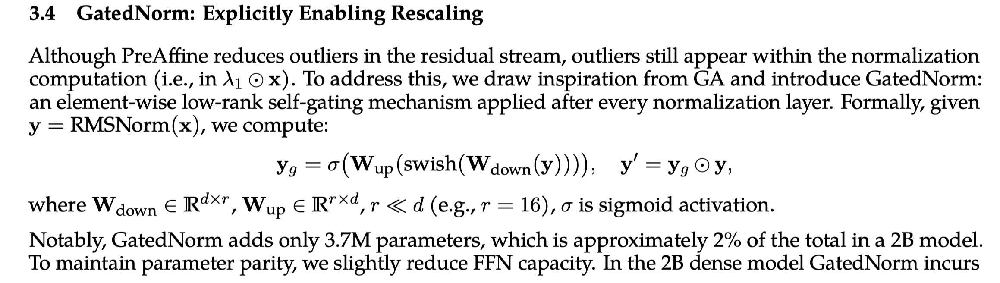

# A Unified View of Attention and Residual Sinks: Outlier-Driven Rescaling is Essential for Transformer Training

> Zihan Qiu, Zeyu Huang, Kaiyue Wen, Peng Jin, Bo Zheng, Yuxin Zhou, Haofeng Huang, Zekun Wang, Xiao Li, Huaqing Zhang, Yang Xu, Haoran Lian, Siqi Zhang, Rui Men, Jianwei Zhang, Ivan Titov, Dayiheng Liu, Jingren Zhou, Junyang Lin

## Abstract

We investigate the functional role of emergent outliers in large language models, specifically attention sinks (a few tokens that consistently receive large attention logits) and residual sinks (a few fixed dimensions with persistently large activations across most tokens). We hypothesize that these outliers, in conjunction with the corresponding normalizations (\textit{e.g.}, softmax attention and RMSNorm), effectively rescale other non-outlier components. We term this phenomenon \textit{outlier-driven rescaling} and validate this hypothesis across different model architectures and training token counts. This view unifies the origin and mitigation of both sink types. Our main conclusions and observations include: (1) Outliers function jointly with normalization: removing normalization eliminates the corresponding outliers but degrades training stability and performance; directly clipping outliers while retaining normalization leads to degradation, indicating that outlier-driven rescaling contributes to training stability. (2) Outliers serve more as rescale factors rather than contributors, as the final contributions of attention and residual sinks are significantly smaller than those of non-outliers. (3) Outliers can be absorbed into learnable parameters or mitigated via explicit gated rescaling, leading to improved training performance (average gain of 2 points) and enhanced quantization robustness (1.2 points degradation under W4A4 quantization).
