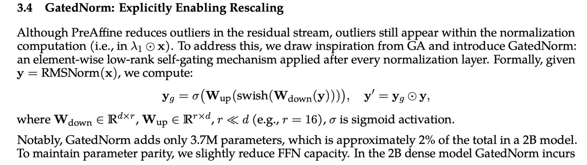

# A Unified View of Attention and Residual Sinks: Outlier-Driven Rescaling is Essential for Transformer Training

> Zihan Qiu, Zeyu Huang, Kaiyue Wen, Peng Jin, Bo Zheng, Yuxin Zhou, Haofeng Huang, Zekun Wang, Xiao Li, Huaqing Zhang, Yang Xu, Haoran Lian, Siqi Zhang, Rui Men, Jianwei Zhang, Ivan Titov, Dayiheng Liu, Jingren Zhou, Junyang Lin



## 一句话总结

本文提出"异常值驱动缩放"（Outlier-Driven Rescaling）统一视角，揭示 Transformer 中注意力汇聚（attention sink）和残差汇聚（residual sink）的共同功能机制——它们通过与归一化层协作缩放非异常值特征，并通过轻量门控机制 GatedNorm 替代异常值实现缩放，从而提升训练性能和量化鲁棒性。

## 摘要翻译

我们研究了大型语言模型中涌现异常值的功能角色，具体包括注意力汇聚（少数 token 持续获得较大注意力 logits）和残差汇聚（少数固定维度在大多数 token 上持续具有较大激活值）。我们假设这些异常值与相应的归一化机制（如 softmax 注意力和 RMSNorm）共同作用，有效地对其他非异常值组件进行缩放。我们将这一现象称为"异常值驱动缩放"，并在不同模型架构和训练 token 数量上验证了这一假设。该视角统一了两类汇聚的起源和缓解方式。我们的主要结论和观察包括：（1）异常值与归一化协同作用：移除归一化会消除相应异常值但损害训练稳定性和性能；直接裁剪异常值同时保留归一化也会导致退化，表明异常值驱动缩放对训练稳定性有贡献。（2）异常值更多作为缩放因子而非贡献者，因为注意力汇聚和残差汇聚的最终贡献显著小于非异常值。（3）异常值可以被吸收到可学习参数中，或通过显式门控缩放来缓解，从而提升训练性能（平均增益 2 个点）并增强量化鲁棒性（W4A4 量化下仅 1.2 个点退化）。

## 研究动机

大语言模型中存在两类重要的异常值现象：

1. **注意力汇聚（Attention Sink）**：少数 token（如第一个 token）持续获得异常大的注意力 logits，但其对应的 value 向量范数较小。已有研究表明这与 softmax 归一化机制密切相关。
2. **残差汇聚（Residual Sink）**：残差流中少数固定维度在绝大多数 token 上持续具有极大激活值（可达数千），与 massive activation (MA) 相关但又有所不同——残差汇聚不绑定于特定输入。

已有工作发现直接裁剪这些异常值会严重损害模型性能，说明异常值在 Transformer 中扮演着重要的功能角色。然而，现有的研究对这些异常值的功能角色缺乏统一的理论框架，且对残差汇聚的研究相对较少。本文试图回答以下关键问题：

- 这些异常值的本质功能是什么？
- 能否在消除异常值的同时保留其功能？
- 如何设计更高效、更量化的 Transformer？

## 方法（技术细节）

### 核心假设：异常值驱动缩放（Outlier-Driven Rescaling）

本文的核心假设是：异常值与归一化层（softmax 注意力和 RMSNorm）协同作用，对非异常值特征进行缩放。具体而言：

- **注意力汇聚**中，异常大的注意力 logits 通过 softmax 归一化来调整注意力输出的范数，sink token 的 value 向量范数较小
- **残差汇聚**中，固定维度的极大激活通过 RMSNorm 来调整特征范数，对应的 RMSNorm 权重参数极小

### 理论支撑

论文在附录中给出数学证明：在 RMSNorm 中，如果某个维度 d 有异常值且对应的仿射参数很小（|λd| ≤ ε‖λ‖∞），则 RMSNorm 输出的特征范数上界随异常值增大而降低，说明异常值可以通过改变自身大小来缩放特征范数。

### 五组实验验证

**实验设置**：主要在 2B 参数模型上进行，训练 120B tokens，遵循 Llama3/Qwen3 的 dense 模型设计，使用 pre-norm Transformer 架构。

#### 1. 移除归一化会减少异常值但损害性能

- 用 Dynamic Tanh (DyT) 替换 RMSNorm 后，异常值显著减少（峰值激活从 6000 降至 73）
- 但 DyT 模型只能在极低学习率（5×10⁻⁴）下收敛，最终 loss 比基线高 +0.259
- 说明移除归一化会打破异常值驱动缩放机制，损害训练稳定性和性能

#### 2. 直接裁剪异常值会损害性能

- 在全注意力模型上进行 activation clipping（clip 10/100/1000），训练发散或 loss 升高
- 即使结合 Gated Attention（GA）减轻注意力汇聚，裁剪仍导致性能下降
- 说明残差汇聚对性能也有贡献

#### 3. 异常值可以吸收到参数中（PreAffine）

引入可学习的逐元素缩放向量 PreAffine：
```
PreAffineRMSNorm(x) = RMSNorm(λ₁ ⊙ x)
```
- λ₁ 学习放大特定维度，使异常值从激活转移到参数中
- 峰值激活从 2800 降至 640，loss 改善 -0.003
- 但仍依赖异常值驱动缩放机制

#### 4. GatedNorm：显式门控缩放

在每个归一化层后添加轻量级低秩自门控机制：
```
yg = σ(W_up(swish(W_down(y))))
y' = yg ⊙ y
```
其中 W_down ∈ R^{d×r}, W_up ∈ R^{r×d}, r ≪ d（如 r=16），σ 为 sigmoid 激活。

- 仅增加约 3.7M 参数（占 2B 模型总参数的 2%）
- 5% 延迟开销（在更大模型中进一步降低，MoE 中 <3%）
- 有效抑制残差汇聚，同时提升训练性能（loss 降低 -0.006）
- 门控对大 |y| 的维度倾向给较小的门控分数，产生更平滑的激活

#### 5. GatedNorm 降低对架构选择的敏感性

- DyT + GA + GateDyT 使 DyT 与 RMSNorm 基线的差距从 0.084 缩小到 0.018
- GLU + GA + GatedNorm 甚至能略微超越 SwiGLU（-0.002~-0.003）
- 说明当提供显式缩放时，模型对架构选择（如激活函数）的依赖降低

### 大规模验证

在两个 MoE 模型上验证：
- **MoE-7B-A2B**（7.4B 参数，1.7B 激活参数），训练 1.2T tokens
- **MoE-24B-A3B**（24.6B 参数，2.7B 激活参数），训练 500B tokens

## 实验结果

### 2B 密集模型（120B tokens）

| 方法 | Outliers（峰值激活） | Final Loss |
|---|---|---|
| Baseline（Full Attention） | 6,000 | 1.964 |
| GA + GatedNorm | 430 | 1.951 |
| GA + PreAffine | 640 | 1.954 |
| DyT | 73 | 2.216 |
| DyT + GA + GateDyT | 53 | 1.969 |

### MoE 大规模模型（BF16）

| 模型规模 | 方法 | 平均分数 |
|---|---|---|
| 7B-A2B | GA | 41.73 |
| 7B-A2B | GA + GatedNorm | 43.11 |
| 24B-A3B | GA | 52.71 |
| 24B-A3B | GA + GatedNorm | 54.79 |

### 量化性能（W4A4）

| 方法 | 量化后平均 | 量化退化 |
|---|---|---|
| GA | 50.89 | -1.82 |
| GA + PreAffine | 49.84 | -3.15 |
| GA + GatedNorm | 53.43 | -1.36 |

- GatedNorm 在量化场景下表现最优，W4A4 量化退化仅 -1.23 点（对比 GA 的 -1.50 和 PreAffine 的 -2.76）
- 在 MGSM 多语言数学基准上，GatedNorm 是唯一将退化控制在 5 分以内的方法

## 优势

1. **统一理论框架**：首次将注意力汇聚和残差汇聚统一到"异常值驱动缩放"视角下，为两类异常值提供了统一的功能解释
2. **轻量级设计**：GatedNorm 仅增加约 2% 参数（3.7M），延迟开销 3-8%（随模型规模降低），在 MoE 中 <3%
3. **训练性能提升**：平均提升约 2 个点（loss 降低 -0.006），在大规模 MoE 模型上也保持一致
4. **量化鲁棒性**：在 W4A4 量化下退化最小（-1.23 点），显著优于其他方法
5. **架构鲁棒性**：降低了模型对架构选择的敏感性，使 GLU 可匹配甚至超越 SwiGLU
6. **理论支撑完善**：提供了关于 RMSNorm 权重与异常值关系的数学证明
7. **广泛适用性**：在 softmax 注意力、线性注意力、混合注意力、MoE 等多种架构上验证

## 局限

1. **缺乏深层理论解释**：论文仅在经验层面证明了异常值驱动缩放的重要性，但未探究为什么这种缩放对有效训练和表征学习是必要的，这是开放问题
2. **未覆盖所有架构**：主要在 pre-norm Transformer 上验证，对于 post-norm 或其他架构的适用性未讨论
3. **量化评估范围有限**：仅评估了 W4A4 量化，未涉及更低精度（如 W2A2）或其他量化方案
4. **延迟开销分析不充分**：虽提到 2B 模型约 5% 延迟开销，但对于更大模型（如 235B）的延迟影响未充分验证
5. **缺少开源代码**：prototxt 中代码 URL 为空，未开源实现
6. **训练规模有限**：部分实验仅在 120B tokens 上验证，未充分讨论在更长训练（如 >1T tokens）下的表现
7. **GatedNorm 与 PreAffine 的结合**：未充分探索两者同时使用的效果

## 与 EfficientPaper 相关的研究方向

1. **结构设计（structure_design）**：GatedNorm 作为一种轻量级归一化后门控机制，属于 Transformer 结构设计的范畴，与 AdaLN、SwiGLU、Gated Attention 等工作密切相关
2. **模型量化（quantization）**：通过减少异常值提升量化鲁棒性，与 SmoothQuant、ZeroQuant、Outlier Suppression+ 等量化工作有直接联系
3. **注意力机制改进**：与 Gated Attention、线性注意力、混合注意力等注意力机制改进工作属于同一研究方向
4. **归一化层改进**：与 Dynamic Tanh (DyT)、RMSNorm 变体等归一化层改进工作密切相关
5. **训练稳定性**：通过理解异常值的功能角色来改善训练稳定性，与梯度裁剪、权重衰减等优化技巧有交叉
6. **MoE 架构优化**：GatedNorm 在 MoE 模型中的低开销表现，与 MoE 架构的高效训练相关
7. **无归一化 Transformer**：与 DyT、Transformers without Normalization 等无归一化架构研究相关，但本文提供了一种保留归一化同时减少异常值的替代方案

---

> **生成声明**：本 note 由 AI Agent（Hermes Agent）自动生成，基于对论文 PDF 全文的阅读和分析。生成时间：2026 年 6 月。内容基于论文原文的理解和总结，可能存在偏差或遗漏，请以原文为准。
