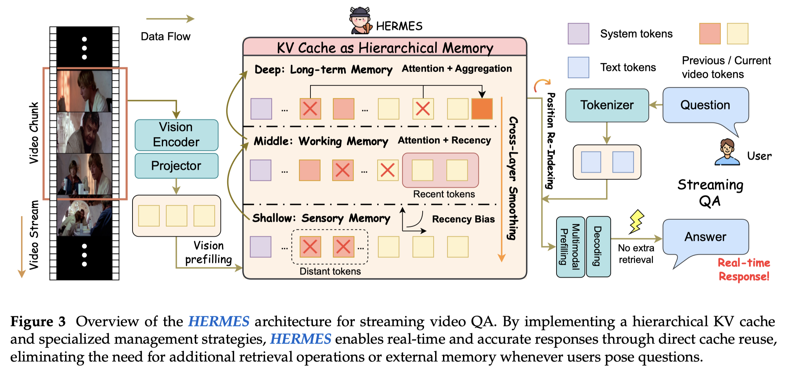

# HERMES: KV Cache as Hierarchical Memory for Efficient Streaming Video Understanding

> Haowei Zhang, Shudong Yang, Jinlan Fu, See-Kiong Ng, Xipeng Qiu

## Abstract

Recent advancements in Multimodal Large Language Models (MLLMs) have demonstrated significant improvement in offline video understanding. However, extending these capabilities to streaming video inputs, remains challenging, as existing models struggle to simultaneously maintain stable understanding performance, real-time responses, and low GPU memory overhead. To address this challenge, we propose HERMES, a novel training-free architecture for real-time and accurate understanding of video streams. Based on a mechanistic attention investigation, we conceptualize KV cache as a hierarchical memory framework that encapsulates video information across multiple granularities. During inference, HERMES reuses a compact KV cache, enabling efficient streaming understanding under resource constraints. Notably, HERMES requires no auxiliary computations upon the arrival of user queries, thereby guaranteeing real-time responses for continuous video stream interactions, which achieves 10$\times$ faster TTFT compared to prior SOTA. Even when reducing video tokens by up to 68% compared with uniform sampling, HERMES achieves superior or comparable accuracy across all benchmarks, with up to 11.4% gains on streaming datasets.
