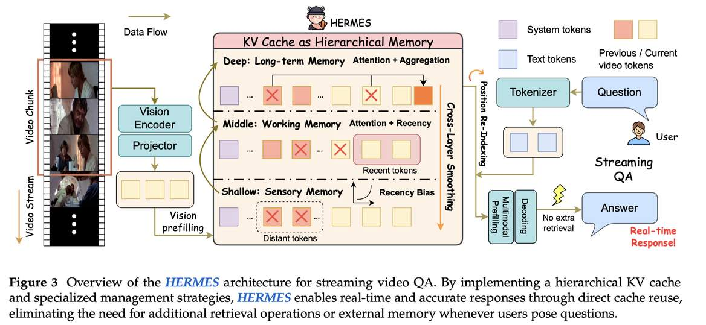

# HERMES: KV Cache as Hierarchical Memory for Efficient Streaming Video Understanding

> Haowei Zhang, Shudong Yang, Jinlan Fu, See-Kiong Ng, Xipeng Qiu

> 注：以下论文笔记由 AI Agent 自动生成，可能存在理解偏差或遗漏，请以原论文为准。

## Abstract

Recent advancements in Multimodal Large Language Models (MLLMs) have demonstrated significant improvement in offline video understanding. However, extending these capabilities to streaming video inputs, remains challenging, as existing models struggle to simultaneously maintain stable understanding performance, real-time responses, and low GPU memory overhead. To address this challenge, we propose HERMES, a novel training-free architecture for real-time and accurate understanding of video streams. Based on a mechanistic attention investigation, we conceptualize KV cache as a hierarchical memory framework that encapsulates video information across multiple granularities. During inference, HERMES reuses a compact KV cache, enabling efficient streaming understanding under resource constraints. Notably, HERMES requires no auxiliary computations upon the arrival of user queries, thereby guaranteeing real-time responses for continuous video stream interactions, which achieves 10× faster TTFT compared to prior SOTA. Even when reducing video tokens by up to 68% compared with uniform sampling, HERMES achieves superior or comparable accuracy across all benchmarks, with up to 11.4% gains on streaming datasets.

## 一句话总结

HERMES 是一个免训练的流式视频理解框架，将 KV 缓存概念化为分层记忆系统（浅层感觉记忆、中层工作记忆、深层长期记忆），通过分层 KV 缓存管理和跨层记忆平滑，在减少 68% 视频 token 的情况下实现 10× 更快的 TTFT 和最高 11.4% 的精度提升。

## 背景与问题

- **流式视频理解挑战**：现有 MLLM 在流式视频输入上难以同时保持稳定的理解性能、实时响应和低 GPU 内存开销
- **外部记忆方法的局限**：
  - 将视频内容存储在数据库中，查询时进行检索和多模态预填充
  - 高延迟，缺乏端到端的连贯性
  - 需要昂贵的模型特定训练
- **内部记忆方法的局限**：
  - ReKV/LiveVLM 等需要额外检索，导致延迟
  - StreamMem 使用聊天模板 token 引导压缩，但缺乏细粒度 KV 管理和机制可解释性
- **核心问题**：如何在不使用额外计算资源的情况下，实现低延迟、高精度的流式视频理解？

## 核心方法

### 1. 分层 KV 缓存管理

**核心思想**：将 KV 缓存概念化为分层记忆框架，不同层的注意力模式对应不同粒度的记忆。

**三个层次**：
- **浅层（感觉记忆）**：强烈的近期偏好，注意力集中在最近的视觉 token 上，快速衰减
- **深层（长期记忆）**：注意力稀疏且有节奏，局部极值出现在帧级别锚点 token 上（每 196 个 token 一个）
- **中层（工作记忆）**：逐渐减少近期偏好，注意力在最近和早期 token 之间均匀分布

**重要性评分**：
- **浅层**：基于指数遗忘曲线（Ebbinghaus 理论）
  - S_i^l = α_i^l · e^{-k·Δt_i}, Δt_i = T-1 - i
- **深层**：基于注意力权重（使用通用指导提示作为伪查询）
  - S_i^l = α_i^l · W_i^l
- **中层**：通过层相关权重插值近期和注意力
  - S_i^l = (1-ω^l) · A_i^l + ω^l · R_i^l

### 2. 跨层记忆平滑

**问题**：分层 KV 缓存管理可能导致跨层不一致，同索引的 token 在不同层被独立剔除，导致视觉记忆不对齐。

**解决方案**：从深层向浅层传播和平滑重要性信号
- 平滑后的分数：S̃_i^l = (1-λ^l) · S_i^l + λ^l · S_i^{l+1}
- 使用 Top-K 选择维持每层固定内存预算
- 被剔除的 token 被聚合成摘要 token，保留长期信息

### 3. 位置重索引

**问题**：流式输入的连续积累导致位置索引超出模型最大支持范围，严重降低文本生成质量。

**两种策略**：
- **Lazy Re-Indexing**：仅在位置索引接近模型限制时触发，计算开销低，适合流式视频
- **Eager Re-Indexing**：在每个压缩步骤执行，保持严格连续的 RoPE 索引，适合离线视频

**支持的 RoPE 类型**：
- 1D RoPE（LLaVA-OV）
- 3D M-RoPE（Qwen2.5-VL）

## 主要结果

### 性能提升

- **TTFT（Time to First Token）**：10× 更快（相比 SOTA）
- **视频 token 减少**：最多 68%（相比均匀采样）
- **精度提升**：最高 11.4%（在流式数据集上）
- **GPU 内存**：恒定、紧凑的 GPU 内存占用，无 OOM 风险

### 关键发现

1. **分层记忆有效**：KV 缓存的分层管理显著优于统一的 FIFO 剔除
2. **无需额外计算**：查询时无需额外计算或外部设备，保证实时响应
3. **跨层平滑重要**：跨层记忆平滑有效解决了分层管理的跨层不一致问题
4. **训练无关**：HERMES 是免训练的，可无缝集成到现有 MLLM 中
5. **鲁棒性**：在短、中、长时间视频上均表现稳定

## 优点与局限

### 优点

1. **免训练**：HERMES 是免训练的，可无缝集成到现有 MLLM 中
2. **分层记忆**：将 KV 缓存概念化为分层记忆系统，有效管理视频信息
3. **实时响应**：查询时无需额外计算，保证实时响应（10× 更快的 TTFT）
4. **高效**：减少 68% 视频 token，同时保持或提升精度
5. **鲁棒**：在短、中、长时间视频上均表现稳定
6. **低内存**：恒定、紧凑的 GPU 内存占用，无 OOM 风险

### 局限

1. **依赖模型架构**：分层记忆管理依赖于模型的层结构，可能不适用于所有架构
2. **固定内存预算**：每层使用固定内存预算，可能不适合所有场景
3. **伪查询**：深层记忆使用伪查询作为指导，可能不完全匹配真实查询
4. **评估范围**：主要在 LLaVA-OV-7B 上评估，其他模型需进一步测试
5. **位置重索引**：可能引入位置信息丢失，影响长期依赖

## 与 EfficientPaper 主题的关系

HERMES 属于 **KV Cache Sparse**（`kv_cache_sparse`）领域，核心贡献包括：

- **分层 KV 缓存管理**：将 KV 缓存概念化为分层记忆系统
- **跨层记忆平滑**：解决分层管理的跨层不一致问题
- **位置重索引**：支持连续流式输入

与 EfficientPaper 中已有论文的关系：
- **ReKV**（2024）：外部 CPU/磁盘存储，需要额外检索
- **LiveVLM**（2025）：类似外部存储，需要额外检索
- **StreamMem**（2025）：使用聊天模板引导压缩，缺乏细粒度 KV 管理
- **FlashPrefill**（2026）：预填充阶段优化
- **Double-P**（2026）：分层 top-p 稀疏注意力

## 可复现/实现要点

1. **分层 KV 缓存管理**：浅层（指数遗忘曲线）、深层（注意力权重）、中层（插值）
2. **跨层记忆平滑**：从深层向浅层传播重要性信号
3. **位置重索引**：Lazy/Eager 两种策略，支持 1D RoPE 和 3D M-RoPE
4. **固定内存预算**：每层固定预算，Top-K 选择
5. **摘要 token**：被剔除的 token 聚合成摘要 token，保留长期信息
6. **LLaVA-OV-7B**：实验使用 LLaVA-OV-7B，28 层，每帧 196 个视觉 token

## 个人备注

- HERMES 的核心洞察是：**KV 缓存可以作为分层记忆系统**，不同层的注意力模式对应不同粒度的记忆。
- 分层 KV 缓存管理是一个重要的设计选择，它将粗粒度和细粒度记忆管理结合在一起。
- 跨层记忆平滑是关键优化，它解决了分层管理的跨层不一致问题。
- 论文来自 Fudan University、Shanghai Innovation Institute、NUS，且基于 LLaVA-OV-7B，说明这是一个实用的系统。
- 值得关注的未来方向：(1) 在其他 MLLM 上的验证；(2) 更复杂的时间推理任务；(3) 与在线学习的结合。
