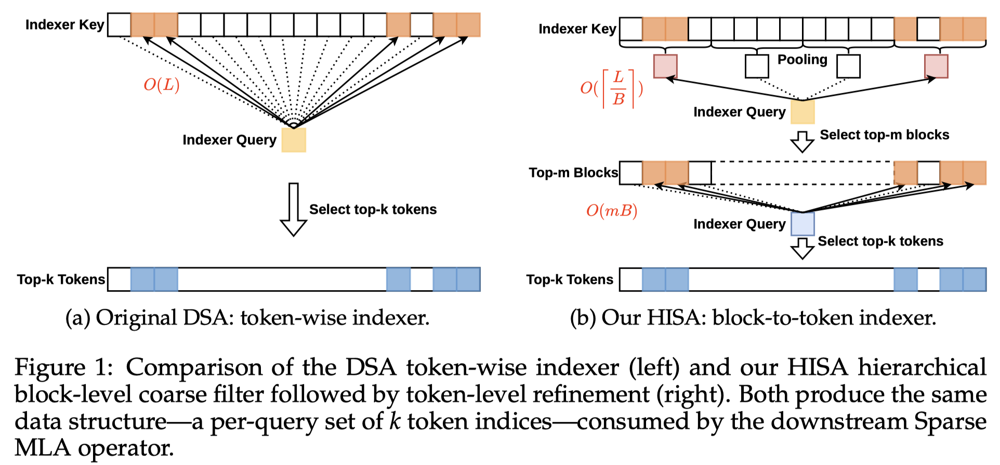

# HISA: Efficient Hierarchical Indexing for Fine-Grained Sparse Attention

> Yufei Xu, Fanxu Meng, Fan Jiang, Yuxuan Wang, Ruijie Zhou, Zhaohui Wang, Jiexi Wu, Zhixin Pan, Xiaojuan Tang, Wenjie Pei, Tongxuan Liu, Di Yin, Xing Sun, Muhan Zhang

## Abstract

Token-level sparse attention mechanisms, exemplified by DeepSeek Sparse Attention (DSA), achieve fine-grained key selection by scoring every historical key for each query through a lightweight indexer, then computing attention only on the selected subset. While the downstream sparse attention itself scales favorably, the indexer must still scan the entire prefix for every query, introducing an per-layer bottleneck that grows prohibitively with context length. We propose HISA (Hierarchical Indexed Sparse Attention), a plug-and-play replacement for the indexer that rewrites the search path from a flat token scan into a two-stage hierarchical procedure: (1) a block-level coarse filtering stage that scores pooled block representations to discard irrelevant regions, followed by (2) a token-level refinement stage that applies the original indexer exclusively within the retained candidate blocks. HISA preserves the identical token-level top-sparse pattern consumed by the downstream Sparse MLA operator and requires no additional training. On kernel-level benchmarks, HISA achieves up to speedup at 64K context. On Needle-in-a-Haystack and LongBench, we directly replace the indexer in DeepSeek-V3.2 and GLM-5 with our HISA indexer, without any finetuning. HISA closely matches the original DSA in quality, while substantially outperforming block-sparse baselines.

---

*以下总结由 MiMo 生成：*

这篇论文针对细粒度稀疏注意力机制中索引器扫描整个前缀导致的上下文长度扩展瓶颈问题，提出了HISA（分层索引稀疏注意力）方法。HISA通过将平坦的令牌扫描重写为两阶段分层过程：首先进行块级粗过滤，然后在保留的候选块内进行令牌级精炼，从而显著减少计算开销。实验表明，HISA在64K上下文长度下实现了高达2.1倍的加速，同时在保持与原始DSA相当质量的前提下，显著优于块稀疏基线方法。

---

比较的是sparse decoding
