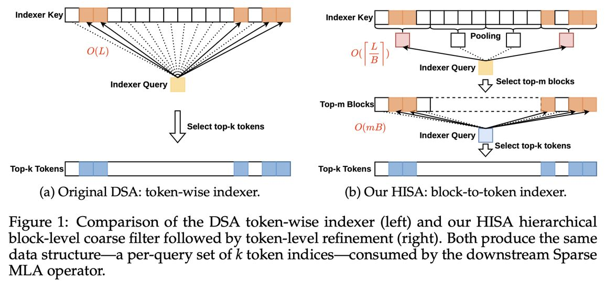

# HISA: Efficient Hierarchical Indexing for Fine-Grained Sparse Attention

> Yufei Xu, Fanxu Meng, Fan Jiang, Yuxuan Wang, Ruijie Zhou, Zhaohui Wang, Jiexi Wu, Zhixin Pan, Xiaojuan Tang, Wenjie Pei, Tongxuan Liu, Di Yin, Xing Sun, Muhan Zhang

---

> ⚠️ **生成声明**：本 note 由 AI Agent（Hermes）自动生成，基于论文全文提取与分析。内容仅供参考，建议结合原文阅读。

---

## 一句话总结

HISA 通过将 DSA 索引器的平坦令牌扫描改写为"块级粗过滤 + 令牌级精炼"两阶段分层搜索，在不改变下游稀疏注意力模式的前提下，将索引器的每层复杂度从 O(L²) 降低到 O(L²/B + LmB)，在 64K 上下文下实现最高 3.75× 加速，同时在 Needle-in-a-Haystack 和 LongBench 上保持与原始 DSA 相当的质量。

---

## 摘要翻译

令牌级稀疏注意力机制（以 DeepSeek Sparse Attention（DSA）为代表）通过轻量级索引器对每个查询的每个历史键进行评分，仅在被选中的子集上计算注意力，从而实现细粒度的键选择。虽然下游的稀疏注意力本身扩展性良好，但索引器仍需为每个查询扫描整个前缀，引入了每层 O(L²) 的瓶颈，且该瓶颈随上下文长度增长而急剧增大。我们提出 HISA（Hierarchical Indexed Sparse Attention），一种可即插即用的索引器替代方案，将搜索路径从平坦的令牌扫描改写为两阶段分层过程：（1）块级粗过滤阶段，对池化的块表示进行评分以丢弃不相关区域；（2）令牌级精炼阶段，在保留的候选块内应用原始索引器。HISA 保留了下游 Sparse MLA 算子所消耗的完全相同的令牌级 top-k 稀疏模式，无需额外训练。在内核级基准测试中，HISA 在 64K 上下文下实现了高达 3.75× 的加速。在 Needle-in-a-Haystack 和 LongBench 上，我们直接将 DeepSeek-V3.2 和 GLM-5 中的索引器替换为 HISA 索引器，无需任何微调。HISA 在质量上与原始 DSA 高度接近，同时显著优于块稀疏基线方法。

---

## 研究动机

随着大语言模型（LLM）的上下文窗口从 128K 扩展到 1M 甚至更长，自注意力机制的二次方计算成本成为预填充延迟和内存消耗的主要瓶颈。稀疏注意力通过仅选择最相关的 token 子集进行计算，有效缓解了这一问题。

**DSA 的瓶颈**：DeepSeek-V3.2 采用的 DSA 通过轻量级索引器为每个查询对所有历史 token 打分，选择 top-k 个键传递给下游的 Sparse MLA。虽然稀疏注意力本身是高效的，但索引器需要为每个查询扫描整个前缀，导致每层的索引成本为 O(L²)，与密集注意力相同。当上下文长度达到 128K 甚至 1M 时，索引器从可忽略的开销变成主导成本。

**核心问题**：能否在不改变最终稀疏注意力模式的前提下，降低索引器的搜索成本？即"改写搜索路径，保持搜索结果"。

---

## 方法（技术细节）

### 1. DSA 背景回顾

DSA 包含两个组件：
- **索引器（Indexer）**：维护轻量级索引键 $k^I_s$、索引查询 $q^I_{t,j}$（$H_I$ 个索引头）和门控权重 $w^I_{t,j}$。查询 $t$ 与键 $s$ 的相关性得分为：
  $$I_{t,s} = \sum_{j=1}^{H_I} w^I_{t,j} \cdot \text{ReLU}(q^I_{t,j} \cdot k^I_s)$$
  然后选择 top-k 个令牌索引 $T_t = \text{TopK}(I_{t,:}, k)$。
- **Sparse MLA**：使用 MQA 模式的 MLA，每个令牌存储一个共享的潜在键值条目，仅在选定的令牌集合 $T_t$ 上计算注意力。

**关键观察**：两个组件之间的接口正是选定的令牌集合 $T_t$。HISA 仅替换索引器的搜索路径，保持下游 Sparse MLA 不变。

### 2. HISA 两阶段分层搜索

#### 阶段一：块级粗过滤（Block-level Coarse Filtering）

- 将前缀令牌（长度 L）划分为 $M = \lceil L/B \rceil$ 个连续块 $B_1, B_2, \dots, B_M$（块大小 B）。
- 对每个块，通过对其索引键进行均值池化，构造一个代表性键：
  $$\tilde{k}^I_b = \text{Pool}(\{k^I_s \mid s \in B_b\})$$
- 使用与 DSA 相同的索引查询表示 $q^I_{t,j}$ 和门控权重 $w^I_{t,j}$，对池化的代表性键进行评分：
  $$J_{t,b} = \sum_{j=1}^{H_I} w^I_{t,j} \cdot \text{ReLU}(q^I_{t,j} \cdot \tilde{k}^I_b)$$
- 选择 top-m 个块 $C_t = \text{TopK}(J_{t,:}, m)$，并强制包含首块和末块（包含注意力汇聚和局部上下文）。
- 候选令牌集 $\Omega_t = \bigcup_{b \in C_t} B_b$。

**因果性**：所有块选择严格遵守因果掩码，仅考虑查询位置 $t$ 之前的块。

#### 阶段二：令牌级精炼（Token-level Refinement）

- 在候选集 $\Omega_t$ 内，使用与原始 DSA 相同的评分机制对令牌进行评分：
  $$I_{t,s} = \sum_{j=1}^{H_I} w^I_{t,j} \cdot \text{ReLU}(q^I_{t,j} \cdot k^I_s), \quad s \in \Omega_t$$
- 从候选集中选择 top-k 个令牌作为最终结果：$T_t = \text{TopK}(\{I_{t,s} \mid s \in \Omega_t\}, k)$。
- 需满足可行性约束 $mB \geq k$（候选池大小需大于等于最终选择的令牌数）。

### 3. 边界行为

三种场景：
- 当 $t \leq k$ 时，所有前缀令牌被选中，HISA 等价于密集注意力。
- 当 $k < t \leq mB$ 时，粗过滤器选择所有块（因为 $m \geq M$），第二阶段将集合缩减为 k 个令牌，HISA 等价于原始 DSA 索引器。
- 当 $t > mB$ 时，粗过滤器执行非平凡的块剪枝，HISA 的分层优势得以显现，且随序列长度增长而愈发显著。

### 4. 复杂度分析

- **每查询索引成本**：$O(L/B + mB)$
- **每层成本**：$O(L^2/B + LmB)$
- **相比 DSA 的改进**：从 $O(L^2)$ 降低到 $O(L^2/B + LmB)$

### 5. 设计优势

- **即插即用**：HISA 产生与原始 DSA 索引器相同结构的输出（每个查询一个 k 个令牌索引的集合），下游 Sparse MLA 完全不变。
- **无需训练**：无需重训练、架构修改或 KV 缓存布局调整。
- **硬件友好**：块级操作可利用 GPU 的 Tile 结构。
- **增量维护**：代表性键可伴随 KV 缓存增量维护，开销可忽略。

---

## 实验结果

### 1. 内核级加速（Kernel-Level Speedup）

- 使用 TileLang GPU 内核实现，在 NVIDIA A100 GPU 上测试。
- 配置：查询长度 1024，最终 top-k = 2048 令牌，块大小 B = 128。
- **64K 上下文下**：
  - 4:1 压缩比（16K 候选预算）：约 2.16× 加速
  - 固定 8K 预算：最高 3.75× 加速
- DSA 在 64K 上下文下索引器耗时约 5.6ms，而 Sparse MLA 操作约 1.6ms，说明主要瓶颈在于索引器。
- HISA 虽增加了块级过滤阶段，但该阶段仅处理池化的块摘要（大小 $\lceil L/B \rceil$），远小于完整令牌序列。

### 2. Needle-in-a-Haystack（NIAH）

- 在 DeepSeek-V3.2 上测试，上下文长度 8K–648K，针深度 0%–100%。
- **HISA 与 DSA**：HISA 与原始 DSA 性能高度接近，仅在极端长度和深度下有轻微退化，说明 HISA 极少丢弃包含目标信息的块。
- **Block-Sparse**：明显出现准确率退化，尤其当针位于上下文中部时（块级选择最不可靠的位置）。
- **结论**：分层选择的价值在于，块稀疏方法常在所选块内浪费预算于不重要令牌，而忽略真正关键的令牌。HISA 通过块检索后的令牌级精炼，更准确地保留重要令牌。

### 3. LongBench 评估

- 评估 DeepSeek-V3.2 和 GLM-5，三种配置：DSA、HISA、Block-Sparse。
- 所有方法最终保留 2048 个令牌用于计算。
- Block-Sparse：直接选择 16 个块（128×16 = 2048 令牌）。
- HISA：先选择 64 个块（128×64 = 8192 令牌），再通过令牌级选择精炼至 2048 令牌。

**DeepSeek-V3.2 结果**（平均分）：
| 索引器 | SQA | MQA | Sum | FS | Syn | Code | Avg |
|--------|------|------|------|------|------|------|------|
| DSA | 50.89 | 52.66 | 22.11 | 62.24 | 69.83 | 48.56 | 51.05 |
| Block | 48.36 | 49.76 | 21.90 | 59.45 | 68.67 | 49.09 | 49.54 |
| HISA | 49.17 | 51.96 | 22.13 | 61.62 | 70.83 | 48.99 | 50.78 |

**GLM-5 结果**（平均分）：
| 索引器 | SQA | MQA | Sum | FS | Syn | Code | Avg |
|--------|------|------|------|------|------|------|------|
| DSA | 41.23 | 27.89 | 18.39 | 63.20 | 68.84 | 56.53 | 46.01 |
| Block | 38.35 | 24.29 | 16.95 | 60.64 | 60.49 | 55.29 | 42.67 |
| HISA | 42.45 | 27.62 | 17.90 | 63.78 | 69.35 | 56.79 | 46.32 |

**关键发现**：
- HISA 在两个模型上均与 DSA 性能高度接近。
- HISA 在 Synthetic 任务上持续超过 DSA，在 GLM-5 上甚至获得更高平均分。
- Block-Sparse 基线性能差距明显，尤其在 GLM-5 的 Synthetic 任务上分数下降 8.35%。

### 4. 注意力分布可视化

- 对 LongBench 代码任务的代表性样本进行注意力分布可视化。
- 发现高注意力权重令牌往往形成连续片段，而非孤立点，对应语义连贯的段落（如代码块、数学公式和推导），且跨层持久存在。
- 这一观察支持了 HISA 两阶段分层结构的合理性。

### 5. 超参数敏感性

- 三种 HISA 配置（候选池大小 mB = 8192，最终 k = 2048）：
  - (B=64, m=128)
  - (B=128, m=64)
  - (B=256, m=32)
- **关键发现**：
  - 所有三种配置均与 DSA 性能高度接近。
  - B=64 和 B=128 的中间配置优于 B=256，说明细粒度选择对准确识别最相关令牌很重要。
  - Block-Sparse 一致低于所有 HISA 配置，强调了令牌级精炼的重要性。

---

## 优势

1. **显著加速**：在 64K 上下文下实现 2.16×–3.75× 内核级加速。
2. **即插即用**：无需重训练、架构修改或 KV 缓存布局调整，可直接替换 DSA 索引器。
3. **保持质量**：在 Needle-in-a-Haystack 和 LongBench 上与原始 DSA 性能高度接近，甚至在部分任务上超越 DSA。
4. **显著优于块稀疏基线**：分层结构有效避免了块稀疏方法中"预算浪费在不重要令牌"的问题。
5. **硬件友好**：块级操作利用 GPU Tile 结构，代表性键可增量维护。
6. **渐进退化**：当 m 接近 M 时，HISA 平滑退化至 DSA 基线，保证了鲁棒性。
7. **训练免费**：推理时直接应用，无需微调。

---

## 局限

1. **粗过滤信息损失**：当前块级阶段使用单个池化向量表示每个块，当块跨越语义边界时，池化表示可能无法反映最重要令牌。潜在缓解方法包括重叠块、自适应块边界或用最大池化替代均值池化。
2. **训练感知 HISA**：当前为训练免费的推理时替换，联合训练块评分阶段可能提高粗过滤器的准确性，尤其是边界情况。
3. **端到端系统集成**：尚未将 HISA 集成到完整的推理服务栈中（如连续批处理和投机解码），未测量实际工作负载下的吞吐量和延迟。
4. **超参数敏感性**：块大小 B 和块级 top-m 的选择需要权衡，过大或过小的 B 都可能影响性能。
5. **仅评估两个模型**：实验仅在 DeepSeek-V3.2 和 GLM-5 上进行，尚未验证对其他模型的泛化性。
6. **仅在 Kernel 级别评估加速**：内核级加速不直接等同于端到端服务吞吐量，后者还受 Sparse MLA、KV 缓存管理等组件影响。
7. **代码未开源**：目前代码 URL 为空，尚无公开实现可复现。

---

## 与 EfficientPaper 相关的研究方向

1. **稀疏注意力优化**：HISA 是细粒度稀疏注意力（attention_sparsity）的高效索引器方案，与 DSA、MoBA、NSA 等方法形成互补。
2. **长上下文推理**：随着上下文窗口扩展至 128K–1M，HISA 为长上下文推理提供了高效索引策略。
3. **即插即用优化**：HISA 的训练免费、架构兼容特性使其成为现有模型（如 DeepSeek-V3.2、GLM-5）的便捷优化手段。
4. **分层注意力设计**：从块级到令牌级的两阶段分层结构为稀疏注意力设计提供了新范式。
5. **GPU 内核优化**：TileLang GPU 内核实现为高效稀疏注意力的硬件实现提供了参考。
6. **与 DSA 的关系**：HISA 是 DSA 的索引器加速方案，可视为 DSA 的插件式升级，与 baseline `2025/DSA` 直接相关。
7. **与块稀疏方法的对比**：HISA 在保持令牌级细粒度选择的同时，利用块级快速过滤，优于 MoBA、NSA 等块稀疏方法。

---

*本 note 由 AI Agent（Hermes）于 2026 年 6 月自动生成，基于 arXiv:2603.28458v3 全文提取与分析。*
