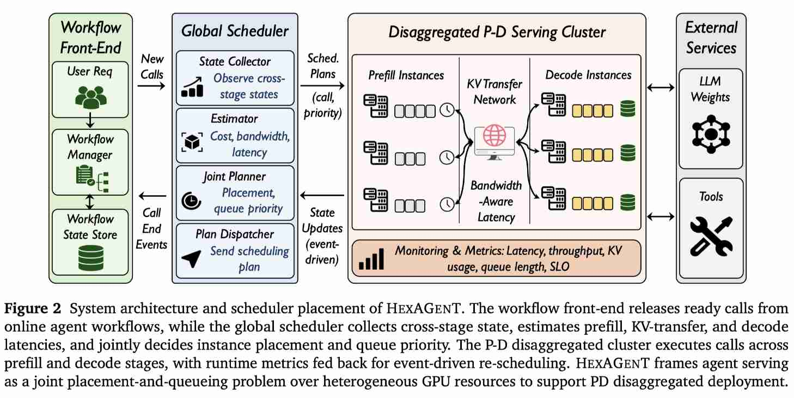

# HexAGenT: Efficient Agentic LLM Serving via Workflow- and Heterogeneity-Aware Scheduling

> You Peng, Youhe Jiang, Wenshuang Li, Xu Xu, Ke Zhou, Jiawei Jiang, Chen Wang, Binhang Yuan

> 注：以下论文笔记由 AI Agent 自动生成，可能存在理解偏差或遗漏，请以原论文为准。

## Abstract

Agentic LLM applications increasingly execute user requests as multi-step workflows involving planning, tool use, branching, refinement, and synthesis. In such settings, users experience the end-to-end latency of an entire workflow, not the latency of any single LLM call. This paper studies how to schedule online agentic workflows across heterogeneous prefill-decode disaggregated LLM serving clusters to meet workflow-level latency objectives. HexAGenT models each request as an online-revealed DAG, maintains a running estimate of the workflow's standalone completion horizon, prioritizes ready calls by projected risk of missing that horizon, and jointly selects prefill placement, decode placement, and local queue priority while accounting for KV-cache capacity and cross-stage transfer latency. Across representative agentic workloads and heterogeneous A100/H100/H200 clusters, HexAGenT reduces the SLO scale required for timely workflow completion by an average of 20.1% at 95% attainment and 33.0% at 99% attainment, with maximum reductions of 45.0% and 80.5%.

## 一句话总结

HexAGenT 把 agent 请求从“独立 LLM call 队列”提升为“在线展开的 workflow DAG”，在异构 prefill-decode 集群里联合决定 call 优先级、prefill/decode 放置和 decode KV 容量可行性，从而优化端到端 workflow SLO 而不是单次调用延迟。

## 创新点

1. **workflow-level serving target**：为每个在线展开的 agent workflow 维护当前已揭示 DAG 的 standalone completion horizon $H_w(t)$，用 scaled-SLO 目标直接刻画用户实际感知的端到端完成时间，而不是用单个 call 的排队/服务时间做代理。
2. **projected-risk priority**：对 ready call 计算 projected ratio $R_s(c,t)=((t-a_w)+\Delta_s(c,t))/H_w(t)$，把 workflow 已等待时间、候选 stage 完成时间、KV transfer 和 decode 等待纳入同一个风险分数，优先推进最可能拖垮 workflow SLO 的 call。
3. **heterogeneous P-D joint scheduling**：在 prefill 阶段联合枚举 prefill instance 和 planned decode instance，在 decode 阶段检查 KV capacity feasibility，并通过异步 plan application 避免 scheduler 阻塞 serving hot path；这比 workflow-FCFS/LLF/ATLAS 只做程序级排序更贴近 P-D disaggregation 的真实瓶颈。

## 带来什么提升

1. **异构集群 tail SLO 更紧**：在 A100/H100/H200 heterogeneous P-D 集群上，HexAGenT 相比最强 baseline 平均降低 Req95 13.0%、Req99 24.5%；Qwen Hetero-1 上 Req95/Req99 从 5.60/7.22 降到 4.48/4.69。
2. **agentic mixed workload 收益明显**：Qwen Hetero-1 的 Mixed trace 中，Req99 从 Workflow-LLF 的 8.96 降到 3.94，降低 56.0%；ShareGPT、BFCL-v3、LATS 也分别在尾部 SLO 上有稳定收益，说明 workflow continuity 与异构放置同时重要。
3. **调度开销可控且对估计误差稳健**：实现基于 SGLang v0.5.9 和 Python simulator，异构设置中平均每次 scheduler invocation 约 7.1-14.7 ms；注入 10%-30% prefill/decode 估计误差时，Req99 degradation 仍保持在可控范围，核心收益不依赖精确服务时间预测。

## 备注

1. 论文没有给出公开代码链接；实现描述是 router/worker 层调度改造加事件驱动 simulator，而不是 CUDA/kernel 级优化。
2. EfficientPaper 视角下，这篇论文和 Splitwise/DistServe 的 P-D disaggregation、SGLang/vLLM 的 serving substrate、Hermes/Autellix/Continuum 的 program-aware/agent-aware serving 是同一条线，但它更强调“在线 workflow DAG + 异构 P-D 放置 + KV capacity”的联合调度问题。
3. 一个需要谨慎看待的点是 workload trace 规模偏模拟化：ShareGPT/BFCL/LATS/Mixed 能覆盖典型 agent 模式，但真实生产 agent 的工具时延、失败重试、模型级动态 batching 反馈可能让 horizon 估计和 projected-risk 排序更难。
