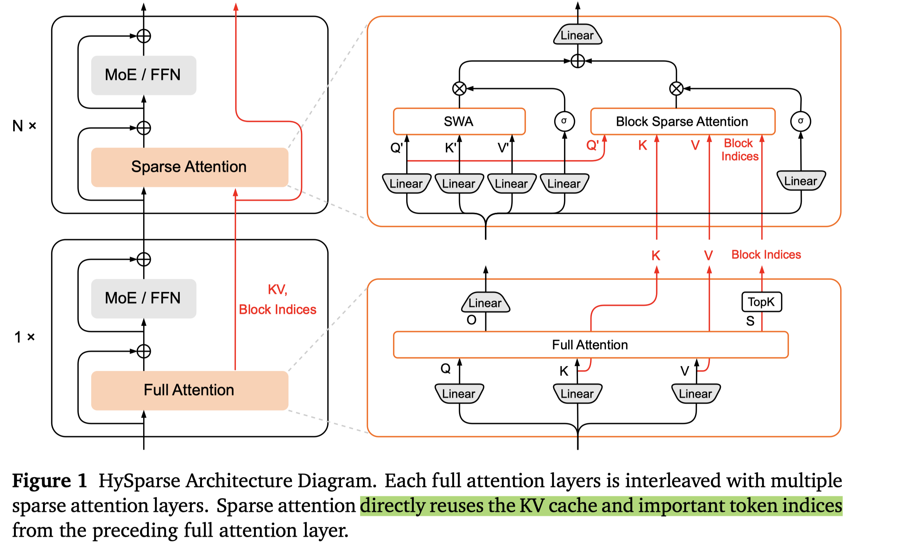

# HySparse: A Hybrid Sparse Attention Architecture with Oracle Token Selection and KV Cache Sharing

> Yizhao Gao, Jianyu Wei, Qihao Zhang, Yu Cheng, Shimao Chen, Zhengju Tang, Zihan Jiang, Yifan Song, Hailin Zhang, Liang Zhao, Bo Yang, Gang Wang, Shijie Cao, Fuli Luo

## Abstract

This work introduces Hybrid Sparse Attention (HySparse), a new architecture that interleaves each full attention layer with several sparse attention layers. While conceptually simple, HySparse strategically derives each sparse layer's token selection and KV caches directly from the preceding full attention layer. This architecture resolves two fundamental limitations of prior sparse attention methods. First, conventional approaches typically rely on additional proxies to predict token importance, introducing extra complexity and potentially suboptimal performance. In contrast, HySparse uses the full attention layer as a precise oracle to identify important tokens. Second, existing sparse attention designs often reduce computation without saving KV cache. HySparse enables sparse attention layers to reuse the full attention KV cache, thereby reducing both computation and memory. We evaluate HySparse on both 7B dense and 80B MoE models. Across all settings, HySparse consistently outperforms both full attention and hybrid SWA baselines. Notably, in the 80B MoE model with 49 total layers, only 5 layers employ full attention, yet HySparse achieves substantial performance gains while reducing KV cache storage by nearly 10x.

- token selection (sliding windows attention, block sparse attention)
- cross layer kv sharing
- full-attn + sparse-attn

将kv cache放在cpu上，在计算前进行pre-fetch