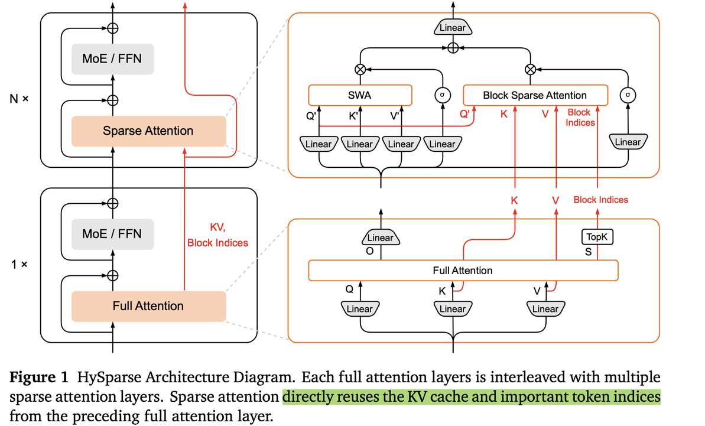

# HySparse: A Hybrid Sparse Attention Architecture with Oracle Token Selection and KV Cache Sharing

> Yizhao Gao, Jianyu Wei, Qihao Zhang, Yu Cheng, Shimao Chen, Zhengju Tang, Zihan Jiang, Yifan Song, Hailin Zhang, Liang Zhao, Bo Yang, Gang Wang, Shijie Cao, Fuli Luo

> ⚠️ **本文档由 AI Agent（Hermes）自动生成，仅供参考。生成时间：2026 年 6 月。**

---

## 一句话总结

HySparse 通过在每个全注意力层后交错多个稀疏注意力层，利用全注意力层作为"预言机"直接驱动稀疏层的 token 选择和 KV 缓存共享，在 7B Dense 和 80B MoE 模型上均超越全注意力和混合 SWA 基线，同时在 80B MoE 模型（49 层中仅 5 层使用全注意力）上实现近 10× KV 缓存缩减。

---

## 摘要翻译

本文提出了混合稀疏注意力（HySparse）架构，通过将每个全注意力层与多个稀疏注意力层交错排列，稀疏层直接从前一个全注意力层派生 token 选择和 KV 缓存。该架构解决了现有稀疏注意力方法的两个根本性限制：（1）传统方法依赖额外的代理模块预测 token 重要性，引入额外复杂性且性能可能不理想；HySparse 使用全注意力层作为精确的预言机来识别重要 token。（2）现有稀疏注意力设计通常仅减少计算而不节省 KV 缓存；HySparse 使稀疏注意力层复用全注意力层的 KV 缓存，同时减少计算和内存消耗。我们在 7B Dense 和 80B MoE 模型上评估 HySparse，在所有设置下均一致优于全注意力和混合 SWA 基线。特别是在 80B MoE 模型中（49 层，仅 5 层使用全注意力），HySparse 在实现显著性能提升的同时，将 KV 缓存存储减少近 10 倍。

---

## 研究动机

1. **长上下文需求与二次方瓶颈**：随着 test-time scaling、agentic workflows 等范式的兴起，LLM 对长上下文能力的需求日益增长。但标准 Transformer 的自注意力机制随序列长度二次方增长，计算延迟和成本急剧上升。

2. **稀疏注意力的两个根本局限**：
   - **基于代理的稀疏 token 选择**：现有方法（训练无关或可训练）依赖轻量级代理（预定义模式、启发式、近似估计或额外选择模块）预测 token 重要性。这些代理本质上是近似的，可能无法捕捉真实 token 重要性，特别是在长上下文和动态上下文中。即使是可训练的稀疏注意力，也未从根本上消除代理瓶颈。
   - **计算缩减无内存缓解**：现代动态稀疏注意力方法可有效减少计算，但通常保留完整 KV 缓存（因 KV 缓存驱逐是不可逆的）。维持全尺寸 KV 缓存是服务吞吐量和最大批大小的主要瓶颈。

3. **两个关键经验观察**：
   - **跨层显著 token 稳定性**：研究表明连续层中显著 token（注意力分数较高的稀疏 token）倾向于保持相对稳定。
   - **跨层 KV 缓存共享**：跨层 KV 缓存共享可减少内存而几乎不损害模型精度（如 YOCO、CLA、Apple Foundation Model、Gemma 3n、SwiftKV、MiniCache 等工作）。

4. **混合注意力架构的不足**：已有混合注意力架构（如 MiniMax-01、Qwen3-Next、Kimi Linear、Nemotron、Jamba、GPT-OSS、Gemma3、MiMo-V2-Flash）将滑动窗口注意力与全注意力交替使用，但混合模型与动态稀疏注意力的结合尚未充分探索。

---

## 方法（技术细节）

### 3.1 HySparse 架构概述

HySparse 将标准 Transformer 骨干替换为重复的混合块（Hybrid Block），每个混合块由 **1 个全注意力层 + N 个连续稀疏注意力层** 组成。全注意力层产生块级注意力重要性分数 S（通过 TopK 选择重要块索引 I）和 KV 缓存，这些直接被后续稀疏层复用。

### 3.2 全注意力层

全注意力层遵循标准 softmax 自注意力，但需暴露注意力分数用于 token 选择。为避免显式存储全注意力矩阵（内存和带宽开销过大），HySparse 仅物化**块级（tile 级）最大注意力分数**用于 TopK 选择。

**具体实现**：
- 设块大小为 B，块数量为 ⌈t/B⌉
- 块级最大注意力分数 S ∈ R^{t×⌈t/B⌉} 定义为每个块内注意力分数的最大值
- **关键创新**：通过轻微修改 FlashAttention 内核实现，在线 softmax 过程中已计算行级最大值（rowmax），复用该中间结果推导块级注意力分数，仅增加可忽略的开销（Algorithm 1）
- 在 GQA 设置下，进一步在每个 query 组内聚合 S（组内最大值），使同组所有 head 共享相同稀疏索引，提高稀疏注意力内核效率并降低索引开销
- 默认 k=1024（稀疏注意力关注的 token 数），B=64（块大小），因此选择 1024/64=16 个 TopK 块

### 3.3 稀疏注意力层

每个稀疏层包含**两个注意力分支**，对同一 query 使用不同的 KV 来源：

#### (1) Block Sparse Attention 分支
- 仅关注由 I 索引的 KV 块，其中 I 和 KV 缓存均来自前一个全注意力层
- 通过索引从共享的 K、V 中选取对应块的 key 和 value，拼接后计算标准注意力
- **关键优势**：稀疏层不产生额外的 KV 缓存，直接复用前一个全注意力层的 KV 缓存

#### (2) SWA（滑动窗口注意力）分支
- 维护自己的独立 KV 缓存，窗口大小 w=128
- 增强短程建模能力
- **实验证明**：SWA 分支需要独立 KV 缓存（而非复用全注意力层的 KV），因为 SWA 主要作为局部信息通道，需要不同表示来捕获短程一致性

#### (3) 门控融合
- 两个分支输出通过 sigmoid 门控融合：
  - ˜g_t, g'_t = σ(W˜g/g' x_t)
  - o_t = ˜g_t ⊙ ˜o_t + g'_t ⊙ o'_t
- 其中 ˜g_t 控制全局（稀疏注意力）分支，g'_t 控制局部（SWA）分支
- 实现全局和局部信息的动态混合

### 3.4 消融研究关键发现

#### 研究 1：是否需要层内 SWA 分支
- 移除 SWA 分支导致明显精度下降：DROP 从 46.4→52.2（+5.8），GSM8K 从 29.7→37.7（+8.0），BBH 从 48.2→52.4（+4.2）
- 即使有高质量稀疏选择，专门的滑动窗口路径对短程一致性和局部计算模式仍很重要

#### 研究 2：KV 缓存共享配置
- 同时为 SA 和 SWA 共享 KV 缓存严重降低精度（DROP 47.9、GSM8K 30.2、MMLU 52.8）
- 仅对 SA 分支共享 KV 缓存可恢复性能（DROP 51.9、GSM8K 36.7、MMLU 58.4）
- 结论：SA 可安全复用跨层 KV 缓存，SWA 应保持独立 KV 缓存

### 3.5 训练配置

| 配置 | 7B Dense | 80B MoE |
|---|---|---|
| 层数 | 36 | 49 |
| 注意力头 (Q/KV) | 32/8 | 64/4 |
| Head 维度 | 128 | 128 |
| Hidden Size | 4096 | 2048 |
| 混合比 (Full:Sparse) | 1:3 | 1:11 |
| SWA 窗口大小 | 128 | 128 |
| 稀疏注意力块大小 | 64 | 64 |
| 稀疏注意力 TopK | 1024 | 1024 |
| MoE 激活/总专家数 | — | 8/512 |

- 7B 模型：先在 1T token（序列长 8192）上训练，再在 200B token（序列长 32768）上扩展
- 80B MoE 模型：在 500B token（序列长 32768）上训练
- 采用 GQA（Grouped-Query Attention）
- RoPE 基础频率调整为 640,000
- 使用 WSD 调度和 AdamW 优化器

---

## 实验结果

### 通用基准测试（7B Dense 和 80B MoE）

| 基准 | 7B Full-Attn | 7B Hybrid SWA | 7B HySparse | 80B Full-Attn | 80B Hybrid SWA | 80B HySparse |
|---|---|---|---|---|---|---|
| MMLU | 56.9 | 57.5 | **58.8** | 61.8 | 54.9 | **62.2** |
| MMLU-Redux | 59.6 | 60.8 | **61.6** | 65.6 | 57.4 | **66.2** |
| BBH | 52.2 | **54.0** | 53.5 | 56.1 | 48.2 | **56.3** |
| GSM8K | 33.3 | 35.6 | **37.9** | 53.8 | 45.3 | **54.1** |
| MATH | 9.2 | 9.2 | **10.1** | 28.6 | 25.8 | **30.8** |
| C-Eval | 50.6 | 50.6 | **52.2** | 64.6 | 58.8 | **65.0** |
| CMMLU | 52.5 | 52.9 | **54.5** | 66.7 | 58.4 | **67.0** |

**关键发现**：
- 7B Dense（混合比 1:3）：HySparse 在大多数基准上超越全注意力和混合 SWA，特别在 MMLU（58.8 vs 56.9）、GSM8K（37.9 vs 33.3）和中文理解上表现突出
- 80B MoE（混合比 1:11，仅 5 层全注意力）：HySparse 几乎在所有基准上超越全注意力和混合 SWA，且性能增益往往大于 7B 设置
- Hybrid SWA 在激进混合比下表现明显下降（BBH、DROP、MMLU 系列、GSM8K、中文理解），而 HySparse 有效弥合差距
- **核心优势**：HySparse 可大幅减少全注意力层数（10× KV 缓存缩减），同时保持甚至超越全注意力性能

### 长上下文基准测试（RULER）

| 设置 | 7B 16k | 7B 32k | 80B 16k | 80B 32k |
|---|---|---|---|---|
| Full-Attn | 93.0 | 88.2 | 93.6 | 82.1 |
| Hybrid SWA | 91.6 | 84.2 | 72.7 | 69.5 |
| HySparse | **94.1** | **89.3** | 90.6 | **87.4** |

- 7B：HySparse 在 16k（94.1）和 32k（89.3）均超越全注意力（93.0、88.2）和混合 SWA（91.6、84.2）
- 80B MoE（激进混合比 1:11）：Hybrid SWA 急剧退化（16k 72.7、32k 69.5），HySparse 在 16k（90.6 vs 93.6）保持竞争力，在 32k（87.4 vs 82.1）超越全注意力
- HySparse 在困难子任务（多键值、推理密集型）上增益最明显，如 CWE（60.8 vs 37.1 at 16k）和 MK3（98.4 vs 77.0 at 32k）
- HySparse 在长上下文场景下与全注意力持平或更优，同时显著降低计算和 KV 缓存

---

## 优势

1. **预言机式 token 选择**：利用全注意力层作为精确预言机，消除了额外代理模块（如 SeerAttention 的门控、NSA 的压缩注意力）的复杂性，确保端到端训练的稳定性
2. **跨层 KV 缓存共享**：稀疏注意力层直接复用前一个全注意力层的 KV 缓存，不增加额外内存开销
3. **大幅减少全注意力层**：在 80B MoE 模型中仅用 5/49 层全注意力，实现近 10× KV 缓存缩减，同时保持或超越全注意力性能
4. **两分支门控融合**：Block Sparse Attention（全局）+ SWA（局部）的双分支设计，通过 sigmoid 门控动态融合全局和局部信息
5. **无需额外训练模块**：不引入可学习的选择模块或辅助损失，训练过程简单直接
6. **修改 FlashAttention 内核**：块级注意力分数通过修改 FlashAttention 内核计算，仅增加可忽略的开销
7. **GQA 友好**：在 GQA 设置下，通过组内聚合 S 实现所有 head 共享相同稀疏索引，提高内核效率
8. **SWA 窗口保持独立 KV 缓存**：实验验证 SWA 需要独立 KV 缓存，避免与全局表示纠缠，保持局部信息通道
9. **与 KV Cache Offloading 兼容**：可将全注意力 KV 缓存卸载到外部内存，仅在计算前预取，进一步减少 GPU 上的 KV 缓存占用
10. **性能全面领先**：在通用基准、长上下文基准、数学推理、中文理解等多个维度均超越全注意力和混合 SWA 基线

---

## 局限

1. **仍需少量全注意力层**：HySparse 不能完全消除 O(n²) 全注意力，仍需保留少量全注意力层（如 80B 模型中 5/49 层）。虽然比例已大幅降低，但完全消除全注意力仍是挑战。
2. **块级注意力分数的近似性**：使用块级最大注意力分数代替完整注意力矩阵进行 token 选择，可能存在信息损失。块大小 B=64 时，选择的块可能包含不相关的 token。
3. **稀疏注意力的 TopK 固定**：TopK 选择（k=1024, B=64）为固定值，未探索自适应稀疏度或动态调整策略。
4. **仅在 7B 和 80B 规模验证**：论文仅在 7B Dense 和 80B MoE 规模上验证，缺乏更大规模（如 200B+）或更小规模（如 1B）的实验。
5. **训练数据规模有限**：7B 模型在 1T+200B token 上训练，80B MoE 在 500B token 上训练，未在更大规模数据上验证。
6. **缺少推理效率的详细分析**：虽然论文讨论了 KV 缓存缩减和内存优势，但缺乏详细的推理延迟分析（如吞吐量、延迟对比）。
7. **FlashAttention 内核修改的通用性**：修改 FlashAttention 内核计算块级注意力分数，可能依赖特定硬件特性，通用性有待验证。
8. **与 NSA（Native Sparse Attention）等可训练稀疏方法的对比**：论文主要与全注意力和混合 SWA 基线对比，未与 NSA 等可训练稀疏注意力方法进行详细对比。
9. **未提供代码开源**：论文未提供代码开源，降低了可复现性。

---

## 与 EfficientPaper 相关的研究方向

1. **混合注意力架构**：HySparse 是混合注意力架构的重要进展，将全注意力与稀疏注意力交错使用，与 GPT-OSS、Gemma3、MiMo-V2-Flash、MiniMax-01 等工作密切相关。研究方向包括：探索更激进的混合比（如 1:100）、混合不同类型的注意力（如线性注意力 + 稀疏注意力）。
2. **跨层 KV 缓存共享**：HySparse 的跨层 KV 缓存共享技术与 YOCO、CLA、Apple Foundation Model、Gemma 3n、SwiftKV、MiniCache 等工作相关。研究方向包括：更高效的跨层共享策略、动态共享配置、与 KV 压缩方法的结合。
3. **稀疏注意力的 token 选择**：HySparse 的预言机式 token 选择为稀疏注意力提供了新范式。相关工作包括 SeerAttention（门控稀疏）、DSA（DeepSeek-V3.2）、NSA（Native Sparse Attention）、Moba 等。研究方向包括：动态稀疏度调整、自适应 token 选择、与可训练选择模块的对比。
4. **长上下文 LLM 推理优化**：HySparse 在长上下文基准上表现突出，与 OmniKV、MiniCache 等长上下文推理优化工作相关。研究方向包括：KV 缓存卸载（CPU/GPU 混合）、动态上下文选择、长序列推理的系统优化。
5. **高效 Transformer 架构设计**：HySparse 通过交错全注意力和稀疏注意力，有效减少计算和内存开销。相关工作包括 FlashAttention 系列、Gated Attention、DuoAttention、H2O 等。研究方向包括：更高效的注意力架构、与 SSM（如 Mamba）的混合设计。
6. **MoE 模型的注意力优化**：HySparse 在 80B MoE 模型上表现突出，展示了稀疏注意力在 MoE 架构中的潜力。研究方向包括：MoE 与稀疏注意力的协同优化、MoE 模型的长上下文能力提升。
7. **KV Cache Offloading 与系统优化**：HySparse 支持将全注意力 KV 缓存卸载到外部内存，与 OmniKV 等工作相关。研究方向包括：KV 缓存的内存层级优化、GPU-CPU 混合推理、批处理优化。
8. **与 FlashAttention 的协同**：HySparse 通过修改 FlashAttention 内核实现块级注意力分数，展示了与 FlashAttention 系列（FA-3、FA-4）的协同优化潜力。研究方向包括：块稀疏模式的优化、FlashAttention 的扩展功能。
