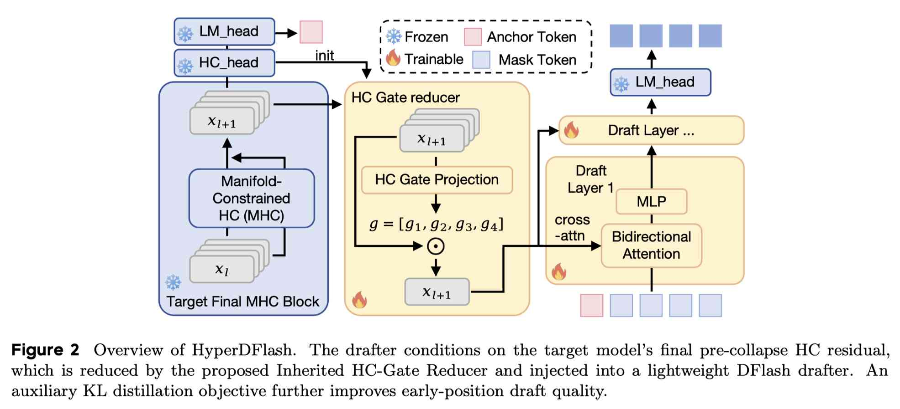

# HyperDFlash: Hyper-Connection-Aligned Block Speculative Decoding with Gated Residual Reduction

> Luxi Lin, Shuang Peng, Rui Ma, Junhao Hua, Shuwei Fan, Zhengda Qin, Qiang Wang, Hongjian Sun, Fangmin Chen, Songwei Liu

> 注：以下论文笔记由 AI Agent 自动生成，可能存在理解偏差或遗漏，请以原论文为准。

## Abstract

We present HyperDFlash, a block-parallel speculative decoding framework tailored to DeepSeek-V4's Hyper-Connections (HC). Despite the strong performance of DeepSeek-V4's native Multi-Token Prediction (MTP) module on initial token drafting, its draft accuracy degrades sharply at later positions, as error accumulation from unverified intermediate tokens severely harms draft acceptance rates. Although the original DFlash method supports efficient one-pass block drafting, it cannot be seamlessly adapted to the HC paradigm, since DeepSeek-V4's m-path residual stream induces inherent feature misalignment with conventional drafting designs. To resolve this architectural mismatch, we propose two dedicated, model-aligned optimizations for HC residual streams. First, we adopt pre-collapse residual states as the exclusive conditioning signal, preserving complete multi-path structural information and better aligning the drafter with the target's native prediction pathway. Second, we replace the heavy generic linear compressor with a lightweight gated residual reducer, whose parameters are directly inherited from the target model's built-in hc_head module. This design yields input-aware path aggregation with three orders of magnitude fewer parameters while maintaining precise architectural alignment. We further enhance model training via a targeted KL distillation loss applied to the LM-head. Extensive experiments across math reasoning, code synthesis, and conversational benchmarks demonstrate that HyperDFlash consistently outperforms both the native MTP baseline and vanilla DFlash adaptation.

## 一句话总结

针对 DeepSeek-V4 的 Hyper-Connections 架构，通过 pre-collapse 残差对齐 + 继承轻量门控路径聚合器 + 早期 KL 蒸馏，将块并行投机解码速度提升至原生 MTP 的 1.24×。

## 创新点

1. **Pre-Collapse 残差条件化**：使用目标模型最终 HC 残差状态（pre_hc_head source）作为 drafter 条件信号，保留完整多路径结构信息，避免中间层特征带来的结构偏移。

2. **继承 HC 门控聚合器**：用目标模型 hc_head 的 input-dependent spline gating 形式替代通用线性压缩器，参数从目标 hc_head 直接继承，将 67M 参数压缩到 65K（三个数量级），实现与目标模型原生预测路径的精确对齐。

3. **早期位置 KL 蒸馏**：仅对 block 前 2 个位置施加 KL 散度损失（α=0.1–0.2），利用目标 LM-Head 的软标签提升早期 draft token 质量，中后期位置避免高方差梯度冲突。

## 带来什么提升

1. **平均接受长度**：Non-thinking T=0 平均接受长度 3.69，相比 MTP(3) 的 2.93 提升 26%，相比 vanilla DFlash(6) 的 2.14 提升 72%。

2. **解码加速**：Non-thinking T=0 平均加速 2.80×，相比 MTP(3) 的 2.25× 提升 24%，相比 vanilla DFlash(6) 的 1.73× 提升 62%；Think-high T=0 平均加速 2.53×。

3. **数学推理突出**：GSM8K 加速 3.80×（T=0 Non-thinking），MATH-500 加速 2.93×，AIME25 加速 2.62×，为所有 benchmark 中量子化最显著的类别。

4. **模型无关扩展**：虽仅适配 DeepSeek-V4 的 HC 架构，其"架构感知 draft 设计"思想可推广到任何多路径残差架构。

## 备注

- **架构限制**：继承 reducer 仅在 pre_hc_head source + 目标/草稿宽度匹配时有效，否则退化为通用线性投影。
- **KL 蒸馏偏差**：当前 teacher 对 HC 路径做 mean-pool 而非 gated collapse，因此 α 保守设置（0.1–0.2）。
- **评估局限**：仅在单目标模型上测试，且包含内部工作负载（不可公开复现）；缺乏完整 serving 端延迟分析（batching、draft 开销、验证开销分离）。
