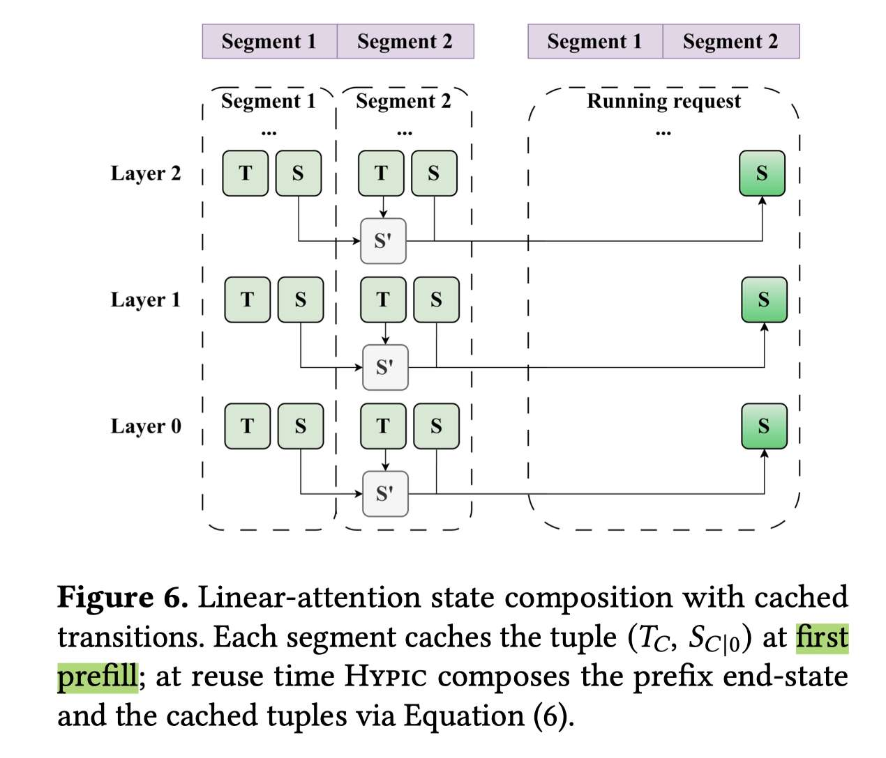

# HYPIC: Accelerating Hybrid-Attention LLM Serving with Position-Independent Caching

> Yifei Liu, Juntong Wu, Yang Liu, Junhao Hu, Minghao Li, Xiaoxu Chen, Weihang Chen

**RAG 多个 segment 可以通过去掉 RePE 进行有损的复用，对于softmax attention来说，每个token都有kv cache，这个有损的复用kv cache 片段的过程比较直接；但是对于Linear Attention来说，recurrent state 是循环更新的，那么如果想用segment 1 + segment 2的 recurrent state，需要一些不同的设计，才能保持与实际linear attention的计算的近似 **

> 注：以下论文笔记由 AI Agent 自动生成，可能存在理解偏差或遗漏，请以原论文为准。

## Abstract

RAG 和 agentic LLM serving 会把多个独立片段拼成长上下文，使 prefill 成为主要成本。Position-independent caching（PIC）可以复用不同请求中位置不固定的 segment，但现有 PIC 依赖 full-attention 的 per-token KV；hybrid-attention 模型的 linear-attention 层只保留 per-request recurrent state，因此二者无法直接结合。Hypic 提出面向 hybrid-attention LLM 的 PIC 系统：为每个 segment 缓存 segment-cumulative transition operator 和 zero-start end-state，使独立 segment 的 recurrent state 可以近似精确、常数时间组合；在少数 full-attention 层用 segment 开头的 seam window 修复跨 segment 误差；对 cold segment 使用 segment parallelism 跨实例并行 prefill。论文在 4 个 hybrid 模型、4 个公开数据集和 1 条生产 RAG trace 上评估。

## 一句话总结

Hypic 把 PIC 从纯 Transformer 扩展到 hybrid-attention LLM，用“transition operator + zero-start state”实现 linear state 组合，用 seam window 修复 full-attention 边界，并用跨实例 segment parallelism 加速冷启动 prefill。

## 创新点

1. **缓存可组合的 linear-attention segment tuple。** 对 segment $C$ 同时缓存 zero-start end-state $S_{C|0}$ 和 segment-cumulative transition operator $T_C=\prod_{t\in C}T_t$。对于任意前缀状态 $S$，segment 组合遵循 $S' = T_C S + S_{C|0}$；多个 segment 可以递推组合，复用代价与 segment 长度解耦。它补上了 naive state addition 遗漏的历史状态变换项。
2. **用 seam window 适配 hybrid stack 的 full-attention 层。** 由于 linear 层不保留每个 token 的中间 hidden state，现有 PIC 的任意 token correction 无法迁移。Hypic 观察到 splice 与 full recompute 的误差集中在每个内部 segment 的开头，只缓存其余 KV，在复用时重算固定宽度的开头窗口并通过 linear 层逐层传播 seam token；默认窗口宽度 $w=8$。
3. **提出 segment parallelism 加速 cache-miss prefill。** PIC segment 的 prefill 只依赖自身 token，因此 cold segment 可被 Router 分发到多个 scatter worker 并行计算，再由 combine worker 组合 state、修复 seam 并接入后续 decode。Hypic 用 LPT 按 segment 长度做负载均衡，并以 non-blocking GPUDirect RDMA transfer 与计算流水重叠。
4. **构建面向 PIC 的双池 cache 管理。** public pool 保存可跨请求/实例共享的 segment-level state、transition 和 local KV；private pool 保存已经按当前全局位置组装好的 per-request running state。Position-dependent prefix cache 与 position-independent segment cache 可以并存，LRU 分别管理两类对象。
5. **覆盖多种 linear-attention transition family。** scalar、diagonal 和 dense transition 分别对应不同的存储与计算代价：scalar 只需一个标量，diagonal 只需 $d_k$ 维向量，dense family 缓存 $d_k\times d_k$ 矩阵；同时处理 causal convolution warm-up 和 state RoPE re-rotation。

## 带来什么提升

1. 在 4 个 hybrid 模型、4 个公开数据集和 1 条生产 RAG trace 上，Hypic 相比 Full Recompute 平均降低 TTFT **3.25×**，相比 Prefix Cache 的优势约为 **2.77×**；在相同 1 秒 TTFT SLO 下，论文摘要报告 sustainable QPS 平均提升 **1.66×**。
2. 在 Prod-RAG trace 上，Hypic 相比 Prefix Cache 的 sustainable QPS 提升为 **1.49–1.85×**（不同模型），peak per-GPU token throughput 提升 **1.30–1.50×**；相较 Full Recompute，提升分别达到 **1.98–3.65×** 和 **1.86–1.89×**。
3. 线性 attention state composition 的复用开销与 segment 长度基本解耦：固定 4 个 segment 时，总 token 约 4K 增加到 16K，Hypic 时间仅从 0.103 s 增至 0.127 s；固定每段 1K token、segment 数从 4 增至 16 时，每增加一个 segment 约增加 2.3 ms，而 Full Recompute 约增加 40.7 ms。
4. transition/state construction 只给首次 segment prefill 增加约 **5.2%–6.7%** 开销，并可在后续复用中摊销；在 Qwen3.5-35B-A3B 上，8-token seam window 在 MultiNews/GovReport 上达到较好的质量-延迟折中，增大窗口没有带来相称收益。
5. 冷请求的 segment parallelism 在 8 个 prefill worker 上将 32K-token prompt 的 TTFT 从单 worker 的 2.83 s 降至 0.49 s，即 **5.7×** 加速；不均匀 segment 下，4 worker 的 LPT 比 round-robin 将 TTFT 从 1.26 s 降到 0.84 s。
6. 相比 Full Recompute，平均任务质量差距为 **1.71 points**；naive state addition 的 Full Recompute 得分损失达到 **66.9%**，说明 transition operator 是消除 hybrid PIC 结构性误差的关键。

## 备注

- 论文的“near-exact”不等于所有深层 hidden state 都数学上等于完整 prefill：transition composition 在输入 hidden state 相同的前提下是 layer-exact，但独立 prefill segment 与完整上下文之间仍存在跨 segment hidden-state drift。作者测得最深 linear layer 的相对 $L_2$ drift 约 8.69%–8.92%，最终任务质量通过 seam window 控制在可接受范围。
- 系统实现于 SGLang，约 14K 行 Python/Triton 代码；硬件为 8× NVIDIA H20、NVLink、RDMA NIC。实验中的 Full Recompute、Prefix Cache、Naive Addition 是对照策略；EfficientPaper 中可直接关联的 PIC baseline 是 CacheBlend。
- 适用前提是应用能明确划分语义独立的 segment，并允许使用 `PIC_SEPARATOR`；segment 边界选择、cache duplication、公共/私有池容量以及 RDMA 传输成本会影响实际收益。与 SPC 不同，Hypic 解决的是非连续 segment 的 position-independent reuse，而不是单一前缀内 recurrent checkpoint placement。
