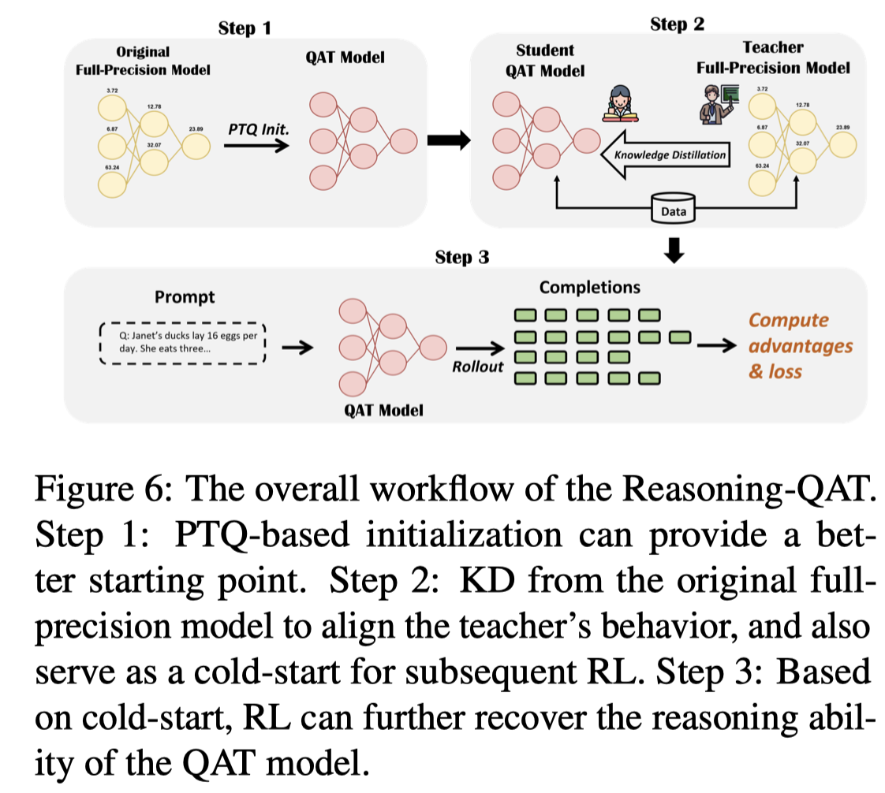

# What Makes Low-Bit Quantization-Aware Training Work for Reasoning LLMs? A Systematic Study

> Keyu Lv, Manyi Zhang, Xiaobo Xia, Jingchen Ni, Shannan Yan, Xianzhi Yu, Lu Hou, Chun Yuan, Haoli Bai

## Abstract

Reasoning models excel at complex tasks such as coding and mathematics, yet their inference is often slow and token-inefficient. To improve the inference efficiency, post-training quantization (PTQ) usually comes with the cost of large accuracy drops, especially for reasoning tasks under low-bit settings. In this study, we present a systematic empirical study of quantization-aware training (QAT) for reasoning models. Our key findings include: (1) Knowledge distillation is a robust objective for reasoning models trained via either supervised fine-tuning or reinforcement learning; (2) PTQ provides a strong initialization for QAT, improving accuracy while reducing training cost; (3) Reinforcement learning remains feasible for quantized models given a viable cold start and yields additional gains; and (4) Aligning the PTQ calibration domain with the QAT training domain accelerates convergence and often improves the final accuracy. Finally, we consolidate these findings into an optimized workflow (Reasoning-QAT), and show that it consistently outperforms state-of-the-art PTQ methods across multiple LLM backbones and reasoning datasets. For instance, on Qwen3-0.6B, it surpasses GPTQ by 44.53% on MATH-500 and consistently recovers performance in the 2-bit regime.
