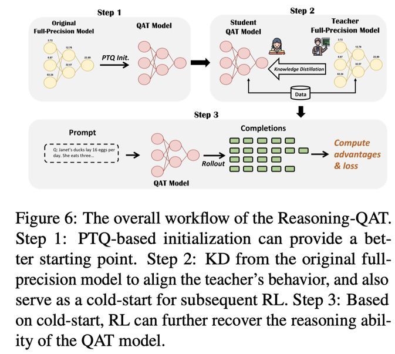

# What Makes Low-Bit Quantization-Aware Training Work for Reasoning LLMs? A Systematic Study

> Keyu Lv, Manyi Zhang, Xiaobo Xia, Jingchen Ni, Shannan Yan, Xianzhi Yu, Lu Hou, Chun Yuan, Haoli Bai

> 注：以下论文笔记由 AI Agent 自动生成，可能存在理解偏差或遗漏，请以原论文为准。

## Abstract

Reasoning models excel at complex tasks such as coding and mathematics, yet their inference is often slow and token-inefficient. To improve the inference efficiency, post-training quantization (PTQ) usually comes with the cost of large accuracy drops, especially for reasoning tasks under low-bit settings. In this study, we present a systematic empirical study of quantization-aware training (QAT) for reasoning models. Our key findings include: (1) Knowledge distillation is a robust objective for reasoning models trained via either supervised fine-tuning or reinforcement learning; (2) PTQ provides a strong initialization for QAT, improving accuracy while reducing training cost; (3) Reinforcement learning remains feasible for quantized models given a viable cold start and yields additional gains; and (4) Aligning the PTQ calibration domain with the QAT training domain accelerates convergence and often improves the final accuracy. Finally, we consolidate these findings into an optimized workflow (Reasoning-QAT), and show that it consistently outperforms state-of-the-art PTQ methods across multiple LLM backbones and reasoning datasets. For instance, on Qwen3-0.6B, it surpasses GPTQ by 44.53% on MATH-500 and consistently recovers performance in the 2-bit regime.

## 一句话总结

本文对推理 LLM 的低比特量化感知训练（QAT）进行了系统研究，发现知识蒸馏是最优训练目标、PTQ 可作为强初始化、强化学习在量化模型上可行且可进一步提升性能、对齐 PTQ 校准域与 QAT 训练域可加速收敛，并据此提出了 Reasoning-QAT 优化工作流，在 MATH-500 上超越 GPTQ 44.53%。

## 背景与问题

- **推理模型瓶颈**：
  - 推理模型（如 DeepSeek-R1、Qwen3）在编程和数学等复杂任务上表现出色
  - 但推理速度慢、token 效率低，导致推理开销大
- **PTQ 的局限**：
  - 后训练量化（PTQ）在低比特设置（3-bit、2-bit）下推理任务精度下降显著
  - 非推理任务下降较小（如 Winogrande 1.03%↓，Hellaswag 3.13%↓）
  - 推理任务下降更大（如 AIME-120 11.67%↓，MATH-500 12.80%↓）
- **QAT 的挑战**：
  - 量化感知训练（QAT）在推理模型上是否有效？
  - 训练目标、PTQ 初始化、RL 集成、数据策略等关键因素如何影响 QAT？
- **核心问题**：什么使低比特 QAT 在推理 LLM 上有效？

## 核心方法

### 1. 系统研究的四个关键发现

**发现 1：训练目标（RQ1）**
- **知识蒸馏（KD）**：是最优的训练目标
- 有效提升 SFT 或 RL 训练的推理模型
- 比标准交叉熵目标更鲁棒

**发现 2：PTQ 初始化（RQ2）**
- **PTQ 提供强初始化**：有效节省训练成本，稳定 QAT 训练
- 特别在早期阶段，PTQ 初始化显著改善精度并减少训练开销

**发现 3：QAT 与 RL（RQ3）**
- **RL 在量化模型上可行**：以 KD 训练为冷启动，QAT 与 RL 可进一步提升性能
- 但需要可行的冷启动，否则无法探索有效推理轨迹

**发现 4：QAT 数据策略（RQ4）**
- **对齐 PTQ 校准域与 QAT 训练域**：加速收敛，改善最终精度
- QAT 训练数据的领域、质量、与校准数据的对齐影响显著

### 2. Reasoning-QAT 优化工作流

**工作流结构**：
1. **PTQ 初始化**：基于 PTQ 的初始化
2. **KD 恢复**：基于知识蒸馏的恢复
3. **冷启动 RL**：基于冷启动的强化学习

**关键特性**：
- **系统化**：基于四个关键发现的系统化工作流
- **优化**：针对推理模型优化的 QAT 工作流
- **鲁棒**：在多个 LLM 骨干和推理数据集上一致超越 SOTA PTQ 方法

## 主要结果

### 性能提升

- **MATH-500**：在 Qwen3-0.6B 上超越 GPTQ 44.53%（3-bit）
- **DeepSeek-R1-Distill-Qwen-1.5B**：超越 QAT 基线平均 4.75%
- **2-bit 量化**：一致恢复性能
- **多个骨干**：Qwen3-0.6B、Qwen3-4B、DeepSeek-R1-Distill-Qwen-1.5B
- **多个推理基准**：AIME-120、MATH-500、GSM8K、GPQA-Diamond、LiveCodeBench

### 关键发现

1. **知识蒸馏有效**：KD 是最优训练目标，有效提升 SFT 或 RL 训练的推理模型
2. **PTQ 初始化有效**：PTQ 提供强初始化，节省训练成本，稳定训练
3. **RL 在量化模型上可行**：以 KD 训练为冷启动，QAT 与 RL 可进一步提升性能
4. **对齐校准域有效**：对齐 PTQ 校准域与 QAT 训练域加速收敛，改善精度

## 优点与局限

### 优点

1. **系统研究**：对推理 LLM 的低比特 QAT 进行系统研究
2. **四个关键发现**：知识蒸馏、PTQ 初始化、RL 集成、数据策略
3. **Reasoning-QAT**：基于发现的优化工作流，一致超越 SOTA PTQ 方法
4. **显著提升**：MATH-500 上超越 GPTQ 44.53%，2-bit 量化恢复性能
5. **多骨干**：在多个 LLM 骨干和推理数据集上验证
6. **实用**：提供有价值的指导，帮助量化推理模型

### 局限

1. **量化范围**：主要关注 3-bit 和 2-bit 权重量化，其他量化设置需进一步测试
2. **评估范围**：主要在特定推理基准上评估，其他任务需进一步测试
3. **训练成本**：QAT 仍需额外训练成本
4. **无代码开源**：代码 URL 为空，可能尚未开源

## 与 EfficientPaper 主题的关系

IBW4TYDG 属于 **Quantization**（`quantization`）领域，核心贡献包括：

- **系统研究**：推理 LLM 的低比特 QAT
- **四个关键发现**：知识蒸馏、PTQ 初始化、RL 集成、数据策略
- **Reasoning-QAT**：优化工作流

与 EfficientPaper 中已有论文的关系：
- **GPTQ**（2023）：PTQ 方法
- **TurboQuant**（2026）：量化方法
- **VQKV**（2026）：向量量化 KV 缓存
- **X3NUE78O**（2026）：INT8 量化
- **SDFP**（2026）：推测解码

## 可复现/实现要点

1. **量化设置**：3-bit 和 2-bit 权重量化，group size 128
2. **训练目标**：知识蒸馏（KD）作为最优目标
3. **PTQ 初始化**：基于 PTQ 的初始化
4. **RL 集成**：以 KD 训练为冷启动，QAT 与 RL 结合
5. **数据策略**：对齐 PTQ 校准域与 QAT 训练域
6. **模型骨干**：Qwen3-0.6B、Qwen3-4B、DeepSeek-R1-Distill-Qwen-1.5B

## 个人备注

- IBW4TYDG 的核心洞察是：**推理 LLM 的低比特 QAT 需要系统化的方法**，包括训练目标、PTQ 初始化、RL 集成和数据策略。
- 知识蒸馏是最优训练目标，这可能是因为 KD 能更好地保留推理能力。
- PTQ 初始化是关键优化，它节省了训练成本并稳定了训练。
- 论文来自 Tsinghua University、Huawei、NUS，说明这是一个学术界和工业界合作的实用系统。
- 值得关注的未来方向：(1) 更多量化设置的验证；(2) 与其他 QAT 方法的结合；(3) 端到端的优化。
