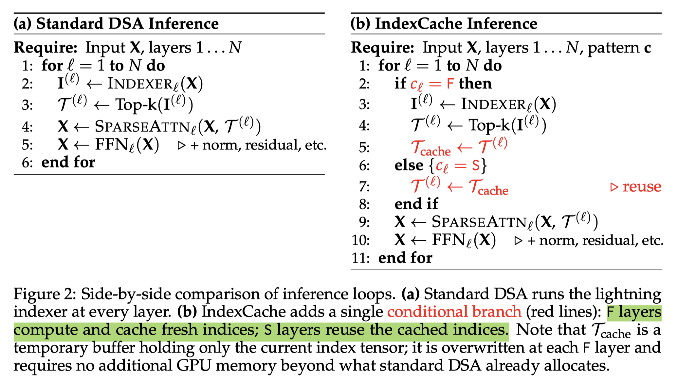

# IndexCache: Accelerating Sparse Attention via Cross-Layer Index Reuse

> Yushi Bai, Qian Dong, Ting Jiang, Xin Lv, Zhengxiao Du, Aohan Zeng, Jie Tang, Juanzi Li

## Abstract

Long-context agentic workflows have emerged as a defining use case for large language models, making attention efficiency critical for both inference speed and serving cost. Sparse attention addresses this challenge effectively, and DeepSeek Sparse Attention (DSA) is a representative production-grade solution: a lightweight lightning indexer selects the top-k most relevant tokens per query, reducing core attention from $O(L^2)$ to $O(Lk)$. However, the indexer itself retains $O(L^2)$ complexity and must run independently at every layer, despite the fact that the resulting top-k selections are highly similar across consecutive layers. We present IndexCache, which exploits this cross-layer redundancy by partitioning layers into a small set of Full layers that run their own indexers and a majority of Shared layers that simply reuse the nearest Full layer's top-k indices. We propose two complementary approaches to determine and optimize this configuration. Training-free IndexCache applies a greedy search algorithm that selects which layers to retain indexers by directly minimizing language modeling loss on a calibration set, requiring no weight updates. Training-aware IndexCache introduces a multi-layer distillation loss that trains each retained indexer against the averaged attention distributions of all layers it serves, enabling even simple interleaved patterns to match full-indexer accuracy. Experimental results on a 30B DSA model show that IndexCache can remove 75% of indexer computations with negligible quality degradation, achieving up to 1.82$\times$ prefill speedup and 1.48$\times$ decode speedup compared to standard DSA. These positive results are further confirmed by our preliminary experiments on the production-scale GLM-5 model (Figure 1).

---

*以下总结由 MiMo 生成：*

这篇论文旨在解决稀疏注意力机制中索引器计算开销过大的问题，尽管其能降低核心注意力复杂度，但索引器本身仍保持O(L²)复杂度且每层独立运行。为此，作者提出了IndexCache方法，通过将层划分为少量运行索引器的Full层和大量复用索引结果的Shared层，利用跨层索引冗余来减少计算。该方法包含两种配置优化策略：训练-free的贪心搜索算法和训练-aware的多层蒸馏损失。实验表明，IndexCache能在30B模型上移除75%的索引器计算，几乎不损失质量，并实现预填充速度提升1.82倍、解码速度提升1.48倍。
