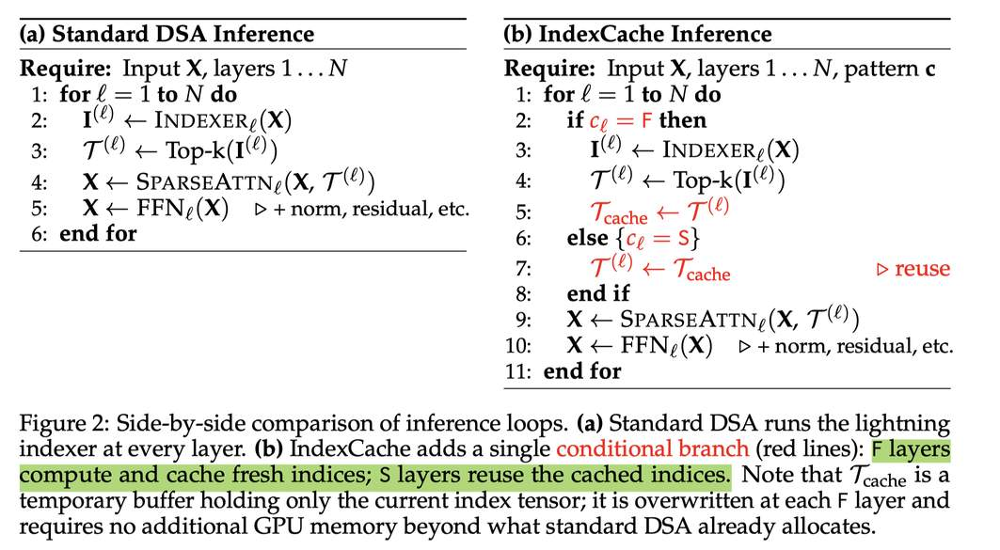

# IndexCache: Accelerating Sparse Attention via Cross-Layer Index Reuse

> Yushi Bai, Qian Dong, Ting Jiang, Xin Lv, Zhengxiao Du, Aohan Zeng, Jie Tang, Juanzi Li
> Tsinghua University, Zhipu AI
> arXiv:2603.12201v1, 2026年3月

---

## 一句话总结

**IndexCache 利用 DSA 稀疏注意力中相邻层 top-k 索引的高度相似性，将 75% 的索引器计算分配给复用层，以几乎不损失质量的方式实现高达 1.82× 的预填充加速和 1.48× 的解码加速。**

---

## 摘要翻译

长上下文智能体工作流已成为大语言模型的标志性应用场景，使得注意力效率对推理速度和服务成本至关重要。稀疏注意力有效地解决了这一挑战，DeepSeek Sparse Attention (DSA) 是一个代表性的生产级解决方案：轻量级闪电索引器为每个查询选择 top-k 最相关 token，将核心注意力从 O(L²) 降至 O(Lk)。然而，索引器本身仍保持 O(L²) 复杂度，且必须在每一层独立运行，尽管相邻层产生的 top-k 选择高度相似。我们提出 IndexCache，通过将层划分为少量运行索引器的 Full 层和大量复用最近 Full 层 top-k 索引的 Shared 层，利用这种跨层冗余。我们提出了两种互补方法来确定和优化这一配置。训练无关的 IndexCache 采用贪心搜索算法，通过直接最小化校准集上的语言模型损失来选择保留索引器的层，无需权重更新。训练感知的 IndexCache 引入多层蒸馏损失，训练每个保留的索引器以匹配其服务的所有层的平均注意力分布，使即使简单的交错模式也能达到全索引器精度。在 30B DSA 模型上的实验结果表明，IndexCache 可以移除 75% 的索引器计算而几乎不损失质量，与标准 DSA 相比，实现高达 1.82× 的预填充加速和 1.48× 的解码加速。这些积极结果在 GLM-5 生产规模模型的初步实验中得到进一步确认。

---

## 研究动机

### 核心问题
自注意力机制是现代大语言模型的基石，但其关于序列长度的二次复杂度构成了长上下文推理的根本瓶颈。随着 LLM 被部署到需要扩展上下文的场景（如长链推理、多步智能体工作流、网页规模检索增强生成），降低注意力成本而不牺牲模型质量成为关键研究问题。

### DSA 的局限
DSA (DeepSeek Sparse Attention) 通过轻量级闪电索引器将核心注意力从 O(L²) 降至 O(Lk)，但索引器本身仍在每一层以 O(L²) 运行。随着 N 层模型，总索引器成本为 O(NL²)，在长上下文长度下成为总注意力预算的显著部分。对 30B DSA 模型的分析显示：索引器在总延迟中的占比随上下文长度急剧上升，尤其在预填充阶段。

### 关键洞察
相邻层的 top-k 选择高度相关（相邻层共享 70-100% 的选定 token），且层间存在明显的重叠簇结构。这意味着大多数索引器计算是冗余的，为利用跨层索引复用提供了机会。

---

## 方法（技术细节）

### 整体框架
IndexCache 将 N 层划分为两种角色，编码为二进制模式字符串 c = c₁c₂...cₙ（cₗ ∈ {F, S}）：
- **F (Full) 层**：保留索引器，独立计算 top-k 索引集，执行标准 DSA 推理
- **S (Shared) 层**：无索引器，继承最近的 F 层的 top-k 索引（Tₗ ← T_f(ℓ)，其中 f(ℓ) = max{j < ℓ: cⱼ = F}）

第一层始终为 F 以初始化索引。在推理时，S 层只需跳过索引器前向传播并复用缓存的索引张量。唯一的变化是一个条件分支：要么运行索引器，要么复制缓存索引。

### 训练无关 IndexCache (Training-Free)

#### 为什么均匀交错不可取
简单的均匀交错策略（如每 r 层保留一个索引器）忽略了索引器重要性在层间的显著差异。某些层（特别是早期和过渡区域）对索引器移除更敏感。均匀交错可能移除关键索引器而保留冗余的，导致明显质量下降。

#### 贪心层选择算法
1. **初始化**：所有层为 F（全索引器）
2. **迭代**：进行 K 步（K = 目标 S 层数），每步在当前 F 层中找到将该层转为 S 后 LM 损失最低的层
3. **校准集**：使用 B 个 mini-batch，所有候选模式在同一批次上评估，确保损失差异仅反映模式变化

贪心解的三个良好性质：
1. 搜索模式在相同保留率下优于均匀交错
2. 每步 LM 验证损失曲线显示"容易"层（前 20 步）和"关键"层（35 步后）的清晰分离
3. 结果在不同校准集上稳定

### 训练感知 IndexCache (Training-Aware)

#### 多层蒸馏损失
将标准 DSA 的单层蒸馏扩展为多层目标。对于保留的 F 层 ℓ，其服务的后续 S 层为 ℓ+1, ..., ℓ+m：
$$L_I^{multi} = \sum_{j=0}^{m} \frac{1}{m+1} \sum_t D_{KL}(p_t^{(\ell+j)} \| q_t^{(\ell)})$$

#### 梯度等价性
多层蒸馏损失等价于针对平均目标分布的蒸馏（Proposition 1）：
$$\nabla_\theta L_I^{multi} = \nabtheta L_I^{avg}$$

这意味着索引器学习预测一个共识 top-k，共同覆盖所有服务层的重要 token。

#### 训练流程
遵循标准 DSA 训练的两阶段流程：
1. **预热阶段**：使用多层蒸馏损失训练 F 层的索引器，其他参数冻结
2. **稀疏训练阶段**：继续使用多层蒸馏损失训练索引器，同时用 LM 损失训练其他参数

---

## 实验结果

### 实验设置
- **模型**：30B DSA 模型（基于 GLM-4.7-Flash，30B-A3B MoE，47层，MLA）
- **评估**：9个基准测试（5个长上下文 + 4个通用/推理）
- **推理环境**：NVIDIA H100 节点，SGLang，dp attention (dp=8)

### 端到端推理加速

| 指标 | DSA | IndexCache (1/2) | IndexCache (1/4) |
|------|-----|------------------|------------------|
| **预填充延迟 (200K)** | 19.5s | 13.7s | **10.7s** |
| **预填充加速 (200K)** | 1.00× | 1.42× | **1.82×** |
| **解码吞吐 (200K, 单请求)** | 58 tok/s | 73 tok/s | **86 tok/s** |
| **解码加速 (200K)** | 1.00× | 1.26× | **1.48×** |
| **解码吞吐 (200K, 全缓存)** | 197 tok/s | 253 tok/s | **297 tok/s** |

### 训练无关 IndexCache 结果
- **1/4 搜索模式**：Long Avg 49.9（vs 原始 DSA 50.2），几乎无损
- **1/8 搜索模式**：Long Avg 46.1（vs 原始 DSA 50.2），有一定下降
- **通用/推理能力**：保持稳定，1/4 搜索模式在 AIME 2025 (92.6 vs 91.0) 和 GPQA-Diamond (78.6 vs 77.6) 上甚至超越 DSA

### 训练感知 IndexCache 结果
- **1/2 均匀交错**：Long Avg 51.6（vs DSA 51.0），超越基线
- **1/4 均匀交错**：Long Avg 50.6，G&R Avg 74.1，均在基线 0.4% 以内
- **跨层蒸馏**：移除跨层损失导致 Long Avg 从 51.6 降至 49.8，证明了多层蒸馏的实际价值
- **模式敏感性消失**：训练后均匀交错与搜索模式表现相当，说明模型学会了适应共享模式

### GLM-5 (744B) 扩展实验
- **1/4 搜索模式**：Long Avg 78.0（vs DSA 78.4），仅差 0.4 分
- IndexCache (1/4) 实现至少 1.3× 预填充和解码加速
- 在 Artificial Analysis Index 全面评估中，性能与原始 GLM-5 几乎一致

---

## 优势

1. **显著推理加速**：在 200K 上下文下，1/4 保留率实现 1.82× 预填充加速和 1.48× 解码加速
2. **几乎无损质量**：1/4 搜索模式在 9 个基准测试上仅损失不到 0.5 分（Long Avg）
3. **两种互补方法**：训练无关方法无需权重更新，训练感知方法可进一步提升
4. **实现简单**：仅需一个条件分支，无需额外 GPU 内存（Tcache 仅是临时缓冲区）
5. **可扩展性**：在 GLM-5 (744B) 上验证了扩展性
6. **保留推理能力**：通用和推理任务性能稳定，某些任务甚至超越原始 DSA
7. **原理通用**：核心跨层复用原则可扩展到其他稀疏注意力方法（如 MoBA、NSA）

---

## 局限

1. **极端保留率下的性能下降**：1/8 保留率下，即使使用搜索模式，Long Avg 仍从 50.2 降至 46.1
2. **贪心搜索的非全局最优性**：贪心算法不保证全局最优，但在实践中表现良好
3. **依赖校准集**：训练无关方法需要校准集进行搜索，且校准集质量可能影响结果
4. **需要训练（训练感知方法）**：训练感知方法需要额外的训练流程和计算资源
5. **未在更多模型上验证**：主要在 30B 和 GLM-5 上验证，其他架构上的表现未测试
6. **生产部署的复杂性**：需要集成到推理系统中，可能增加部署复杂度

---

## 与 EfficientPaper 相关的研究方向

### 相关研究方向
1. **稀疏注意力机制**：DSA、MoBA、NSA 等动态稀疏注意力方法，通过选择性计算降低推理成本
2. **跨层共享与 KV 缓存优化**：TidalDecode、LessIsMore、OmniKV、DELTA、Kascade 等方法利用跨层稳定性减少计算冗余
3. **混合注意力架构**：GPT-OSS、Gemma 3 等通过滑动窗口、线性注意力或状态空间层与全注意力层交错
4. **KV 缓存压缩**：MiniCache、SwiftKV、MLKV 等通过跨层共享减少内存开销
5. **长上下文推理优化**：HySparse 等方法统一跨层索引共享和 KV 缓存复用

### 研究意义
IndexCache 展示了跨层共享原则从全注意力到稀疏注意力的自然扩展。随着 DSA 成为前沿 LLM 的默认选择（DeepSeek-V3.2、GLM-5），跨层索引复用有望成为高效推理管道的标准组件。

---

*本 note 由 Hermes Agent (MiMo) 自动生成，基于 arXiv 论文 2603.12201v1 的全文提取和分析。生成时间：2026年6月。所有内容为中文翻译和总结，仅供学术参考。*
