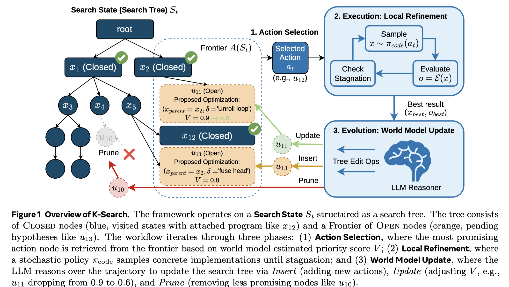

# K-Search: LLM Kernel Generation via Co-Evolving Intrinsic World Model

> Shiyi Cao, Ziming Mao, Joseph E. Gonzalez, Ion Stoica

## Abstract

Optimizing GPU kernels is critical for efficient modern machine learning systems yet remains challenging due to the complex interplay of design factors and rapid hardware evolution. Existing automated approaches typically treat Large Language Models (LLMs) merely as stochastic code generators within heuristic-guided evolutionary loops. These methods often struggle with complex kernels requiring coordinated, multi-step structural transformations, as they lack explicit planning capabilities and frequently discard promising strategies due to inefficient or incorrect intermediate implementations. To address this, we propose Search via Co-Evolving World Model and build K-Search based on this method. By replacing static search heuristics with a co-evolving world model, our framework leverages LLMs' prior domain knowledge to guide the search, actively exploring the optimization space. This approach explicitly decouples high-level algorithmic planning from low-level program instantiation, enabling the system to navigate non-monotonic optimization paths while remaining resilient to temporary implementation defects. We evaluate K-Search on diverse, complex kernels from FlashInfer, including GQA, MLA, and MoE kernels. Our results show that K-Search significantly outperforms state-of-the-art evolutionary search methods, achieving an average 2.10x improvement and up to a 14.3x gain on complex MoE kernels. On the GPUMode TriMul task, K-Search achieves state-of-the-art performance on H100, reaching 1030us and surpassing both prior evolution and human-designed solutions.
