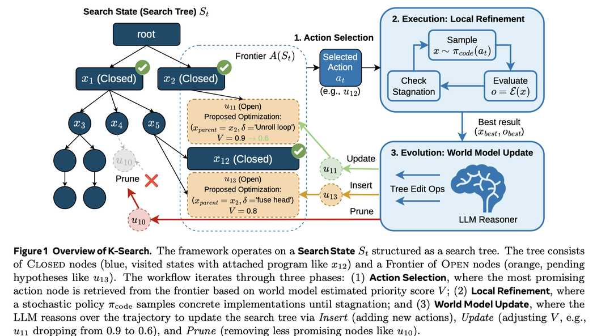

# K-Search: LLM Kernel Generation via Co-Evolving Intrinsic World Model

> Shiyi Cao, Ziming Mao, Joseph E. Gonzalez, Ion Stoica
> UC Berkeley

> ⚠️ **本 note 由 AI Agent 自动生成**（基于论文全文阅读），仅供参考，如有疏漏请以原文为准。
> 生成时间：2026-06-04

---

## 一句话总结

K-Search 通过将 LLM 作为协同进化的内在世界模型来指导搜索过程，将高层算法规划与底层代码生成解耦，在 FlashInfer 复杂 GPU kernel 优化上实现了平均 2.10×、最高 14.3× 的性能提升，并在 GPUMode TriMul 竞赛中取得 SOTA。

---

## 摘要翻译

优化 GPU kernel 对高效现代机器学习系统至关重要，但由于设计因素的复杂交互和硬件的快速演进，仍极具挑战。现有自动化方法通常仅将大语言模型（LLM）作为启发式进化循环中的随机代码生成器。这些方法往往难以处理需要协调的、多步骤结构变换的复杂 kernel，因为它们缺乏显式的规划能力，且经常因低效或错误的中间实现而丢弃有前景的策略。为此，我们提出了 Search via Co-Evolving World Model 方法，并构建了 K-Search 框架。通过用协同进化的世界模型替代静态搜索启发式，我们的框架利用 LLM 的先验领域知识来引导搜索，主动探索优化空间。该方法明确将高层算法规划与底层程序实例化解耦，使系统能够导航非单调的优化路径，同时对暂时性实现缺陷保持鲁棒。我们在 FlashInfer 的多种复杂 kernel（包括 GQA、MLA 和 MoE）上评估了 K-Search。结果表明，K-Search 显著优于最先进的进化搜索方法，平均提升 2.10×，在复杂 MoE kernel 上最高提升 14.3×。在 GPUMode TriMul 任务上，K-Search 在 H100 上达到 1030µs 的 SOTA 性能，超越了先前的进化方法和人工设计方案。

---

## 研究动机

1. **GPU kernel 优化的固有困难**：现代 GPU 需要在 tiling、内存布局、同步、架构特定指令等大量设计空间中导航，加之硬件快速演进（如从 Hopper 到 Blackwell），优化难度极高。
2. **现有 LLM 进化方法的局限**：OpenEvolve 等方法将 LLM 仅视为随机代码生成器，依赖 MAP-Elites 等进化启发式在程序空间直接搜索。然而，高性能 kernel 往往需要多步骤结构变换（如先重构内存布局再向量化），中间步骤可能不会立即带来性能提升。缺乏显式规划机制导致：
   - 无法规划多步优化序列（中间编辑可能不改善目标）
   - 因临时编译错误而过早丢弃理论上合理的策略
   - 难以发现深度结构优化以达到 SOTA 性能
3. **核心洞察**：LLM 不仅是代码生成器，还具有内在的规划能力和领域先验知识，可以作为世界模型来指导搜索过程。

---

## 方法（技术细节）

### 核心思想：协同进化的世界模型（Co-Evolving World Model）

K-Search 将 GPU kernel 合成形式化为在固定评估预算下的优化问题，核心是用 LLM 作为内在世界模型，将搜索过程组织为一棵结构化的搜索树，明确将**高层算法规划**与**底层程序实例化**解耦。

### 形式化定义

- **Kernel 程序** x ∈ X
- **观测元组** o = (s, p, m) = E(x)，其中 s 为正确性，p 为性能指标（延迟），m 为元数据
- **目标函数** J(x) = s · pref/p · 100（相对于参考 SOTA 的加速比）
- **搜索状态** S_t 包含：探索历史、前沿动作集合 A(S_t)、优先级评分 V

### 三阶段迭代流程

**1. 动作选择（Action Selection）**：
- 从搜索状态前沿中选择优先级评分最高的动作：a_t = argmax V(a|S_t)
- 动作 a_t = (x_parent, δ)，其中 δ 为自然语言描述的优化意图（如"Resolve bank conflicts via padding"）

**2. 程序实例化（Program Instantiation）**：
- 使用 LLM 作为随机策略 π_code 生成具体实现：x_t ~ π_code(·|a_t)
- 执行评估 o_t = E(x_t)
- **局部精炼循环**：重复采样直到停滞（连续 K 次无改进）
- 确保有效动作不会因临时语法错误被丢弃

**3. 世界模型协同进化（World Model Co-Evolution）**：
- 观察执行结果后，世界模型通过上下文学习（in-context learning）更新搜索状态
- 三种树编辑操作：
  - **Insert**：添加新的子节点扩展当前状态
  - **Update**：根据新证据重新评估现有前沿节点的优先级（如 V 从 0.9 降到 0.6）
  - **Prune**：永久移除不可行或冗余分支，集中资源到有前景的方向

### 搜索树结构

- **Closed 节点**（蓝色）：已访问状态，附带最佳程序
- **Open 节点**（橙色）：前沿的待探索动作，包含 (x_parent, δ) 和优先级评分 V

### 关键设计要点

- **解耦规划与实现**：世界模型负责高层规划（意图选择、优先级评估），代码生成器负责底层实现
- **非单调优化路径**：系统可以导航非单调的优化路径，对暂时性实现缺陷保持鲁棒
- **协同进化**：世界模型通过 in-context learning 持续细化其过渡动态，动态更新先验信念
- **预算控制**：B=120 次评估，停滞阈值 K=7

---

## 实验结果

### 评估设置

- **Kernel 来源**：FlashInfer 高度优化的 kernel（GQA、MLA、MoE）
- **硬件**：NVIDIA H100 和 B200 GPU（CUDA 12.8, FlashInfer 0.5.3, PyTorch 2.8.0）
- **预算**：每个 kernel 120 次迭代，重复 3 次
- **基线**：OpenEvolve、ShinkaEvolve（使用 gemini-3-pro-preview 和 Qwen3-8B）
- **评估器**：FlashInfer-Bench

### 主要结果

| Kernel | K-Search | OpenEvolve | ShinkaEvolve | K-Search vs OpenEvolve | K-Search vs ShinkaEvolve |
|--------|----------|------------|-------------|----------------------|------------------------|
| **总体平均** | **56.13** | 26.68 | 25.37 | **2.10×** | **2.21×** |
| GQA Decode | **76.0** | 44.2 | 27.7 | 1.72× | 2.74× |
| MLA Prefill | **57.4** | 19.5 | 11.3 | 2.95× | 5.10× |
| MLA Decode | **47.1** | 39.9 | 34.7 | 18% | 36% |
| **FP8 MoE (Blackwell)** | **44.1** | 3.09 | 27.9 | **14.3×** | 1.58× |

### GPUMode TriMul 竞赛

- **任务**：AlphaFold3 中的 Triangle Multiplicative Update，4D 对表示，O(N³) 复杂度
- **配置**：K=5，300 次迭代（GPT-5.2 + Gemini-3-Pro）
- **结果**：**1030 µs**（几何平均延迟），超越所有人造和自动方法

| 提交 | 语言 | 模型 | 迭代数 | 延迟 (µs) |
|------|------|------|--------|-----------|
| K-Search (Ours) | Triton | GPT-5.2 + Gemini-3-Pro | 300 | **1030** |
| shiyegao | CUDA | – | – | 1074 |
| Zeyu Shen | Triton | – | – | 1140 |
| TTT | Triton | GPT-OSS-20B w/ RL | 25,600 | 1161 |

### Kernel 内部分析

**FP8 MoE Kernel (Blackwell)**：
- K-Search 使用 warp 级协作（__shfl_down_sync）找到全局 top-8 experts
- 使用 tensor cores（WMMA）和双缓冲，跳过零 token 的 experts
- OpenEvolve 使用 persistent kernel 但需要 atomicAdd，ShinkaEvolve 不使用 tensor cores

**GQA Paged Decode (Hopper)**：
- K-Search 使用 split-K 并行化，将 KV 序列分配给多个 block
- 使用双缓冲重叠内存和计算
- OpenEvolve 和 ShinkaEvolve 使用单 block，无法充分利用并行性

**MLA Paged Prefill (Hopper)**：
- K-Search 在 GPU 上动态处理变长批次边界
- 保持所有线程在计算阶段忙碌

**MLA Paged Decode (Hopper)**：
- K-Search 将 Q 向量存储在寄存器中而非共享内存
- 使用更深的预取管线（加载 chunk i+2 而非仅 i+1）
- 自适应分割数量

---

## 优势

1. **显著性能提升**：平均 2.10× 优于 OpenEvolve，在 MoE kernel 上达到 14.3×
2. **规划与实现解耦**：将高层意图与底层代码分离，避免因临时错误丢弃好的策略
3. **协同进化机制**：世界模型通过 in-context learning 持续学习和调整搜索策略
4. **非单调优化**：能够导航非单调路径，对暂时性缺陷保持鲁棒
5. **高效搜索**：避免在程序空间中枚举大量稀疏搜索空间，而是从高层意图出发
6. **SOTA 竞赛表现**：在 GPUMode TriMul 上仅用 300 次迭代就超越了使用 25,600 次迭代的 RL 方法
7. **通用性**：支持多种 kernel（GQA、MLA、MoE）和两种硬件（H100、B200）

---

## 局限

1. **依赖 LLM 的领域先验**：搜索效果受限于 LLM 对 GPU kernel 优化的理解程度
2. **in-context learning 的局限**：当前版本的世界模型进化仅通过上下文学习实现，可能存在上下文窗口限制
3. **小批量性能**：在 batch_size=1 时，K-Search 的 split-K 策略反而带来额外同步开销，性能不如简单的单 block 设计
4. **评估预算依赖**：需要大量的编译和性能评估（每个 kernel 120 次迭代），计算成本较高
5. **依赖 FlashInfer-Bench**：实验主要基于 FlashInfer kernel，对其他 kernel 类型的泛化性有待验证
6. **LLM 成本**：使用了 gemini-3-pro-preview 等大模型，推理成本较高
7. **未超越 FlashInfer SOTA**：生成的 kernel 很少超越专家手动优化的 FlashInfer kernel（加速比多在 0.36-1.0 之间）
8. **缺乏理论保证**：搜索过程依赖启发式和经验，缺乏收敛性保证

---

## 与 EfficientPaper 相关的研究方向

1. **GPU kernel 自动优化**：直接关联到 FlashInfer 等高效推理系统的 kernel 优化
2. **LLM 辅助代码生成**：将 LLM 从代码生成器提升为规划引擎，对高效 AI 系统有重要影响
3. **进化搜索算法**：与 OpenEvolve、ShinkaEvolve 等进化方法形成对比，提供新的搜索范式
4. **AI 驱动的编译器优化**：与 TVM、Ansor 等自动调优系统形成互补
5. **高效 LLM 服务**：通过优化 kernel 支持 GQA、MLA 等新注意力机制的高效推理
6. **世界模型在规划中的应用**：将 LLM 作为世界模型用于搜索和规划，为 AI Agent 提供新的范式
7. **混合精度计算**：FP8 MoE kernel 优化对混合精度训练和推理有重要意义
8. **Triton 生态**：在 GPUMode TriMul 中使用 Triton 语言，对 Triton 生态的自动化发展有推动作用
