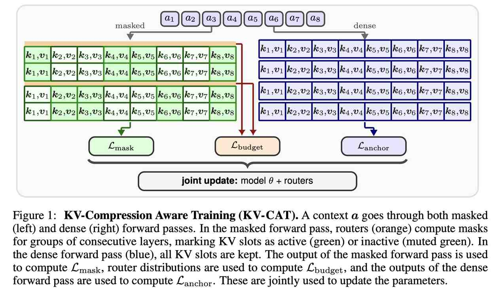

# Training Transformers for KV Cache Compressibility

> Yoav Gelberg, Yam Eitan, Michael Bronstein, Yarin Gal, Haggai Maron

## Abstract

Long-context language modeling is increasingly constrained by the Key-Value (KV) cache, whose memory and decode-time access costs scale linearly with the prefix length. This bottleneck has motivated a range of context-compression methods, from token-level summarization to recent optimization-based KV compression methods. These post-hoc methods operate on the KV cache of a fixed pretrained model, so their effectiveness is fundamentally limited by how well the model's internal representations can be compressed. In this work, we formalize the notion of KV compressibility and show that it is a property of the learned representations, rather than of the context alone. We prove that almost any sequence-to-vector function admits both highly compressible and inherently non-compressible transformer implementations, highlighting the need to guide transformers toward compressible representations during training. Motivated by this, we propose KV-Compression Aware Training (KV-CAT), a continued pretraining procedure that incentivizes the emergence of compressible representations. We introduce a train-time KV sparsification policy that masks KV slots during training. This forces the model to use fewer KV slots and encourages it to learn representations amenable to post-hoc compression. Empirically, we show that KV-CAT improves the quality-budget tradeoff of downstream compression methods across retrieval, long-context question answering, and perplexity-based evaluation of compressed-prefix continuation.

---

*以下总结由 MiMo 生成：*

这篇论文针对长上下文语言建模中KV缓存内存和解码时间成本随前缀长度线性增长的问题，提出了一种新的训练方法。研究者们发现KV可压缩性是模型学习表征的属性，而非仅依赖于上下文本身，因此设计了KV压缩感知训练（KV-CAT）方法，通过在持续预训练中引入训练时KV稀疏化策略，强制模型使用更少的KV槽位并学习更易压缩的表征。实验表明，KV-CAT在检索、长上下文问答和压缩前缀续写的困惑度评估中，显著提升了下游压缩方法的质量-预算权衡效果。

---

## 论文详细总结

### 1. 研究背景与动机

长上下文 LLM 的核心瓶颈是 **KV 缓存**——内存和解码访问成本随前缀长度线性增长。现有压缩方法都是对已固定的预训练模型进行后处理，效果受限于模型内部表征本身的可压缩程度。压缩瓶颈不在方法本身，而在模型学到了什么样的表征。

### 2. KV-CAT 核心思想

**KV 压缩感知训练**（KV-Compression Aware Training）：在训练过程中激励模型学习可压缩的表征，而非训练后再压缩。

### 3. 关键技术

| 技术 | 说明 |
|------|------|
| **KV 遮蔽训练** | 训练时随机丢弃 KV 槽位，迫使模型用更少 KV 完成任务 |
| **可压缩性形式化** | 证明可压缩性是模型表征的属性，而非上下文本身的属性 |
| **持续预训练** | 在现有模型基础上持续训练，使其表征对压缩友好 |

### 4. 实验结果

| 任务类型 | 效果 |
|---------|------|
| 检索任务 | 提升压缩方法的质量-预算权衡 |
| 长上下文 QA | 同压缩率下更高质量 |
| 困惑度评估 | 同质量下更高压缩率 |

### 5. 核心贡献

1. **理论贡献**：形式化 KV 可压缩性概念，证明可压缩性取决于模型表征
2. **方法贡献**：提出 KV-CAT 持续预训练方法，使模型表征对压缩友好
3. **实践价值**：可与现有各种后处理压缩技术结合，具有通用性和可叠加性
